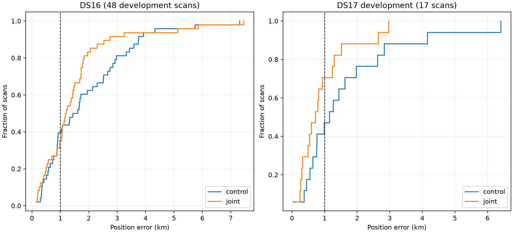
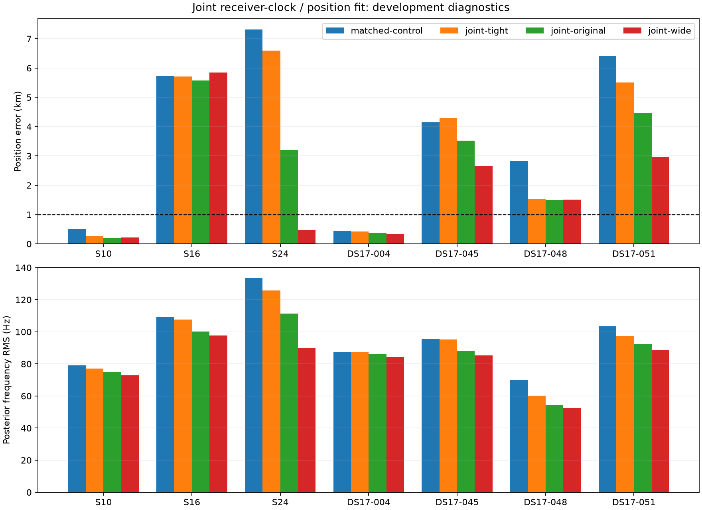
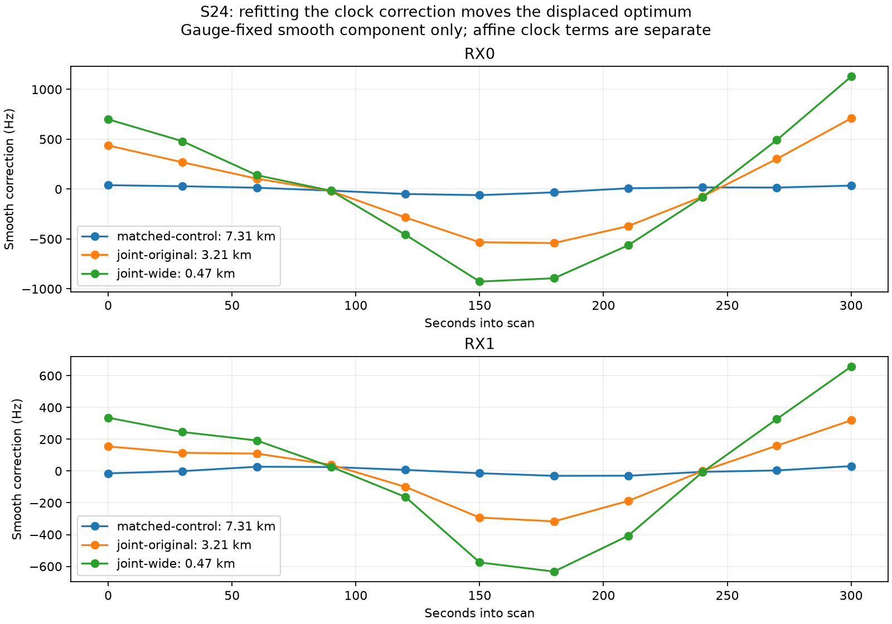

# Iteration 4: joint receiver-clock and position fitting

**The joint fit improves development means, but is not yet deployed.** All 65
development scans completed: the 48 DS16 recordings and 17 DS17 development
recordings. Fitted-c mean error falls from **1.886 to 1.515 km on DS16**, and
from **1.646 to 0.927 km on DS17 development**. DS16's worst error and 95th
percentile increase, so the sub-1-km development result on DS17 is not sufficient
to establish the overall goal or justify deployment.



## Model and controls

The existing pipeline estimates a receiver correction at a trial location, then
holds that correction fixed during the final position fit. This experiment
instead jointly optimizes the same 30-second piecewise-linear clock knots and
the final position. Each receiver's knot vector retains zero constant and zero
linear components through the original null-space basis. Existing affine
receiver terms remain separate, with their ±60 Hz/s bounds. Relative satellite
timing sigma remains 2 seconds, and the existing physical timing constraints
remain active.

The smooth-clock penalty is

```
0.5 * sum(knots²) / sigma_knot²
  + 0.5 * sum(second_difference(knots)²) / sigma_curvature²
```

Three variants use knot/curvature sigmas of 25/12.5, 50/25 (the original
penalty), and 100/50 Hz. Joint coefficients have a ±2000 Hz numerical bound in
the null-space coordinates; this is not a bound on the total clock drift.
The initial coefficients exactly reconstruct the previous smooth correction;
the baseline retains the previous affine component. The experiment changes
both when the smooth correction is estimated and, in two variants, its prior.
It does not add a new RF calibration term.

All comparisons use the same observations, satellite bank, seed, timing priors,
25-km local disk and 20-second/600-iteration fit budget. Both fitted-c and c=0
arms are run for every variant. Their upstream calibration and discrete
association remain the same fitted-c products. This is a controlled final-fit
ablation, not a completely c-free upstream pipeline. Reference position is
used only to evaluate results after optimization.

## Diagnostic results and expansion



On the seven initial diagnostics, fitted-c mean error changes from 3.911 km to
3.478, 2.696 and 1.997 km for tight, original and wide joint priors. We then
froze the wide variant in [expansion-protocol.json](expansion-protocol.json)
before evaluating the other 58 development scans. No variant is selected per
scan by reference-position error.

| Cohort | Mean km before → after | Median km before → after | p95 km before → after | Worst km before → after |
|---|---:|---:|---:|---:|
| DS16, 48 scans | 1.886 → 1.515 | 1.518 → 1.188 | 4.186 → 4.470 | 7.314 → 7.451 |
| DS17 development, 17 scans | 1.646 → 0.927 | 1.149 → 0.717 | 4.604 → 2.712 | 6.404 → 2.960 |
| Expansion only, 58 scans | 1.571 → 1.284 | 1.285 → 1.059 | 3.741 → 2.820 | 4.326 → 7.451 |

DS16 has 31 improvements and 17 regressions; DS17 development has 13 improvements
and 4 regressions (changes greater than one metre). All fitted-c controls and
joint-wide fits pass the independent stationarity check. The largest regression
is S11, **4.326 → 7.451 km**. S44 also worsens, **3.739 → 5.130 km**. These
regressions remain in every aggregate; no outcome-based fallback is applied.

The matched zero-c mean changes from 2.249 to 1.740 km on all 48 DS16 scans.
On the 13 paired stationary DS17 development scans it changes from 2.042 to
1.609 km. Four local zero-c controls fail stationarity (DS17-002, -004, -018,
-047), as does DS17-047's joint-wide zero-c fit. Raw results retain them, and
paired aggregates exclude the same scans before and after. A local control
failure does not mean the original published multi-start zero-c result failed.
The DS16 local zero-c control mean differs slightly from the published mean
because both arms here start from the same fitted-c seed.

## S24: evidence of calibration/position coupling

S24 changes from **7.314 km** with the frozen correction to **3.210 km** when
jointly fitting under the original clock prior, then **0.466 km** under the
wider prior. Its matched zero-c error also drops from 7.202 to 0.605 km. This
supports calibration/position coupling as a contributor to this failure,
without requiring a change to the search grid or satellite candidate bank.



The original S24 correction has a maximum knot magnitude near 61 Hz; the wide
joint correction reaches about 1128 Hz. This is a fitted nuisance correction,
not an independent measurement of hardware drift. It could absorb unmodelled
signal or association effects. The original-prior joint improvement separates
the benefit of joint fitting from the additional benefit of loosening the
prior, but does not establish the physical cause of the correction.

S16 remains difficult: 5.738 → 5.856 km under the wide variant, despite better
frequency fit. Thus frozen smooth calibration explains part of the remaining
problem, not every failure.

## Fit quality is separate from localization

Mean fitted-c posterior frequency RMS improves from 90.344 to 75.624 Hz on DS16
and 79.701 to 69.522 Hz on DS17 development. S11 also obtains a better score
and frequency RMS while moving farther from the reference. More flexible
calibration can improve in-sample fit while weakening positional information.
Scores across prior widths require the appropriate clock penalty; the stored
control objective includes the original penalty, so its penalty must be
rescaled when comparing with the wide objective.

## Status, validation, and reproduction

The 34 reserved DS17 validation scans were not opened for this development
iteration. The next step is to freeze the exact wide candidate and acceptance
criteria, then evaluate that reserved set once. A mean below 1 km on DS17
development alone does not meet the full objective; deployment and newer-data
verification require their own evidence. Existing production bounded-recovery
Hard60 and the longest-16 review rendering remain unchanged.

`joint_clock.py` implements the prototype; `run_joint.py` runs the seven
diagnostics; `expand.py` executes the frozen 58-scan expansion in two disjoint
shards. `probes/*.json` retains every returned candidate, knot vector, physical
parameter vector, score, RMS, position error and convergence result. The
summary scripts regenerate the JSON aggregates and figures. Existing outputs
are not overwritten. Corpus access and previously sealed analysis products
are required for reproduction.

Four tests pass in development Python 3.13 and production Python 3.14: exact
reproduction of the original correction and objective plus penalty, physical
and clock finite-difference gradients, gauge constraints, and physical bounds
with both RF arms. Ruff passes. The production orbit kernel is used. No new RF
collection, public-contract change, golden-fixture update or production model
change was made.
