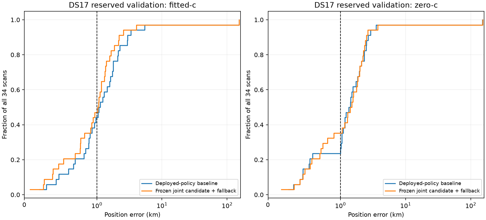
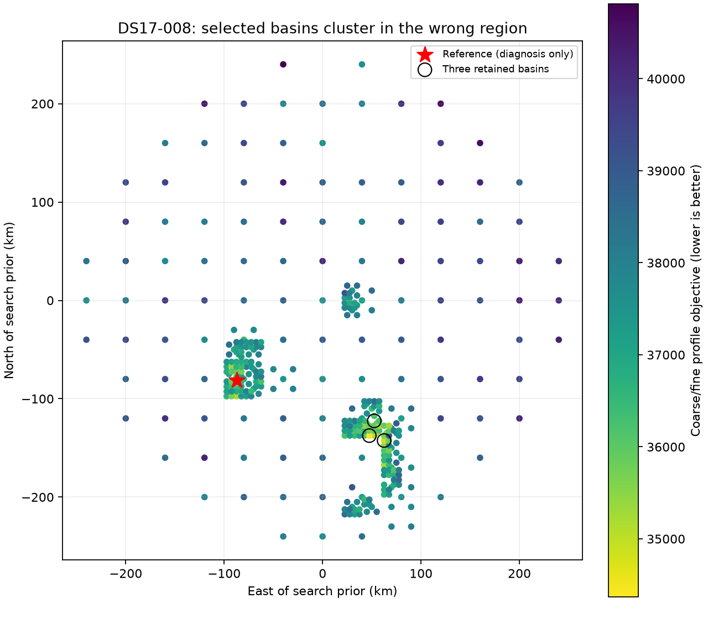

# Iteration 5: frozen DS17 validation of joint clock/position fitting

**Decision: do not deploy joint-wide as the new default.** All 34 reserved
validation scans completed. Mean fitted-c error improves only **4.4%**, from
**5.893 to 5.631 km**, failing the predeclared 15% improvement gate. The
below-1-km objective is not met. The catastrophic DS17-008 result is included
in every full-cohort aggregate.

The horizontal axis is linear below 1 km and logarithmic above it so both
ordinary errors and the roughly 153-km tail remain visible.

| All 34 scans, deployed-policy baseline → frozen candidate | Fitted-c | Zero-c with declared fallback |
|---|---:|---:|
| Mean error km | 5.893 → 5.631 | 5.878 → 5.900 |
| Median error km | 1.101 → 1.048 | 1.386 → 1.452 |
| p95 error km | 4.070 → 3.092 | 3.113 → 3.020 |
| Worst error km | 152.840 → 153.348 | 151.707 → 153.106 |
| Improved / worsened / unchanged | 24 / 10 / 0 | 16 / 17 / 1 |
| Fallback count | 0 | 1 |

All 34 joint fitted-c results passed the independent convergence audit.
The joint zero-c result on DS17-032 did not and therefore falls back to its
deployed-policy zero-c estimate in the all-scan operational comparison. Two
local zero-c controls also fail convergence (DS17-022 and DS17-028). The
strictly matched stationary zero-c comparison therefore uses the same 31 scans
on both sides: mean error 6.425 → 6.373 km and mean posterior frequency RMS
128.498 → 122.586 Hz. The matched fitted-c comparison includes all 34 scans;
frequency RMS improves 80.090 → 70.283 Hz, a substantially larger relative
improvement than localization. Better frequency fit alone is insufficient.

The availability, convergence, p95 and worst-error gates pass, but the mean
improvement gate fails. No threshold or model parameter was changed after
opening these outcomes. The sub-1-km development mean from iteration 4 did
not generalize to this reserved sample.

The joint-wide candidate and acceptance criteria were committed to remote main
in `06c5a1281` **before opening the 34 reserved DS17 outcomes**. This report
separates that one-time validation from subsequent root-cause diagnostics.
The candidate is unchanged from iteration 4: jointly fit the existing
gauge-fixed smooth receiver correction with position, using 100/50 Hz
knot/curvature priors. The original ±60 Hz/s affine slope bounds and 2-second
relative timing prior remain in force.

The candidate uses the deployed-policy baseline's fitted-c basin, satellite bank, seed and
affine baseline. Both RF arms share observations, candidates, priors and a
20-second/600-iteration budget. The matched-control comparison refits the
original fixed-clock objective from the same seed. The separate operational
comparison uses each arm's deployed-policy result as baseline and falls back to it
if the corresponding joint fit does not pass the independent convergence
audit. Older publications are replayed through the deployed bounded-recovery
policy using verified saved stages; these reconstructed baselines are not
claimed to have overwritten the original publications. No fallback or
selection uses reference-position error.

The protocol requires all 34 results, at least 15% mean improvement, no more
than 10% degradation in p95 or worst error, and at least 95% fitted-c joint
convergence to qualify as a candidate. A validation mean below 1 km is reported
separately; it does not erase DS16 regressions or replace newer-data testing.

## Catastrophic case: DS17-008

`scan-fw-f6399482c82aa4ae` has a deployed-policy fitted-c error of **152.840 km**.
The frozen joint refinement gives **153.348 km**. Both are locally stationary.
A 25-km local fit cannot recover a receiver about 150 km away from its seed.

This is not simply missing grid coverage. The nearest sampled point is 1.579 km
from the reference, and the nearest converged 40-km coarse cell ranks second
out of 115 converged coarse cells. The search performs finer evaluation in
that region. However, all three final basins lie in the wrong region, with
centres near (47.5, −137.5), (62.5, −142.5), and (52.5, −122.5) km in the prior's
coordinate chart. All 18 final attempts start from those three basins.

The current minimum separation of 12.5 km allows multiple starts in this one
wrong region to consume every final-refinement slot. A post-outcome selection
diagnostic, using the same sampled scores and no reference in ranking, shows
that separations of 25, 50 or 80 km would also retain a sampled basin at
(−87.5, −97.5) km. The reference is used only afterward to measure that this
candidate is 16.516 km away. **This is not a demonstrated position fix:** the
additional basin still needs calibration, association and final refinement,
and a truth-free score must select it. The frozen validation model is not
changed in response to this finding.

The deployed numerical recovery had attempted nine failed coarse fits and
recovered seven on this scan. Its existence therefore does not guarantee
correct region selection. Wider basin separation or allocation across coarse
parent regions is a concrete next hypothesis, to be tested on development
data and fresh replication data, not retuned against this validation aggregate.

## S11 development regression: score/model failure is also present

A separate development audit repeats the joint-wide fit from its original
seed and four ±5-km cardinal offsets, with both c arms and the same fit budget.
All ten fits pass stationarity. In the fitted-c arm, some starts return errors
as low as 1.397 km, but their objective is worse than the original 7.451-km
solution. Minimum-score selection still selects the 7.451-km result. The
zero-c arm similarly selects the 7.280-km result despite another start giving
1.643 km error.

Thus adding local starts alone does not fix this regression under the current
score. Calibration flexibility can improve the model's score while moving
away from the receiver. Better scoring/association or independent clock evidence
must distinguish these alternatives. These diagnostic starts are not used to
alter the frozen validation candidate or to select by known position.

## Newer data and evidence

`newer-recordings.json` freezes eight additional **published** recordings with
capture starts in [2026-10-08 14:36:56, 16:50:00) UTC and publication by the
cutoff. Admission uses capture metadata and hashes only, not localization
outcomes or analysis readiness. Unpublished/spooled data are outside this
explicit published-recording cohort. No new RF acquisition was launched.
These recordings are reserved for separate replication of subsequent work.

`protocol.json` binds the candidate source, runner, original random DS17 split,
membership and gates. `results/*.json` retains every candidate, baseline arms,
source hashes, vectors, timing/clock parameters and convergence diagnostics.
`summary.py` separates full-cohort fallback statistics from paired stationary
RF ablations. `audit_search.py` and `audit_s11.py` produce the post-outcome
diagnostics; neither modifies the validation model. Production remains on the
previously verified bounded-recovery Hard60 and longest-16 review renderer.

The 34 DS17 validation scans are now **consumed validation**, not an unopened
holdout for subsequent model tuning. Any follow-up that uses their outcomes
must obtain fresh validation or clearly report development-only status.
