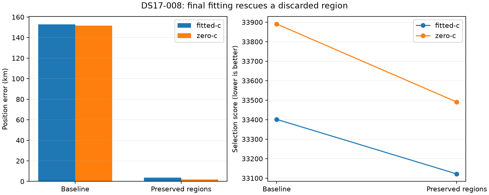
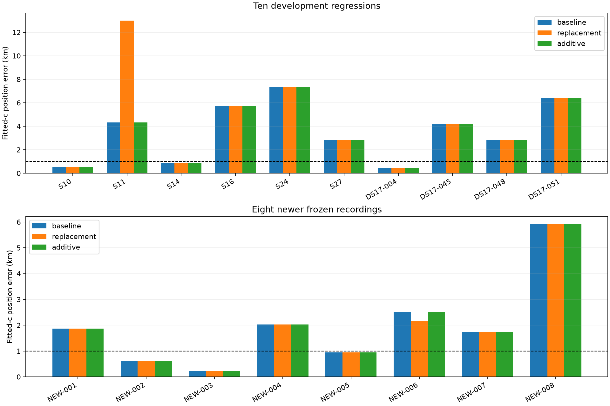

# Iteration 6: preserve distinct regions through final fitting

**The discarded-region diagnosis is confirmed.** On DS17-008, final fitting
of a previously discarded region reduces fitted-c error from **152.840 to
3.636 km**, and zero-c error from **151.707 to 1.840 km**. The existing score
selects these results without using the reference location. Separations of
25, 50 and 80 km all produce the same selected result on this diagnostic case.

Simply replacing the three original basins is unsafe: S11 worsens from
4.326 to 12.994 km. An additive policy preserves the original finalists and
selects the lowest-score converged result from the original and additional
regions. It rescues DS17-008, preserves all ten development regression results,
and leaves all eight newer results unchanged. **The newer mean remains
1.982 km, above the below-1-km goal. No production change is deployed.**

## What failed, and what changed

The original 400-point search visited within 1.579 km of the DS17-008
reference location. However, the 12.5-km minimum separation let three final
basins cluster in the wrong region. Increasing separation to 25 km retains
the basin at (−87.5, −97.5) km in the prior coordinate chart. Its coarse
score, 35163.957, is worse than the best wrong-region coarse score, 34367.031.
After calibration, association and final fitting, its fitted-c selection
score is **33121.703**, better than the original selected **33401.492**.
Coarse scores do not reliably predict the ordering after these later steps.

This is a search-region retention failure, not an optimizer failing to move
150 km inside a 25-km local fit. The corrected fitted-c solution passes the
independent stationarity audit (9.43e-5); the zero-c solution also passes
(1.74e-4). All baseline and replacement selections in this iteration converge.

The first experiment changes only minimum basin separation, preserving the
same 400 sampled coordinates, three ordinary basin slots, fit starts, timing
priors, hard ±60 Hz/s affine slope bounds, and bounded coarse recovery.
Saved point/calibration/association/final stages may be reused when their
inputs and basin coordinates match. Recovery bookkeeping is recomputed for
each policy. Receipts assert the exact same ordered grid on every run.
Recovery may add basins beyond the three ordinary slots under either policy.

The additive policy then compares each arm's original and replacement
selected candidates by `selection_score`; ties keep the original and a
nonconverged additional result falls back to the original. It never uses
position error for selection. This retains the minimum of the two finalist
sets without refitting identical finalists. It costs extra fits: up to two
additional ordinary regions plus recovery differences. This is **not** an
equal-three-basin comparison, and cached replay does not measure cold runtime.
Both RF arms receive matched observations, candidates, priors and budgets
within each policy; their selected final regions can differ.

## Results and matched RF ablation

| Cohort / arm | Baseline mean km | Replace basins | Preserve original + extra |
|---|---:|---:|---:|
| Ten development regressions, fitted-c | 3.544 | 4.411 | 3.544 |
| Ten development regressions, zero-c | 4.440 | 6.257 | 4.440 |
| Eight newer recordings, fitted-c | 1.982 | 1.939 | 1.982 |
| Eight newer recordings, zero-c | 2.646 | 2.594 | 2.646 |
| DS17-008 diagnostic, fitted-c | 152.840 | 3.636 | 3.636 |
| DS17-008 diagnostic, zero-c | 151.707 | 1.840 | 1.840 |

The ten deliberately chosen regressions are not a representative DS16/DS17
aggregate. DS17-008 is displayed separately, not silently excluded from a
claimed full-cohort result. This iteration does not rerun all 48 DS16 or all
51 DS17 scans. The complete per-scan table and mean/median/p95/worst results
are in [summary.json](summary.json).

On newer data, additive fitted-c median/p95/worst remain **1.809/4.721/5.912 km**;
zero-c remains **1.767/5.559/6.549 km**. No scan is omitted. NEW-006 alone has
a closer replacement estimate (fitted-c 2.510→2.170 km; zero-c 3.269→2.856 km),
but its selection score is worse in both arms. The additive rule correctly
follows its declared score and retains the original. Lower score guarantees
neither lower position error nor protection from all future accuracy regressions.

Frequency evidence must be kept separate. DS17-008 fitted-c posterior RMS
**worsens from 137.273 to 144.313 Hz** while localization improves enormously.
Across newer recordings, baseline/additive mean RMS is **102.732 Hz fitted-c**
and **142.511 Hz zero-c**; replacement gives 102.959 and 142.683 Hz. Fitted-c
helps mean accuracy on this small cohort, but zero-c is more accurate on the
rescued catastrophic case. Neither frequency fit nor a single case justifies
choosing the RF arm using known position.

## Validation chronology and reproducibility

DS17-008 was opened in iteration 5 and is now development evidence. The
25/50/80-km diagnostic preceded [protocol.json](protocol.json), which froze
25 km and the ten regressions plus eight newer recordings. After observing
the S11 regression, [additive-protocol.json](additive-protocol.json) froze
candidate preservation before any newer result was opened. The initial
replacement protocol was retained unchanged. The eight newer recordings had
already been frozen by capture metadata in
[iteration 5](../2026_10_08_position_error_iter05/newer-recordings.json),
without position-based admission and without DS17 IQ overlap. They are a
small published-recording replication cohort, not all recorded/spooled data.
They are now consumed and must not be described as untouched validation in
later tuning.

`regions.py` replays public analysis checkpoints into isolated research
storage. `newer_inputs.py` verifies capture, tracking input, analysis and
causal TLE snapshot digests through public ports. Baseline receipts use the
deployed bounded-recovery policy, including corrected DS16 S14/S27 and DS17
baselines where older published documents predate recovery. No publication
or original checkpoint is overwritten. The initial diagnostic runner was
refactored for testability and baseline receipts before expansion; the primary
protocol hashes bind the expansion source. `integrity.json` seals final
report evidence; checkpoint caches are excluded from publication.

Three focused tests pass under both development and deployed Python:
distinct-basin retention, safe checkpoint reuse, and truth-independent additive
selection including ties and nonconvergence. Ruff passes. Figures are generated
by `summarize.py` from all 19 predeclared cases (including the diagnostic).

## Decision and next experiment

Keep the deployed bounded-recovery hard60 pipeline and longest-16 per-track
PNG rendering unchanged. Additive region preservation is a supported candidate
for avoiding catastrophic omissions, but it has not demonstrated better typical
accuracy or measured production runtime. Qualify it over the full corpus before
promotion. Joint clock/position fitting remains a separate, unpromoted hypothesis
from iterations 4–5; this iteration uses the unchanged frozen clock model.

Next, test the already specified joint-wide clock model on the eight newer
recordings and the recovered DS17-008 region with matched local controls and
zero-c arms. This separates search rescue from local clock/model error. Report
all members and failures, do not tune its priors against these outcomes, and
keep broad deployment contingent on accuracy and regression evidence.
