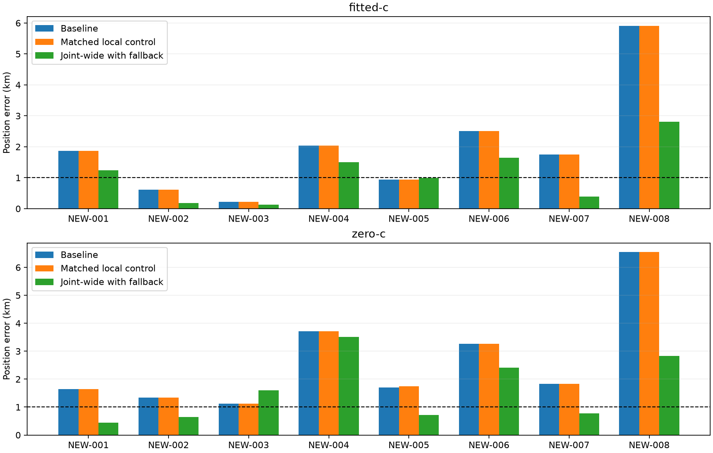

# Iteration 7: joint clock/position replication on newer recordings

The unchanged joint-wide model improves newer-data fitted-c mean error from
**1.982 to 1.111 km (43.9%)**, with seven improvements and one 40-m regression.
The worst case improves from **5.912 to 2.813 km**. All eight scans and both
RF arms converge; none are dropped or replaced by fallback. The below-1-km
mean goal remains unmet. **No scientific default is changed.**

| Eight newer recordings | Baseline fitted-c | Joint fitted-c | Baseline zero-c | Joint zero-c |
|---|---:|---:|---:|---:|
| Mean error km | 1.982 | 1.111 | 2.646 | 1.616 |
| Median error km | 1.809 | 1.113 | 1.767 | 1.187 |
| p95 error km | 4.721 | 2.405 | 5.559 | 3.270 |
| Worst error km | 5.912 | 2.813 | 6.549 | 3.506 |
| Improved / worsened | — | 7 / 1 | — | 7 / 1 |

## Controlled experiment

This uses exactly the joint-wide model from iterations 4–5: fit position and
the existing smooth receiver-clock knots together, remove constant and linear
clock gauge freedoms, and use 100/50 Hz knot/curvature priors. Production
2-second relative timing and ±60 Hz/s affine bounds remain unchanged. The
joint model source hash and runner were frozen in [protocol.json](protocol.json)
before these joint outcomes were opened. There is no prior tuning here.

For each scan, both c arms use the same observations, satellite bank, initial
vector, clock calibration and 20-second/600-iteration budget. The starting
region is the fitted-c selection from iteration 6's additive policy. On all
eight newer scans that policy retained the deployed baseline. Fixed-clock
local controls use the same seed and candidate bank as the joint fits. The
reference position is used only to evaluate returned solutions. Nonconverged
joint fits would fall back to each arm's baseline; no fallback was needed.

The fixed-clock local control reproduces the newer fitted-c baseline mean
to numerical precision. Its zero-c mean is 2.651 km versus the operational
baseline 2.646 km, because the controlled ablation shares the fitted-c basin
and satellite bank rather than each arm's independently selected bank.
The paired stationary comparison includes all eight scans for both arms.

Frequency-fit effects are separate: fitted-c mean posterior RMS improves
**102.732→80.715 Hz**, while zero-c improves **142.517→129.977 Hz**, measured
against the matched local controls. These are in-sample fit measurements,
not independent positioning guarantees. NEW-005 fitted-c worsens
0.946→0.986 km; NEW-003 zero-c worsens 1.120→1.595 km. Both remain included.

## Recovered DS17-008 region

This diagnostic is separate from the eight-scan aggregate. Iteration 6
rescued the discarded region, reducing fitted-c error 152.840→3.636 km.
Joint-wide refinement in that region gives **3.537 km**. The matched zero-c
control gives **1.826 km** and joint-wide gives **1.996 km**; the independently
selected iteration-6 zero-c baseline was 1.840 km. All four local fits pass
stationarity. Joint clock fitting does not remove the residual several-km
fitted-c error and slightly worsens zero-c in this case.

Search-region retention and local clock flexibility therefore address
different errors. Recovering a discarded region is essential here; additional
clock freedom offers little afterward. The reference cannot be used to choose
the more accurate RF arm in production.

## Scope, evidence and deployment decision

The eight published recordings were frozen by capture metadata in iteration 5,
then consumed by the region experiment in iteration 6. This is replication of
an already fixed model on those recordings, **not a new untouched validation
set**. DS17-008 is explicitly post-outcome development evidence. No new RF
collection was launched. All nine cases, their seeds, satellite banks, source
manifest hashes and numerical results are retained in `results/`; the aggregate
and every per-scan comparison are in [summary.json](summary.json).

Four joint-clock model tests pass. The runner remains byte-identical to the
frozen protocol; lint passes with the import-spacing rule I001 excluded for
its research-loader import block. The numerical model is unchanged. The
figure is generated from the complete results and PNG decoding is verified.
`integrity.json` seals the report and evidence.

This small-cohort result does not supersede the earlier failed full DS17
validation or DS16 regressions. Joint-wide still has DS16 mean 1.515 km and
known S11/S16 regressions from iteration 4. Full-corpus qualification of
region preservation, remaining score/model failures, and fresh validation
are required before promotion. Preserve the deployed bounded-recovery
hard60 and longest-16 TLE review PNG behavior.

The next useful development experiment is a controlled clock-prior sensitivity
check, retaining the frozen original joint-wide as comparator, on DS16 and
DS17 development plus this now-consumed newer cohort. It must report both c
arms, all convergence failures and tail regressions. An improvement in mean
alone cannot erase the existing model-selection counterexamples.
