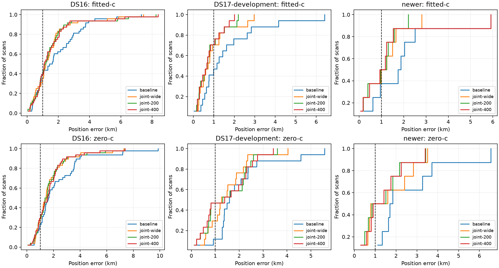

# Iteration 8: clock-prior sensitivity across 74 fixed cases

**Looser clock priors do not solve the remaining accuracy problem.** The
200/100 Hz setting brings the eight previously consumed newer recordings to
**0.998 km mean**, but DS16 worsens from the existing joint model's **1.515 to
1.529 km**, and its worst error increases to **8.258 km**. This narrow crossing
of 1 km on eight development recordings does not establish the goal. No
candidate is deployed, and the six later reserved recordings remain unopened.

## Experiment and scope

The frozen protocol includes all 48 DS16 scans, all 17 DS17 development scans,
all eight newer recordings consumed in iterations 6–7, and rescued DS17-008
as a separate diagnostic. Both c arms use identical observations, satellite
banks, initial vectors, priors and 20-second/600-iteration budgets within each
variant. The initial vectors are asserted byte-for-byte equal to the earlier
joint experiments. No new search or reference-based initialization is added.

Only the smooth-clock knot/curvature prior standard deviations change:
`joint-wide` uses 100/50 Hz (the existing research comparator), `joint-200`
uses 200/100 Hz, and `joint-400` uses 400/200 Hz. Larger values penalize clock
deformation less strongly. Gauge removal, 30-second clock nodes, 2-second
relative timing, hard ±60 Hz/s affine slope bounds, physical constraints and
the numerical stationarity threshold remain unchanged. The affine slope bound
is not a bound on the derivative of the additional smooth correction.

The protocol and runner were published as `fe58f0f4b` during execution, before
completion of the outcomes. The runner verifies its own and the unchanged
joint model's source hashes. The old joint-wide results are immutable matched
comparators from iterations 4 and 7. No per-scan choice by known error or by
cross-prior objective is permitted; every prior is evaluated as its own policy.

## Complete operational comparison

Nonconverged fits fall back to the corresponding deployed-policy baseline arm,
as specified before execution. Every member remains in these means.

| Cohort / arm | Baseline | Joint 100/50 | Joint 200/100 | Joint 400/200 |
|---|---:|---:|---:|---:|
| DS16, 48, fitted-c mean km | 1.886 | 1.515 | 1.529 | 1.545 |
| DS16, 48, zero-c mean km | 2.245 | 1.739 | 1.734 | 1.738 |
| DS17 development, 17, fitted-c mean km | 1.646 | 0.927 | 0.798 | 0.767 |
| DS17 development, 17, zero-c mean km | 2.000 | 1.494 | 1.465 | 1.447 |
| Newer, 8, fitted-c mean km | 1.982 | 1.111 | 0.998 | 1.433 |
| Newer, 8, zero-c mean km | 2.646 | 1.616 | 1.411 | 1.422 |
| Rescued DS17-008, fitted-c error km | 3.636 | 3.537 | 3.493 | 2.168 |
| Rescued DS17-008, zero-c error km | 1.840 | 1.996 | 1.688 | 2.259 |

DS17-008's baseline here is the rescued region from iteration 6, not its
original 152.840-km estimate. The 34 consumed DS17 validation scans are not
rerun in this sensitivity experiment; this table is not a full-DS17 result.

For DS16 fitted-c, p95 grows **4.470→4.761→4.634 km**, and worst error grows
**7.451→8.258→8.393 km** across the three joint priors. For the eight newer
recordings, joint-200 median/p95/worst are **1.091/1.986/2.208 km**. It improves
seven scans versus baseline and worsens one. Its mean is only about 1.8 m
below the nominal 1-km target, on a small already-consumed development cohort.

All 296 newly requested fits returned results. Two joint-400 fitted-c fits
fail the independent stationarity audit: **S42** and **NEW-008**. S42 reports
solver success but stationarity 0.001313 exceeds the unchanged 0.001 threshold;
the failed candidate's raw error is 1.897 km and baseline fallback is 1.947 km.
NEW-008's raw error is 2.165 km, but fallback retains 5.912 km. Neither raw
candidate is counted as accepted merely because it looks accurate. The older
joint-wide zero-c comparator also has a nonconverged DS17-047 result; its
operational baseline fallback is included here. This explains why its
operational DS17 mean differs from an aggregate of raw candidate errors.

## Fit quality versus position accuracy

A strict comparison uses exactly the same scans with all three joint priors
converged in both RF arms: 47 DS16 (excluding S42), 16 DS17 development
(excluding DS17-047), and seven newer (excluding NEW-008). These exclusions
apply only to the additional paired analysis, not the operational table.

| Strict paired fitted-c comparison | Joint 100/50 | Joint 200/100 | Joint 400/200 |
|---|---:|---:|---:|
| DS16 mean error km | 1.510 | 1.523 | 1.537 |
| DS16 mean posterior RMS Hz | 75.743 | 73.593 | 73.009 |
| DS17 development mean error km | 0.908 | 0.771 | 0.737 |
| DS17 development mean posterior RMS Hz | 69.986 | 68.834 | 68.406 |
| Newer mean error km | 0.868 | 0.825 | 0.793 |
| Newer mean posterior RMS Hz | 76.576 | 74.542 | 74.008 |

The strict zero-c counterparts and every per-scan result are retained in
[summary.json](summary.json). The operational baseline zero-c may use a
different independently selected bank; the joint-prior comparisons use a
shared bank in both arms. Lower in-sample frequency RMS is not proof of
better localization: DS16 worsens even in the strictly paired comparison.

Three development cases expose the limitation:

* **S11:** error 7.451→8.258→8.393 km while RMS improves
  103.85→101.56→100.61 Hz. Maximum smooth-clock knot magnitude grows
  226→324→399 Hz. Additional clock flexibility moves the fit farther away.
* **S24:** error 0.466→0.839→1.173 km while RMS improves
  89.81→82.58→81.34 Hz. The corresponding maximum knot magnitudes are
  1128→1281→1331 Hz. An initially helpful correction becomes less accurate
  as its penalty weakens.
* **S44:** the deployed error is 3.739 km; joint errors are
  5.130→6.485→6.252 km. Each fit passes stationarity. This is not a failed
  convergence flag that can be repaired by simply raising the iteration cap.

These are symptoms of model ambiguity or misspecification; the experiment
does not yet identify which observations or nuisance terms cause it. A local
stationarity certificate does not establish global optimality or model truth.

## Reserved later data, tests and next investigation

Six additional published recordings in **[16:50, 18:30) UTC on October 8**
were frozen using capture metadata only, with publication by the cutoff.
There is no analysis-readiness or localization-error admission gate. No DS17
or previous newer-recording IQ digest overlaps; DS16 session IDs do not overlap.
Unpublished/spooled recordings are outside this explicit published cohort.
[newer-validation.json](newer-validation.json) was pushed as `0e8e7bf90` before
opening any of their localization outcomes. They remain reserved for a
candidate chosen without their outcomes. No RF collection was launched.

Four joint-clock tests pass under both development and deployed Python,
covering numerical gradients, gauge invariance, physical constraints and the
zero-c restriction. Ruff passes. All 74 result documents, comparator receipts,
protocols, summaries and figures are sealed by `integrity.json`; the source
hash assertions are rechecked. Production bounded recovery and longest-16
TLE review PNG rendering remain unchanged.

The next diagnostic should profile nuisance parameters with position fixed
at the known reference and at the selected estimate on S11/S16/S24/S44.
This is explicitly an oracle diagnostic, never an operational initializer or
selection rule. Decompose the likelihood and timing/clock penalties, then
identify which satellite tracks prefer the wrong region. That evidence can
distinguish a search minimum from a model that actively prefers a wrong
position before introducing another model or tuning another prior.
