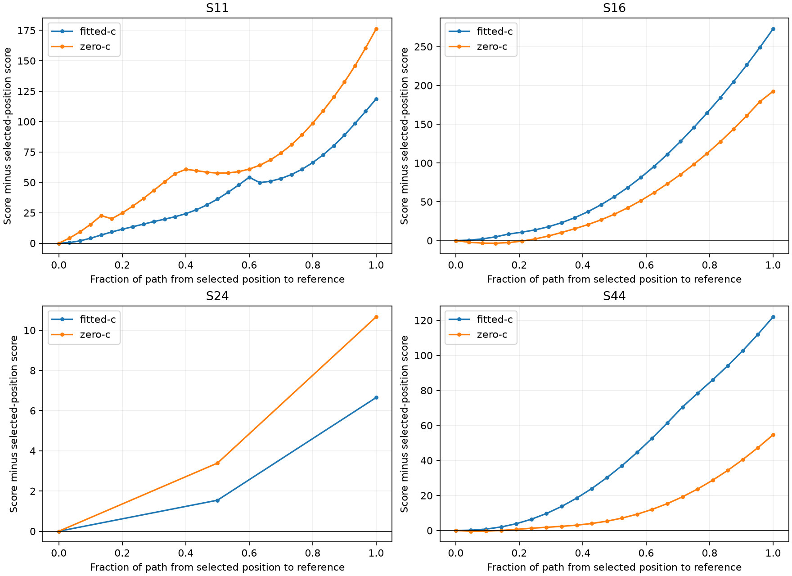
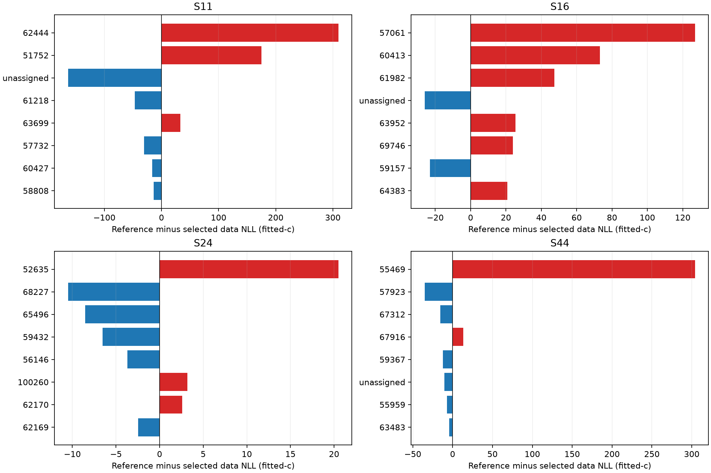

# Iteration 9: profile the remaining failures at the reference position

**Several large errors are supported by particular inferred satellite groups,
not just by the clock prior.** In S11, S16 and S44, window groups assigned to
candidates requiring relative timing shifts larger than ten seconds dominate
the likelihood preference for the inaccurate position. This motivates testing
timing-consistency checks on the candidate bank. It does not establish that
those satellite identities or their TLEs are wrong, nor that removing them
will improve accuracy on other scans.

No operational estimate or deployment is changed. These are explicitly
reference-assisted diagnostics on four development cases, not new accuracy
results or validation. The six later recordings remain unopened.

## Avoid confusing a nuisance minimum with a model error

We use the unchanged joint-wide model (100/50 Hz smooth-clock priors,
2-second relative timing prior and ±60 Hz/s affine bounds). For each arm:

1. Hold position at the selected fitted-c location and refit nuisance terms.
2. Hold position at the known reference and fit from both the selected and
   original baseline nuisance initializations.
3. Follow the selected solution toward the reference in steps of at most
   250 m, fitting nuisance terms at each fixed location.
4. Release position from the best stationary reference profile found.

Both arms share observations, candidate bank, point sequence, priors and
20-second/600-iteration budget per fit. The first direct starts share the
fitted-c physical nuisance vector, with c projected to zero in the zero-c arm.
Later continuation naturally uses each arm's own fitted nuisance state.
All windows are retained. The original fitted-c location is the common fixed
point in both arms; this is not each arm's independently best location.

Direct jumps are misleading. For S11 fitted-c, the two reference starts give
scores **27392.806** and **25644.599**, both stationary. For S16, the better
direct reference fit scores **37762.883**, but continuation reaches
**35461.468** at the same exact reference location. For S44, direct reference
fitting gives **34825.161**, versus **30326.597** after continuation. The
mixture likelihood has substantial nuisance/association minima even with
position fixed. Stationarity is not a global-optimality certificate.

The original continuation stopped at nonstationary steps in S11 zero-c and
S44 fitted-c. A separately frozen supplemental procedure allows at most two
warm retries at the *same fixed point*, without changing the threshold or
per-attempt budget. One retry in S11 zero-c and two in S44 fitted-c complete
the paths. All other paths require no retries. Original failures remain in
`continuation/`; complete supplemental traces and every retry score and
stationarity value are in `retried/`. This is additional diagnostic compute,
not a retroactive change to iteration 8's fallback policy.

## What the score prefers after continuation

The following differences are **reference minus selected-position**. Positive
total means the inaccurate selected position has the lower objective among
the nuisance fits found. Every reference endpoint is stationary. These are
best-found profiles, not proofs that all nuisance minima have been explored.

| Case, fitted-c | Selected error km | Data NLL difference | Common + relative timing penalty difference | Clock penalty difference | Total difference |
|---|---:|---:|---:|---:|---:|
| S11 | 7.451 | +181.257 | −2.509 | −60.091 | +118.657 |
| S16 | 5.856 | +226.733 | +0.558 | +45.679 | +272.970 |
| S24 | 0.466 | −10.581 | +0.187 | +17.045 | +6.651 |
| S44 | 5.130 | +225.017 | −0.489 | −102.541 | +121.987 |

S11 and S44 prefer the inaccurate position despite its *larger* clock penalty:
the likelihood gain outweighs that penalty. Simply weakening the clock prior
therefore does not target the observed problem. S16's data fit and clock prior
both favor its inaccurate estimate. S24 differs: the reference improves the
data fit slightly, but requires more clock correction, producing a small
0.466-km displacement. It is a useful counterexample to a blanket claim that
all large timing shifts should be removed.

The zero-c reference-minus-selected total differences are **+176.236,
+192.517, +10.666 and +54.667**, respectively. Both RF arms therefore exhibit
the same sign of profile preference on these four cases. Full decompositions
are in [summary.json](summary.json); frequency likelihood and prior effects
are reported separately from position accuracy.

Releasing position from the best reference profile returns fitted-c errors
**2.829, 5.856, 0.466 and 5.130 km** for S11/S16/S24/S44. All releases converge.
S11's closer released solution still scores **25571.589**, worse than the
7.451-km selected solution's **25523.635**. It cannot be selected by known
error in an operational pipeline. S16 and S44 return to their prior inaccurate
solutions, supporting a model-preference diagnosis within this explored basin.

## Which window groups supply the preference?

Groups are frozen from the original fitted-c joint solution's most probable
satellite where posterior responsibility is at least 0.5; other windows are
group 0 (unassigned). Every window belongs to exactly one group. Differences
sum exactly to the total data NLL difference, including unassigned windows.
The plots show only the eight largest absolute contributions; the complete
mapping is retained. These are conditional group labels, not independent
confirmation of satellite identity or proof of causation.

| Case | Inferred catalogue group | Windows | Fitted relative shift s | Group data NLL difference |
|---|---:|---:|---:|---:|
| S11 | 62444 | 223 | −11.94 | +309.763 |
| S11 | 51752 | 119 | +17.04 | +175.007 |
| S16 | 57061 | 327 | −11.10 | +126.944 |
| S44 | 55469 | 194 | −14.42 | +304.101 |

Other groups partly oppose these contributions: S11's unassigned windows
favor the reference by 163.616 NLL units, for example. S16 also has positive
contributions from groups 60413 and 61982. A single-group explanation is
therefore incomplete. The large shifts are fitted model quantities relative
to the common timing term; they are not measured satellite clock errors.

## Evidence and next test

The diagnostic fitter is copied from iteration 4 with only fixed-position and
warm-clock initialization options added. It uses the existing physical
parameterization and independent stationarity audit. Three tests pass in both
development and deployed Python, checking fixed coordinates, physical bounds,
zero-c enforcement and invalid clock seeds. Every fit also verifies the
per-window likelihood decomposition against the original objective. Source
hashes bind the original, continuation and retry protocols. Lint reports three
cosmetic findings in frozen sources: E501 (line length), I001 (import ordering),
and B007 (unused retry-loop index). It passes with those three rules excluded;
the original report's two-rule statement was corrected without changing any
frozen source or numerical result.
All inputs, results, paths, summaries and figures are sealed by `integrity.json`.

Next, prototype three reference-free consistency policies on these failures
and explicit good controls: remove candidate satellites with fitted relative
shifts over 5 s; remove only those over 10 s; or retain candidates but cap total
satellite timing shifts at ±5 s during the joint refit. Keep every observation,
both c arms, the same clock prior and matched fit budgets. Candidate selection
must use only fitted quantities, never reference-position error. These are
separate experimental policies, not a per-scan hindsight choice.

First establish whether any policy fixes the diagnosed failures without
damaging controls, including S24. Only then broaden to DS16/DS17 development
and the consumed newer cohort. The six reserved later recordings should remain
unopened until a candidate and acceptance criteria are fixed. Production
bounded recovery and longest-16 per-track TLE review PNGs stay unchanged.
