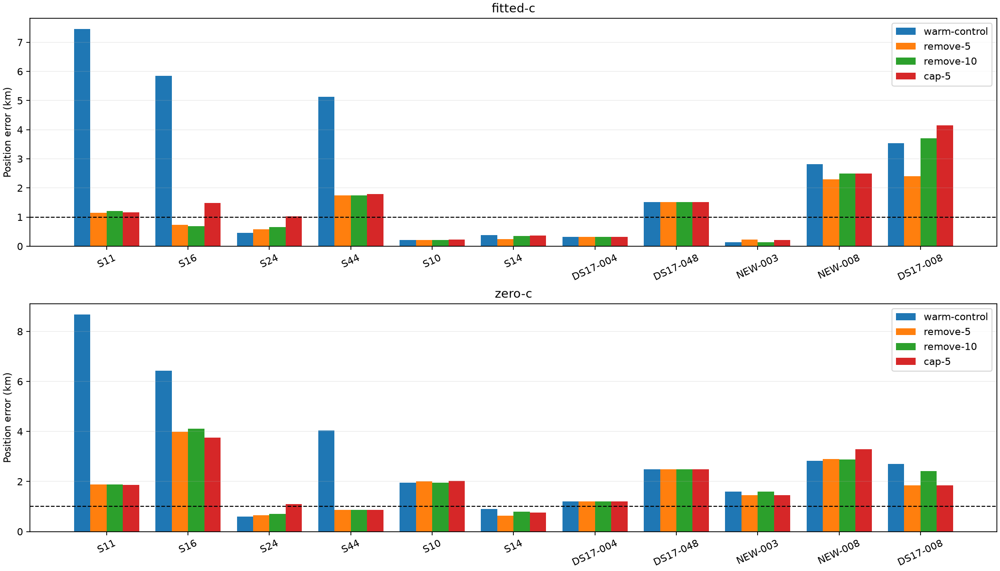

# Iteration 10: timing-consistency interventions on failures and controls

**The timing-outlier diagnosis produces a useful intervention.** Removing
candidates whose fitted relative timing shifts exceed 5 seconds reduces mean
fitted-c error on the 11 predeclared development cases from **2.529 to
1.041 km**, with worst error **7.451→2.409 km**. All fitted-c results converge.
The three diagnosed large failures improve substantially, while some controls
worsen. This selected diagnostic cohort is not a DS16/DS17 population estimate
and does not establish the below-1-km goal. No candidate is deployed.

## Matched experiment

The starting solution is the existing reference-free joint-wide fitted-c fit
(100/50 Hz clock priors). Every policy retains all observations, the original
2-second relative timing prior and hard ±60 Hz/s affine slope bounds. Both
c arms share each policy's candidate bank, starting physical nuisance vector,
smooth-clock seed, priors and 20-second/600-iteration budget.

* **Warm control:** refit the unchanged model from that joint solution.
* **Remove >5 s:** remove candidates with absolute fitted *relative* timing
  shift above 5 seconds, then refit position, timing and clocks.
* **Remove >10 s:** the same rule with a 10-second threshold.
* **Cap ±5 s:** retain all candidates but hard-bound each *total* timing shift
  relative to the unshifted ephemeris to ±5 seconds, instead of ±20 seconds.

Removal thresholds are relative to the fitted common shift; the hard cap is
on common plus relative shift. These are intentionally different interventions.
Candidate removal uses fitted quantities only, never reference error. The
retained candidates' total timing shifts are preserved exactly when projecting
the initial vector into the smaller zero-sum timing basis. Removed-candidate
windows remain in the likelihood and can be assigned to other candidates or
clutter. No windows are deleted to improve the reported fit.

Each policy is evaluated independently. Objectives across changed candidate
banks are not used to choose a per-scan winner. The reference appears only
after fitting to measure error. The six later reserved recordings stay locked.

## Results

| Fitted-c error km | Warm control | Remove >5 s | Remove >10 s | Cap ±5 s |
|---|---:|---:|---:|---:|
| S11 | 7.451 | 1.152 | 1.207 | 1.160 |
| S16 | 5.856 | 0.727 | 0.691 | 1.481 |
| S24 | 0.466 | 0.588 | 0.651 | 1.022 |
| S44 | 5.130 | 1.752 | 1.752 | 1.787 |
| S10 | 0.212 | 0.217 | 0.212 | 0.223 |
| S14 | 0.385 | 0.240 | 0.353 | 0.359 |
| DS17-004 | 0.327 | 0.327 | 0.327 | 0.327 |
| DS17-048 | 1.510 | 1.510 | 1.510 | 1.510 |
| NEW-003 | 0.134 | 0.225 | 0.134 | 0.221 |
| NEW-008 | 2.813 | 2.303 | 2.498 | 2.501 |
| Rescued DS17-008 | 3.537 | 2.409 | 3.699 | 4.141 |
| **All 11 mean** | **2.529** | **1.041** | **1.185** | **1.339** |

The deployed-policy baseline mean on these same cases is 3.232 km, using the
iteration-6 rescued region as DS17-008's baseline. The table does not count
the original catastrophic 152.840-km result as the baseline a second time.

Relative to the warm control, remove-5 improves six fitted-c cases, worsens
three and leaves two unchanged (1-m tolerance). Remove-10 improves five,
worsens two and leaves four unchanged. Cap-5 improves five and worsens four.
The regressions include S24, where the prior diagnostic already showed a
different mechanism, and NEW-003. Removing large-shift candidates is not
universally beneficial.

Removing only the >10-second candidates suffices for the major failures:
S11 removes 51752 and 62444, S16 removes 45673 and 57061, and S44 removes
55469. These overlap the high-impact groups identified without intervention
in iteration 9. This strengthens the causal evidence within these fits;
it still does not independently verify satellite identity or TLE correctness.

## RF ablation, convergence and frequency evidence

| All 11 operational means | Warm control | Remove >5 s | Remove >10 s | Cap ±5 s |
|---|---:|---:|---:|---:|
| Fitted-c position error km | 2.529 | 1.041 | 1.185 | 1.339 |
| Zero-c position error km | 3.039 | 1.811 | 1.901 | 1.879 |
| Fitted-c mean posterior RMS Hz | 90.432 | 85.314 | 85.931 | 85.525 |
| Zero-c fallback count | 0 | 1 | 0 | 1 |

All 88 fits return results. Two zero-c fits on rescued DS17-008 are
nonstationary: remove-5 and cap-5. Their raw errors are 2.092 and 3.327 km,
respectively. The predeclared operational fallback uses that arm's rescued
baseline error, 1.840 km. These numerical failures are neither omitted nor
represented as accepted improvements.

The strict paired comparison uses the same ten other scans in both arms
and all four policies, with every fit stationary. Fitted-c means are
**2.428→0.904/0.933/1.059 km**, and zero-c means are
**3.073→1.808/1.850/1.883 km** (remove-5/remove-10/cap-5).
Mean posterior RMS is **85.814→80.793/80.893/80.542 Hz** fitted-c and
**128.402→125.443/126.084/125.452 Hz** zero-c. The paired ten-scan subset
is supplementary, not a replacement for the all-member result. Posterior
RMS conditions on inferred associations; changing candidate banks can change
that conditioning. It is not an independent measure of localization accuracy.

The warm fitted-c control reproduces its previous joint result to numerical
precision. The warm zero-c control differs from the earlier independently
initialized zero-c experiment (mean 3.039 versus 2.835 km). Using the shared
fitted-c nuisance seed exposes other local minima, especially on S11. The
warm control is therefore essential for attributing intervention effects;
the historical zero-c and deployed baselines are retained separately in
[summary.json](summary.json).

## Evidence, limits and next iteration

`protocol.json` freezes membership, policies, fallback behavior and source
hashes before these outcomes. The runner rechecks those hashes. Four tests
pass under both development and deployed Python: tight timing bounds and
seed projection in both RF arms, invalid-bound rejection, and candidate
removal preserving all observations and retained total timing shifts. Ruff
passes without exclusions. `integrity.json` seals all result documents,
protocols, source, summary and visualization.

The new timing bound is research-only. Existing deployment, bounded numerical
recovery and longest-16 per-track TLE review PNG rendering remain unchanged.
No RF acquisition was launched. These 11 cases were deliberately selected
to test a diagnosed mechanism; their improvement must not be generalized
to the full recording corpus without measurement.

Next, run the same four policies across the remaining DS16 and DS17 development
scans and the remaining consumed newer recordings, reusing these exact 11
results. Compare all 48 DS16, 17 DS17 development and eight newer scans
separately, with rescued DS17-008 as a separate diagnostic. Keep both removal
thresholds and the hard-cap comparator fixed. Do not open the six later
reserved recordings until the broad development results support a single
candidate and its acceptance criteria have been published.
