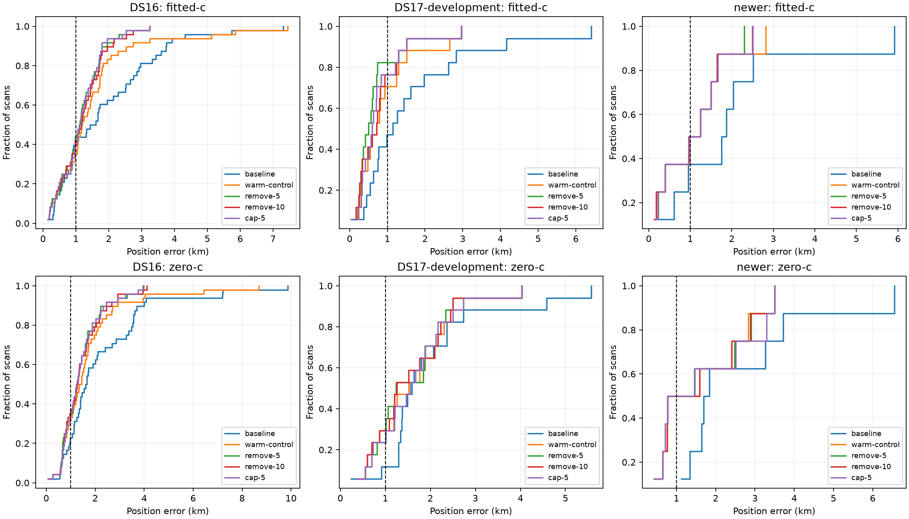

# Iteration 11: full development evaluation of timing-consistency policies

**Select remove-5 for the next evaluation, not deployment.** Removing candidate
satellites whose joint fitted relative timing shift exceeds 5 seconds gives
the lowest fitted-c mean in each development cohort. Against the deployed
baseline, means improve **1.886→1.150 km on DS16**, **1.646→0.695 km on DS17
development**, and **1.982→1.056 km on the eight consumed newer recordings**.
All 74 fitted-c results converge. Significant individual regressions remain.

The mean over all 74 cases is **1.052 km**, including rescued DS17-008.
The below-1-km goal is therefore not met. The 34 previously consumed DS17
validation scans have not received this policy as a complete cohort, and
six later recordings remain reserved. No scientific default is deployed.

## Complete results

Every cohort member is retained. The three policies and shared warm control
are unchanged from iteration 10: joint-wide 100/50 Hz clock priors, 2-second
relative timing prior, ±60 Hz/s affine bounds, all observations, matched
candidate banks and 20-second/600-iteration budgets in both c arms within
each policy. Candidate removal uses fitted relative shifts; cap-5 instead
bounds total shifts. No selection uses reference error. See the
[policy definitions](../2026_10_08_position_error_iter10/README.md).

| Cohort / arm, mean error km | Deployed baseline | Warm joint control | Remove >5 s | Remove >10 s | Cap ±5 s |
|---|---:|---:|---:|---:|---:|
| DS16, all 48, fitted-c | 1.886 | 1.515 | **1.150** | 1.189 | 1.153 |
| DS16, all 48, zero-c | 2.245 | 1.716 | 1.412 | 1.428 | 1.410 |
| DS17 development, all 17, fitted-c | 1.646 | 0.927 | **0.695** | 0.793 | 0.779 |
| DS17 development, all 17, zero-c | 2.000 | 1.628 | 1.577 | 1.562 | 1.632 |
| Newer consumed, all 8, fitted-c | 1.982 | 1.111 | **1.056** | 1.069 | 1.083 |
| Newer consumed, all 8, zero-c | 2.646 | 1.619 | 1.621 | 1.625 | 1.667 |
| Rescued DS17-008, fitted-c | 3.636 | 3.537 | **2.409** | 3.699 | 4.141 |
| Rescued DS17-008, zero-c | 1.840 | 2.698 | 1.840 fallback | 2.410 | 1.840 fallback |

DS17-008's baseline is the iteration-6 region rescue. This experiment does
not count its original 152.840-km estimate as a fresh improvement. Baseline
mean across the 74 evaluated cases is 1.865 km; joint warm control gives
1.364 km and remove-5 gives 1.052 km. The 73 non-diagnostic cases alone give
1.840→1.334→1.034 km. Neither aggregation meets the goal. Dataset-specific
results remain primary because these are different development cohorts.

For remove-5 fitted-c, all-member tail results are:

| Cohort | Baseline p95 → candidate km | Baseline worst → candidate km | Improved / worsened versus baseline |
|---|---:|---:|---:|
| DS16 | 4.186 → 2.256 | 7.314 → 3.244 | 34 / 14 |
| DS17 development | 4.604 → 1.800 | 6.404 → 2.960 | 16 / 1 |
| Newer consumed | 4.721 → 2.072 | 5.912 → 2.303 | 7 / 1 |

DS16's remaining worst case is **S41, 3.244 km**. DS17 development's is
**DS17-051, 2.960 km**. Neither has candidates removed at these thresholds,
so the identified timing-outlier mechanism does not explain every remaining
error. The newer worst case is NEW-008, 2.303 km. Removal does not solve the
residual error in the rescued DS17-008 case either.

Examples of regressions versus the deployed baseline are **S40 0.574→1.708 km**,
**S43 0.149→0.979 km**, **S09 0.329→1.036 km**, and **S04 0.290→0.965 km**.
Some originate in the earlier joint-clock stage, not candidate removal alone.
Compared with the warm joint control, remove-5 improves/worsens 14/10 DS16
scans, 8/2 DS17 development scans and 3/1 newer scans; remaining scans are
unchanged within 1 m. These regressions are not hidden by the improved mean.

## Convergence and controlled RF comparison

The experiment evaluates 592 fits: 88 sealed results reused exactly from
iteration 10 and 504 new fits on the remaining 63 cases. All fitted-c policy
fits converge. Zero-c has four nonstationary policy results: warm-control and
cap-5 on DS17-018, and remove-5 and cap-5 on rescued DS17-008. Each falls back
to its baseline arm in the operational table. The historical joint-wide
comparator also contains a DS17-047 zero-c failure and retains its own
fallback; it is separate from the new warm control.

The strict paired analysis uses the same members with every new policy
converged in both arms: all 48 DS16, 16 DS17 development (excluding DS17-018),
and all eight newer recordings. Rescued DS17-008 has no all-policy pair and
remains in the separate operational diagnostic result.

| Strict paired warm control → remove-5 | Fitted-c mean error km | Zero-c mean error km | Fitted-c mean posterior RMS Hz | Zero-c mean posterior RMS Hz |
|---|---:|---:|---:|---:|
| DS16, 48 | 1.515 → 1.150 | 1.716 → 1.412 | 75.624 → 73.788 | 106.822 → 105.783 |
| DS17 development, 16 | 0.934 → 0.724 | 1.559 → 1.624 | 70.271 → 67.328 | 126.010 → 125.100 |
| Newer consumed, 8 | 1.111 → 1.056 | 1.619 → 1.621 | 80.715 → 80.396 | 130.020 → 129.960 |

The zero-c DS17 paired comparison worsens even though frequency RMS improves;
the all-member operational mean is affected by fallback in the control.
Better in-sample frequency fit is not a localization guarantee. Also, posterior
RMS conditions on inferred associations, which can change with the bank.
Both RF arms share the fitted-c-derived bank and initialization; this is a
controlled conditional c ablation, not two independently searched pipelines.

DS17-018's zero-c warm control fails stationarity, while remove-10 converges
despite removing no candidates. The removal path reprojects timing into the
bank's basis, so numerically tiny differences can affect termination near the
strict threshold. This is not evidence of a physical benefit from an empty
removal. A production implementation should preserve the original vector
exactly for a no-op bank change and qualify any bounded retry separately.

## Evidence and next evaluation

The protocol was pushed as `6f3f0d918` before expansion began. Its hashes bind
the unchanged iteration-10 numerical source and each of the 11 reused result
documents. The expansion redirects only the research output directory; no
sealed result or original analysis publication is overwritten. The summary
records a digest for every source result. Four numerical tests passed in
both development and production Python in iteration 10; the numerical source
remains identical. The summary code passes Ruff. The frozen expansion wrapper
has cosmetic I001/E501 findings; these do not alter the numerical policy.
PNG decoding is verified, and `integrity.json` seals this report and evidence.

Next, evaluate the unchanged remove-5 candidate on the complete set of 34
previously consumed DS17 validation recordings, preserving the rescued region
for DS17-008 and reporting that region-policy distinction explicitly. These
are now development evidence, not untouched validation. Do not tune the
threshold against the six later recordings. End-to-end qualification must
also apply region preservation consistently across the corpus before any
deployment claim; this local-fit study alone does not establish that complete
pipeline behavior.

The next candidate should retain the original joint 100/50 Hz clock prior and
5-second removal threshold, with both RF arms and explicit nonconvergence
fallbacks. After full development qualification, publish its acceptance criteria
before opening the six later recordings. Production bounded numerical recovery
and longest-16 TLE review PNG rendering remain unchanged. No RF acquisition
was launched; the below-1-km goal remains active.
