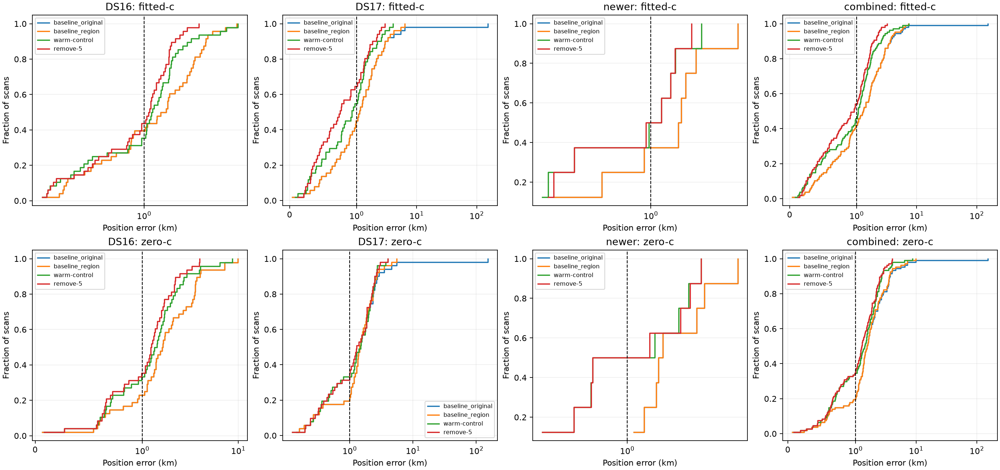

# Iteration 12: complete DS17 and 107-recording development comparison

**The candidate reaches 1.043 km mean over 107 distinct development recordings,
not below 1 km.** Median error is 0.963 km and worst error is 3.244 km. Full
DS17 mean is **0.941 km**, while DS16 remains **1.150 km** and the eight consumed
newer recordings remain **1.056 km**. All fitted-c candidate results converge.
The six later reserved recordings remain unopened. No new model is deployed.

The horizontal axis is linear below 1 km and logarithmic above it, retaining
the roughly 153-km original failure in the plots. The membership audit confirms
107 unique session IDs and 107 unique recording IQ digests from existing
dataset metadata: 48 DS16, all 51 DS17 and eight newer recordings. No raw IQ
collection or rerecording was performed.

## What was evaluated

The remove-5 candidate is unchanged from iterations 10–11: start from the
joint-wide fit with 100/50 Hz clock priors, remove candidates whose fitted
relative timing shifts exceed 5 seconds, then refit with all observations.
Both c arms share the bank, physical nuisance seed, clock seed, priors and
20-second/600-iteration budget. Relative timing remains sigma 2 s; affine
slopes remain hard-bounded at ±60 Hz/s. Selection never uses position error.

This iteration adds 132 fits on the remaining 33 DS17 scans and reuses the
sealed rescued-region DS17-008 result. Together with iteration 11, this covers
the complete DS17 dataset. These 34 scans were originally validation data,
but were consumed in iteration 5; they are **development evidence now**, not
a second fresh validation. No threshold was tuned against their new outcomes.

The loader checks the archived baseline digest and reproduces the previous
joint objective at its saved vector and clock coefficients to within 1e-6
before refitting. This guards against comparing changed inputs or an incorrect
clock baseline. Every returned fit and its source digests are retained.

## Keep the search rescue separate from the timing improvement

Four comparisons are reported:

* **Original baseline:** the deployed bounded-recovery policy, including
  DS17-008's 152.840-km fitted-c error.
* **Region baseline:** replace only that diagnostic case with the iteration-6
  rescued region, reducing it to 3.636 km. Other baselines are unchanged.
* **Warm joint control:** refit the joint-wide clock model from its saved
  fitted-c solution, using the rescued region for DS17-008.
* **Remove-5:** the fixed candidate-removal policy applied after that stage.

| All-member fitted-c mean km | Original baseline | Region baseline | Warm joint control | Remove-5 |
|---|---:|---:|---:|---:|
| DS16, 48 | 1.886 | 1.886 | 1.515 | **1.150** |
| Full DS17, 51 | 4.477 | 1.551 | 1.126 | **0.941** |
| Newer consumed, 8 | 1.982 | 1.982 | 1.111 | **1.056** |
| **Combined, 107** | **3.128** | **1.734** | **1.299** | **1.043** |

The combined 3.128→1.043-km comparison includes both the separate search rescue
and the local-model improvements. It must not be attributed solely to candidate
removal. Relative to the warm joint control, removal improves mean by about
19.7%. The region rescue has only been applied to DS17-008 in this full combined
comparison. A uniform end-to-end region-preservation policy still requires
qualification across the corpus before deployment.

Combined fitted-c median/p95/worst are **0.963/2.306/3.244 km**. Against the
original baseline, 81 scans improve and 26 worsen; against the warm control,
35 improve, 20 worsen and 52 remain unchanged within 1 m. The goal concerns
the mean, so a median below 1 km does not establish success.

## Results on the 34 previously consumed DS17 scans

Their fitted-c mean improves **1.225→1.064 km** versus the warm joint control,
with p95 **2.912→2.274 km** and worst **4.053→2.575 km**. Ten improve, seven
worsen and 17 remain unchanged. DS17-032 improves **4.053→1.107 km**, and
DS17-012 improves **1.074→0.439 km**. DS17-009 worsens **1.123→1.371 km** and
DS17-021 worsens **1.357→1.653 km**. All remain in the aggregates.

The full DS17 fitted-c p95/worst are **2.305/2.960 km**, with DS17-051 still
the worst. DS16 S41 remains the combined worst at 3.244 km. Neither is changed
by remove-5 because its initial candidate bank contains no timing shifts above
the removal threshold. This mechanism therefore cannot remove all residual
position error by itself.

## Matched c ablation and numerical failures

| Operational mean error km | Warm fitted-c | Remove-5 fitted-c | Warm zero-c | Remove-5 zero-c |
|---|---:|---:|---:|---:|
| Full DS17, 51 | 1.126 | 0.941 | 1.534 | 1.485 |
| Combined, 107 | 1.299 | 1.043 | 1.622 | 1.463 |

All fitted-c fits converge. Zero-c warm controls fail stationarity on
DS17-018 and DS17-032; remove-5 fails on rescued DS17-008. Each operational
result falls back to its corresponding baseline arm, using the rescued-region
baseline for DS17-008. No failure is dropped or retrospectively retried here.

The strict paired comparison uses the same 104 recordings in both arms and
both new policies, excluding those three cases only from this supplementary
analysis. Fitted-c mean improves **1.256→1.037 km**, while zero-c improves
**1.612→1.450 km**. Mean posterior frequency RMS changes **72.927→71.204 Hz**
fitted-c and **116.368→115.673 Hz** zero-c. The much smaller frequency-fit change
must be distinguished from localization gains; RMS also conditions on inferred
associations. This is a conditional RF ablation with matched banks, not two
independently searched pipelines. Full paired and fallback-inclusive results
are in [summary.json](summary.json).

## Decision and next work

Keep remove-5 as the development candidate and preserve its fixed threshold.
The experiment's source and protocol were pushed as `d1dcebe7a` before these
outcomes. Numerical source is identical to the iteration-10 implementation,
whose four tests passed under both Python environments. The new adapter and
summary pass Ruff; all 33 new baseline digest and objective-reproduction checks
pass. Reused artifacts remain hash-bound, figures decode as PNGs, and
`integrity.json` seals the report, source and results.

The next controlled experiment should test **clock-prior strength after
candidate removal**, holding the pruned bank fixed. Earlier loose-prior tests
were confounded by the same high-impact candidates now removed; they cannot
answer this interaction question. Compare the existing 100/50 Hz prior with
200/100 and 400/200 Hz, with a shared post-removal start and both c arms. Keep
all 107 development recordings and convergence fallbacks. Do not select a
different prior per scan using known error, and do not open the six later
recordings during tuning.

End-to-end search qualification, fresh validation and deployment verification
are still required. Production bounded numerical recovery, fitted-c default
and longest-16 per-track TLE review PNG rendering remain unchanged. The active
below-1-km mean goal is not complete.
