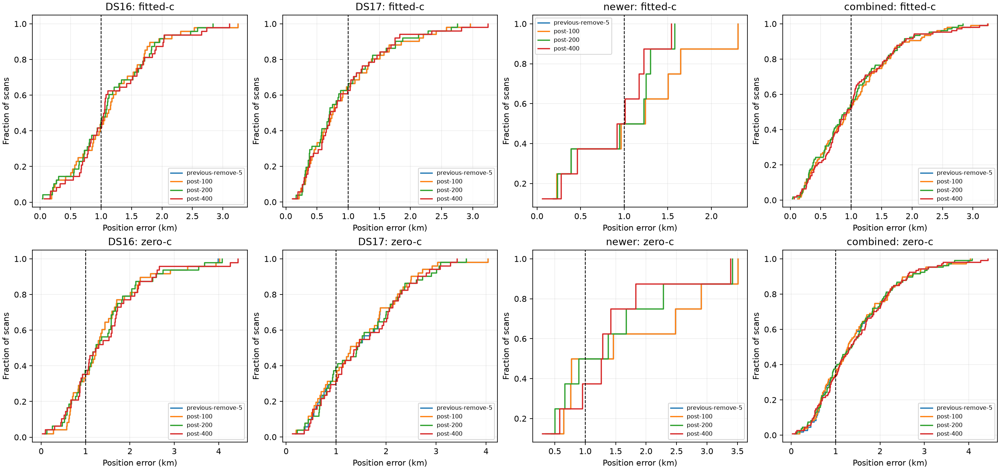

# Iteration 13: clock-prior strength after timing-based candidate removal

**The best tested fixed prior reaches 1.004952 km mean over all 107 development
recordings, narrowly missing the below-1-km target.** The 200/100 Hz setting
improves mean by 3.67% from 1.043199 km, and reduces worst error from 3.244 to
2.835 km. None passes the predeclared gate. No new model is deployed and no
reserved recording outcomes were opened.

## Controlled experiment

Iteration 12 used a joint clock/position fit followed by removing satellite
candidates whose fitted relative timing offsets exceeded 5 seconds. That left
a fixed, pruned candidate bank for each scan. Here we hold that bank and all
observations fixed and compare three smooth-clock regularization settings:

| Name | Clock knot scale | Clock curvature scale |
|---|---:|---:|
| post-100 | 100 Hz | 50 Hz |
| post-200 | 200 Hz | 100 Hz |
| post-400 | 400 Hz | 200 Hz |

These are Gaussian penalty scales for the gauge-fixed smooth receiver clock
model, not receiver affine slope bounds. The affine slopes remain bounded at
±60 Hz/s; relative timing sigma remains 2 seconds. Every new fit starts from
the same saved post-removal fitted-c physical vector and clock coefficients.
Both c arms use identical observations, candidate banks, priors and
20-second/600-iteration budgets. No further candidates are removed. This is
a conditional RF ablation, not independent candidate searches for each arm.

The input bindings and protocol were published in `8c3b259c9` before outcomes.
There are 48 DS16, 51 DS17 and eight consumed newer recordings: 107 distinct
sessions and IQ hashes, as audited in iteration 12. All are development data;
the original DS17 validation set was consumed in iteration 5.

Each scan's prior result digest is checked. The 100/50 Hz model must reproduce
the saved objective within 1e-6 before any fit. A nonstationary fit falls back
to the previous remove-5 result if it converged, otherwise its corresponding
pre-removal baseline. DS17-008 uses the separately rescued region baseline.
No failure is dropped or accepted because its position error looks favorable.

## Full-cohort position results

| Fitted-c mean error, km | Previous remove-5 | post-100 | post-200 | post-400 |
|---|---:|---:|---:|---:|
| DS16, 48 | 1.149654 | 1.149654 | **1.132295** | 1.181058 |
| DS17, 51 | 0.941063 | 0.941063 | **0.903526** | 0.930843 |
| Newer consumed, 8 | 1.055587 | 1.055587 | 0.887485 | **0.831817** |
| **Combined, 107** | **1.043199** | **1.043199** | **1.004952** | **1.035685** |

| Combined fitted-c metric | Previous | post-200 | post-400 |
|---|---:|---:|---:|
| p95 error, km | 2.305954 | **2.234540** | 2.246009 |
| Worst error, km | 3.244427 | **2.835493** | 3.239861 |
| Worst scan | S41 | S41 | DS17-008 |
| Converged new fits | 107/107 | 106/107 | 105/107 |
| Improved / worsened versus previous, >1 m | — | 55 / 51 | 53 / 52 |

The unchanged post-100 fitted-c rerun reproduces the previous positions to
numerical precision. Post-200 helps all three cohort means but still leaves
DS16 above 1 km. Post-400 fits frequencies more closely, yet gives worse
pooled position accuracy than post-200. Increasing clock flexibility alone
does not reliably improve localization.

Examples relative to previous remove-5:

| Scan | Previous km | post-200 km | post-400 km |
|---|---:|---:|---:|
| NEW-008 | 2.303 | 1.249 | 1.010 |
| DS17-051 | 2.960 | 2.127 | 1.747 |
| DS17-032 | 1.107 | 0.300 | 1.028 |
| S41 | 3.244 | 2.835 | 2.732 |
| S33 | 2.307 | 2.470 | 3.107 |
| DS17-008 | 2.409 | 2.655 | 3.240 |
| DS17-041 | 0.319 | 0.695 | 0.790 |

These are diagnostics, not a rule to choose different settings per scan.
Known reference positions never enter fitting or operational selection.

## Matched c ablation and numerical behavior

| Combined metric, including fallback | Previous | post-100 | post-200 | post-400 |
|---|---:|---:|---:|---:|
| Fitted-c mean position error, km | 1.043199 | 1.043199 | 1.004952 | 1.035685 |
| Zero-c mean position error, km | 1.462648 | 1.452788 | 1.457139 | 1.481401 |
| Fitted-c mean posterior frequency RMS, Hz | 71.588 | 71.588 | 69.952 | 69.575 |
| Zero-c mean posterior frequency RMS, Hz | 116.592 | 116.588 | 114.912 | 114.412 |

RMS is a frequency-fit metric conditional on inferred associations, not a
substitute for localization accuracy. Objectives under different prior
strengths are not used to select per-scan winners. In particular, post-400
reduces RMS in both arms while worsening position accuracy versus post-200.

Fitted-c post-200 fails stationarity on DS17-020; post-400 fails on S15 and
S23. They use the frozen previous-result fallback. Zero-c post-100 fails on
DS17-008, DS17-030, DS17-038, DS17-046 and S06; post-200 fails on DS17-046;
post-400 converges everywhere. Previous remove-5 zero-c already failed on
DS17-008, so its fallback remains the rescued baseline when needed.

Zero-c post-100 is not an exact rerun of the previous zero-c path: both new
arms deliberately share the post-removal **fitted-c** seed and clock state.
Its small changes therefore do not establish a prior-strength benefit.

The supplementary strict paired comparison retains the same 99 scans that
converge in both arms under all four reported policies. Previous → post-200
fitted-c mean is **1.047089 → 1.004051 km**, with RMS **71.314 → 69.726 Hz**.
Zero-c mean is **1.465228 → 1.458179 km**, with RMS **116.231 → 114.571 Hz**.
The eight excluded labels and all fallback-inclusive results are retained in
[summary.json](summary.json). The primary result remains all 107 scans.

## Decision and validation status

The frozen gates required mean below 1 km, no cohort mean regression beyond
5%, p95 and worst within 10% of previous, and fitted-c convergence at least
95%. **Every variant fails the mean gate; all other gates pass.** The prescribed
development choice is therefore null. We do not round 1.004952 down and call
the goal achieved or select a new threshold retrospectively.

The uniform additive search-region audit is underway in iteration 14. It
retains original finalists and adds separated-region finalists, selecting by
the unchanged hard60 score. Any changed fitted region requires fresh
downstream clock and pruning fits before claiming end-to-end accuracy.
Iteration 13 still uses the separate DS17-008 rescue from iteration 6.

The six later recordings remain unopened. Their existing reservation is
chronological, not a randomized holdout; it must not be relabeled as randomized
validation. Repository rules require future scientific validation to use
reproducible random assignments of whole independent groups, with the seed
and assignments recorded before outcomes and preprocessing fitted on training
data. Any later-cohort result must retain its actual sampling description.

All 107 input digest and objective reproduction checks completed. The
numerical fitter is unchanged from iteration 10, where four tests passed in
both environments. Current experiment and summary scripts pass Ruff. The
summary requires all 107 members; its aggregates were independently checked,
and the PNG was decoded. [integrity.json](integrity.json) seals sources,
protocol, all 107 result files, summary and figure.

Production bounded numerical recovery, fitted-c default, and longest-16
per-track TLE review PNG rendering remain unchanged. The active mean-error
goal is not complete.
