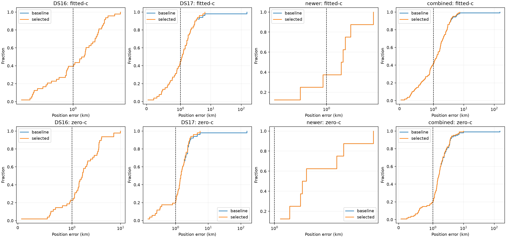

# Iteration 14: preserve distinct search regions across all 107 recordings

**The uniform additive policy rescues DS17-008 from 152.840 to 3.636 km
fitted-c error without changing any other selected position.** The zero-c
rescue is 151.707 to 1.840 km, also with no other changes. All 107 cases are
complete. The selected regional inputs exactly match the archived inputs of
the later joint-clock/pruning experiments; no additional downstream refits
are required for this qualification.

The axis is linear below 1 km and logarithmic above it, retaining the original
catastrophic failure. These are regional hard60 results **before** the later
joint-clock and candidate-pruning stages, not their final accuracy.

## Fixed policy and budget

The protocol was published as `b4b2da20c` before the new runs. It applies the
iteration-6 policy uniformly to 48 DS16, 51 DS17 and eight consumed newer
recordings. Nineteen sealed iteration-6 region experiments are reused with
file-digest checks, and 88 new cases run the same procedure.

Each case retains its original hard60 finalists, produced with 12.5-km basin
separation, and adds finalists from a run with 25-km basin separation. The
ordered 400-point grid, including its coordinates and spacings, is identical.
Each run uses three ordinary basins and the unchanged bounded-recovery policy.
The union spends extra calibration/final-fit work; this is **not** a claim of
equal total compute to the original three-basin pipeline.

Selection is independent for each c arm: accept an additional finalist only
if it converges and has a strictly lower unchanged `selection_score`.
Keep the original on ties or failed additional fits. Reference position never
enters sampling, finalist selection or this decision. Observations, physical
priors and grid budgets are matched between c arms; regional calibration and
candidate generation retain the existing pipeline behavior.

Original cache stages are reused only where their inputs are unchanged;
recovery bookkeeping is not borrowed. New region-specific stages run under
isolated, input-bound checkpoints. All 88 new candidate document digests and
grid receipts are verified, alongside the 19 reused sealed experiments.

## Full-cohort regional accuracy

| Mean position error, km | Original fitted-c | Additive fitted-c | Original zero-c | Additive zero-c |
|---|---:|---:|---:|---:|
| DS16, 48 | 1.885733 | 1.885733 | 2.245378 | 2.245378 |
| DS17, 51 | 4.477043 | 1.551480 | 4.585465 | 1.646902 |
| Consumed newer, 8 | 1.981859 | 1.981859 | 2.645944 | 2.645944 |
| **Combined, 107** | **3.128030** | **1.733603** | **3.390695** | **1.990072** |

In each arm, one scan improves, none worsens, and 106 remain exactly unchanged.
All accepted regional results converge. Combined fitted-c p95 falls from
5.095 to 4.274 km; worst error falls from 152.840 to 7.314 km (S24). Zero-c
p95 falls from 5.272 to 4.429 km; worst error becomes 9.870 km (S11).

DS17-008's fitted-c selection score improves **33401.492 → 33121.703**.
Its posterior frequency RMS actually worsens **137.273 → 144.313 Hz**, while
position improves sharply. Zero-c score improves **33890.637 → 33490.548**
and RMS improves **156.993 → 149.431 Hz**. Score, posterior frequency RMS
and localization accuracy are distinct quantities; RMS alone would not have
identified this fitted-c rescue.

Across all 107 cases, mean fitted-c RMS is 86.321 → 86.386 Hz and zero-c RMS
is 126.371 → 126.301 Hz. These tiny pooled RMS differences coexist with a
large accuracy gain because the catastrophic position failure is rare.

## Why retaining the original finalists matters

Changing separation and discarding the old finalists would introduce serious
regressions. The additive score comparison rejects these examples:

| Fitted-c case | Original error km | Additional-run error km | Original score | Additional score |
|---|---:|---:|---:|---:|
| DS17-012 | 3.341 | 33.983 | 38639.055 | 41932.037 |
| S11 | 4.326 | 12.994 | 25718.535 | 26873.309 |
| S19 | 0.724 | 5.321 | 42659.566 | 43209.520 |

This supports an additive final-fit policy rather than replacing the original
basins. It does not prove 25-km separation is optimal for every search geometry
or that added regions can never produce a lower-score, less-accurate solution.

## Downstream reuse audit

[downstream-audit.json](downstream-audit.json) compares both selected regional
arm records against the exact archived baseline arm records carried into
iteration 13. All 107 match, including DS17-008, whose iteration-6 rescue was
already used in those experiments. There are **zero newly changed fitted-c
inputs and zero changed zero-c fallback baselines relative to those runs**.
The other source and observation bindings remain in the frozen protocols.

Consequently, the previously reported 107-scan remove-5 mean of **1.043199 km**
and post-200 mean of **1.004952 km** are compatible with this uniformly applied
regional selection policy. This is a staged replay qualification with verified
reuse, **not a cold execution of a newly integrated end-to-end pipeline**.
It does not add another accuracy gain to those means: the DS17-008 rescue was
already included in them. Neither result satisfies the below-1-km goal.

## Decision and remaining work

The development evidence supports preserving original finalists and adding
separated-region finalists as the search policy for the next integrated
candidate. The numerical selection implementation is unchanged from the
tested iteration-6 policy. Current wrappers, selectors and summary pass Ruff;
full-cohort score monotonicity, convergence and input-equality assertions pass.
The PNG decodes and `integrity.json` seals report files, result documents and
receipts. Resumable compute checkpoints are excluded from publication.

All DS16/DS17/newer cases in this experiment are consumed development data.
The six reserved later outcomes remain unopened. Fresh qualification and cold
pipeline execution are still required before promoting a new scientific model.
The independent density-weighting experiment in iteration 17 remains underway.

Production bounded numerical recovery, fitted-c default and longest-16
per-track TLE review PNG rendering remain unchanged. No RF collection was
started and QNAP remained read-only.

