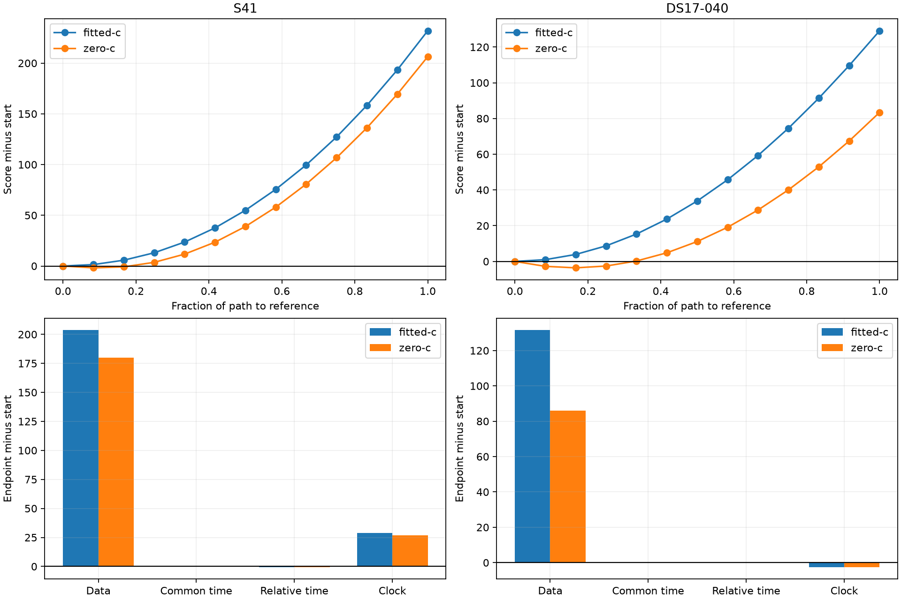

# Iteration 15: why the remaining worst fits prefer the wrong position

**The two largest post-200 development errors persist because the evaluated
model prefers their wrong positions along a converged path to the reference.**
S41 remains 2.835 km wrong and DS17-040 remains 2.754 km wrong. Releasing
position after fitting at the reference returns to those same solutions.
This supports investigating the frequency evidence rather than simply adding
optimizer iterations. It is conditional evidence, not proof of a global minimum.

## Frozen diagnostic

The protocol and runner were published as `b147302b6` before execution. We
selected the two largest fitted-c errors from iteration 13's fixed post-200
policy, retaining its candidate banks, observations, 200/100 Hz smooth-clock
priors, 2-second relative timing prior, and ±60 Hz/s affine slope bounds.

At each of 12 steps of at most 250 metres toward the reference, position is
fixed and nuisance parameters are optimized. Both c arms share the initial
fitted-c physical and clock seed, the same path, and the same per-fit budget
of 20 seconds/600 iterations. Up to two same-point warm retries are allowed
only after failed stationarity. Every attempt is retained. A final free-position
fit starts from the converged reference endpoint.

**Reference positions are used only for this diagnostic. None of these paths
or reference-initialized estimates is an operational solution or included as
an accuracy improvement.** No new RF collection or production change occurs.

All four paths complete. S41 requires no retries in either arm. DS17-040
requires one zero-c retry and no fitted-c retry. The numerical source is the
unchanged iteration-9 fixed-position fitter; three existing profile tests pass.
Each reconstructed model reproduces its saved post-200 objective within 1e-6.

## Where the score difference comes from

Positive values mean the reference endpoint scores worse than the selected
starting position after nuisance refitting. Lower objective is better.

| Case and arm | Frequency data NLL | Common timing | Relative timing | Clock prior | Total |
|---|---:|---:|---:|---:|---:|
| S41 fitted-c | +203.627 | +0.000 | −0.695 | +29.000 | **+231.933** |
| S41 zero-c | +180.071 | +0.000 | −0.676 | +27.006 | **+206.402** |
| DS17-040 fitted-c | +131.554 | −0.013 | +0.078 | −2.490 | **+129.129** |
| DS17-040 zero-c | +86.014 | −0.012 | +0.070 | −2.619 | **+83.453** |

The fitted-c objective increases at every step toward the reference in both
cases. At S41, the clock prior reinforces the wrong preference but the data
term contributes most of the difference. At DS17-040, the clock prior slightly
favors the reference and the data term still dominates. Neither is primarily
a timing-penalty problem.

After releasing position, fitted-c returns to **2.835493 km** on S41 and
**2.754123 km** on DS17-040, matching the original post-200 errors. Zero-c
releases converge to 3.677600 and 2.375085 km respectively. The latter results
are diagnostic nuisance paths, not fresh zero-c pipeline comparisons; the
matched operational ablation remains iteration 13.

## Which observations drive the preference

We assign each window to its highest-responsibility satellite at the starting
fitted-c solution, using group 0 when maximum responsibility is below 0.5.
These groups are fixed during attribution. Their likelihood contributions
are still evaluated under the full mixture, so they are conditional observation
groups, not confirmed satellite identities or isolated satellite likelihoods.

| Case | Inferred group | Windows | Starting relative shift, s | Reference-minus-start data NLL |
|---|---:|---:|---:|---:|
| S41 | 67908 | 328 | −0.592 | +143.647 |
| S41 | 65908 | 109 | +0.608 | +111.840 |
| DS17-040 | 63860 | 135 | +0.110 | +142.981 |
| DS17-040 | 63870 | 314 | +0.279 | +29.242 |

Other groups partly offset these contributions, explaining why their sums can
exceed the net data difference. The leading groups have timing shifts well
inside the 5-second removal threshold. The timing-based rule that fixed earlier
outliers therefore cannot identify these remaining groups merely by making
the same check again.

This does **not** establish that those satellites have bad TLEs, that their
identifications are correct, or that removing them would generalize. The next
diagnostic should inspect their frequency residuals over time, receiver and RF
channel, and measure repeated/correlated evidence within tracks. Plausible
explanations include persistent frequency bias, incorrect associations and
overcounting correlated windows. Any proposed weighting or nuisance model
must be selected without reference error and tested with matched zero-c and
fitted-c arms across the full development corpus.

## Interpretation and remaining work

More optimizer budget on this same model is unlikely to fix these two
particular fitted-c errors: the reference-directed fits converge and return to
the existing solution when released. Other remote or nuisance minima have
not been exhaustively ruled out. The uniform search-region audit in iteration
14 remains independently underway; this diagnostic does not replace it.

No mean-error improvement is claimed in this iteration. The best tested fixed
post-pruning prior still gives **1.004952 km** development mean across 107
recordings and fails the below-1-km gate. Reserved newer recordings remain
unopened, and production bounded recovery, fitted-c default and longest-16
TLE review PNG behavior remain unchanged.

The runner and summary pass Ruff. All four profile paths, the one failed
attempt followed by retry, and released fits are included in `results/`.
Score decompositions and grouped deltas are in [summary.json](summary.json).
[integrity.json](integrity.json) seals sources, protocol, results and figure.
