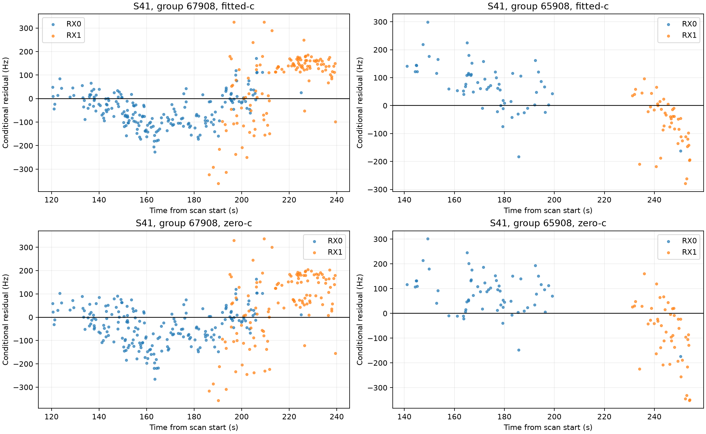
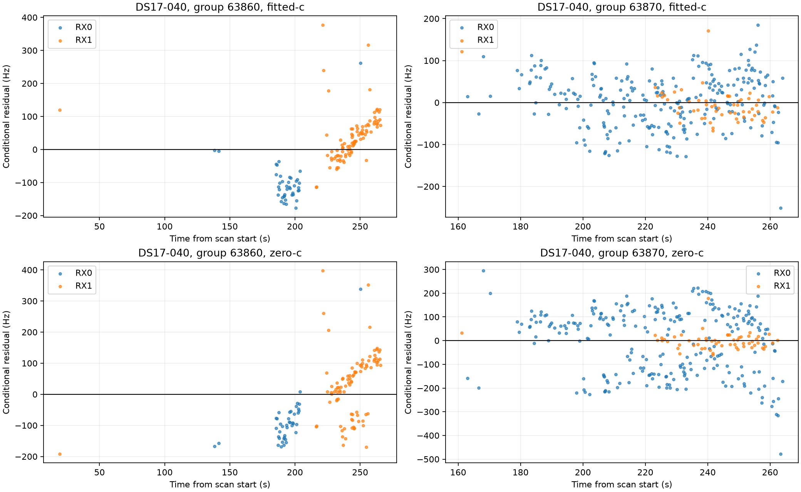

# Iteration 16: structured residuals in the remaining influential groups

**The leading groups contain receiver disagreements and serially correlated
frequency residuals.** Near-zero pooled mean residuals conceal offsets of
opposite sign on the two receivers. This motivates testing how repeated
evidence is weighted, but does not establish a hardware fault or a new
localization improvement.

## Method and scope

This is a read-only diagnostic of the saved post-200 fits from iteration 13.
There are no new optimization runs, candidate removals or reference-assisted
estimates. The model is reconstructed with identical observations, candidate
banks, receiver baseline and 200/100 Hz smooth-clock priors. Its objective
must reproduce each saved fitted-c and zero-c result within 1e-6.

Window groups are frozen from the fitted-c maximum-responsibility assignment,
with group 0 for maximum responsibility below 0.5. Both c arms use those same
groups. Residuals are measured minus prediction for that assigned component;
they are unweighted descriptive statistics, not posterior-weighted pipeline
RMS. The four displayed groups were identified by the reference-profile
attribution in iteration 15, so this is explicitly selected-case diagnosis,
not independent validation or evidence of corpus-wide prevalence.

Adjacent residual pairs are formed only within the same receiver, channel
and inferred satellite group, with positive time gaps at most two seconds.
Pearson correlation is reported only with at least ten pairs. Pairs can share
observations and are not independent replicates. Pooled correlation can also
be inflated by differences between channel means; no independent-sample
significance or effective-sample-size claim is made.

## Fitted-c observations

| Case / inferred group | Windows | Pooled mean Hz | RX0 mean Hz | RX1 mean Hz | RX0 adjacent correlation | RX1 adjacent correlation |
|---|---:|---:|---:|---:|---:|---:|
| S41 / 67908 | 328 | −6.24 | −48.33 | +64.85 | 0.677 | 0.344 |
| S41 / 65908 | 109 | +13.04 | +70.64 | −62.93 | 0.455 | 0.344 |
| DS17-040 / 63860 | 135 | −3.64 | −99.91 | +38.35 | 0.174 | 0.583 |
| DS17-040 / 63870 | 314 | +2.20 | +3.93 | −5.44 | 0.580 | −0.097 |

The correlations above use respectively 197/110, 48/37, 37/84 and 239/54
RX0/RX1 adjacent pairs. Median same-receiver/channel sampling gaps range from
about 0.42 to 0.89 seconds. Receiver observation time ranges differ, so their
mean differences are not simultaneous clock-difference measurements.

Both receivers already have jointly fitted affine and smooth clock terms.
The surviving patterns may reflect remaining receiver/RF calibration effects,
association mistakes, correlated estimation errors or other model mismatch.
The data do not identify which mechanism is responsible. A single shared
satellite frequency offset cannot directly represent opposite receiver
offsets at the same time, though the different observation times make that
an incomplete explanation of these particular means.

## Matched c diagnostic

| Case / group | Zero-c RX0 mean Hz | Zero-c RX1 mean Hz | Zero-c RX0 correlation | Zero-c RX1 correlation |
|---|---:|---:|---:|---:|
| S41 / 67908 | −38.20 | +53.71 | 0.742 | 0.380 |
| S41 / 65908 | +79.70 | −82.38 | 0.421 | 0.608 |
| DS17-040 / 63860 | −89.31 | +31.89 | 0.477 | 0.795 |
| DS17-040 / 63870 | −1.69 | −2.07 | 0.905 | −0.153 |

Fitting c reduces the large RX0 serial structure in DS17-040 group 63870,
but it does not remove all structured residuals. Neither table establishes
better position accuracy by itself. The operational mean comparison remains
iteration 13: fitted-c 1.004952 km versus zero-c 1.457139 km over all 107
development recordings for post-200, including predeclared fallbacks.

## Next test

Test fixed density weights after candidate pruning, using five-second bins
within inferred satellite, receiver and channel. Compare a mild inverse
square-root count weight and an inverse count weight against unchanged
weights. Normalize total weight to the original observation count, so this
does not merely weaken the whole likelihood relative to timing/clock priors.
Freeze groups and weights from the same fitted-c seed for both c arms, retain
every observation, and leave priors, banks and budgets matched. Group 0 must
have an explicitly documented treatment rather than being silently dropped.

This is a hypothesis about unequal repeated evidence, not a calibrated
covariance model. Normalization can increase the influence of sparse noisy
groups, so regressions are a real possibility. Test all 107 development scans,
not just these two; keep nonstationary-fit fallbacks and report frequency
fit separately from position. Do not choose weights per scan from reference
error or use the reference-attributed group IDs as a removal list.

The uniform search-region audit remains underway. Reserved newer outcomes
remain unopened. No production code or deployed PNG behavior changed. The
mean-error goal is still unmet.

The diagnostic passes Ruff, all four saved objectives reproduce, and both
PNGs decode. Per-window residuals, group statistics, receiver/channel/time
metadata and source digests are retained in `results/`; `integrity.json`
seals this report and its artifacts.
