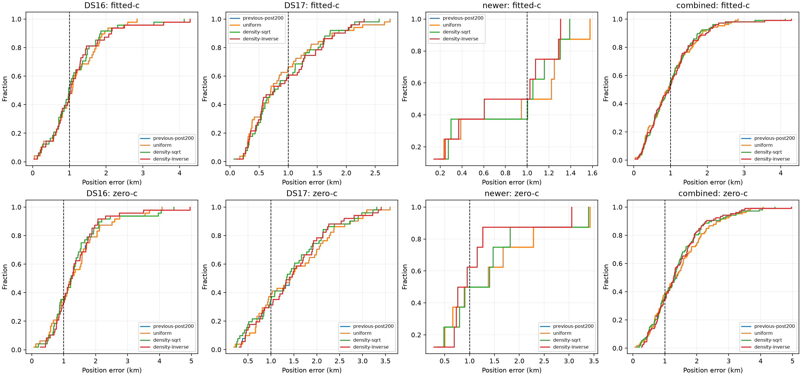

# Iteration 17: density weighting fails the full-corpus acceptance gates

**Reject both density-weighting variants.** Across all 107 development scans,
fitted-c mean error worsens from **1.004952 km** to **1.012704 km** with mild
weighting and **1.025073 km** with strong weighting. Worst error rises from
2.835 km to 4.122 and 4.285 km. Improvements on the diagnostic failures do
not generalize sufficiently across the corpus.

## Frozen experiment

The runner, numerical prototype, tests and protocol were published as
`1e6646666` before outcomes. Each scan starts from its converged post-200
fitted-c state; DS17-020 uses its predeclared previous remove-5 fallback.
Satellite groups are fixed from that seed's maximum posterior responsibility,
with group 0 when maximum responsibility is below 0.5.

Five-second bins are formed within inferred satellite, receiver and RF
channel. Compare uniform weight, inverse-square-root bin count, and inverse
bin count. Group 0 retains weight one before normalization. All weights are
then normalized to sum to the original number of observations. Every
observation remains; this changes relative evidence weighting rather than
uniformly weakening the likelihood against its priors.

Both c arms share observations, candidate bank, groups, weights, physical seed,
clock seed, 200/100 Hz smooth-clock priors, 2-second relative timing prior,
hard ±60 Hz/s affine slope bounds and 20-second/600-iteration fit budgets.
This is a conditional RF ablation, not independent candidate searches.
No reference position enters grouping, weighting or fitting. No per-scan
choice is made using known position error or cross-model objective values.

The 107 members are the same 48 DS16, 51 DS17 and eight consumed newer scans.
All are development data. No reserved newer outcomes are used.

## Full-cohort position results

| Fitted-c mean km | Previous post-200 | Uniform rerun | Mild weighting | Strong weighting |
|---|---:|---:|---:|---:|
| DS16, 48 | 1.132295 | 1.132295 | 1.129102 | 1.159511 |
| DS17, 51 | 0.903526 | 0.903526 | 0.930923 | 0.940770 |
| Consumed newer, 8 | 0.887485 | 0.887485 | 0.835667 | 0.755873 |
| **Combined, 107** | **1.004952** | **1.004952** | **1.012704** | **1.025073** |

| Combined fitted-c metric | Previous | Mild | Strong |
|---|---:|---:|---:|
| p95 error, km | 2.234540 | 2.128640 | 2.155223 |
| Worst error, km | 2.835493 | 4.122070 | 4.284937 |
| Worst scan | S41 | S37 | S33 |
| Improved / worsened, >1 m | — | 64 / 43 | 61 / 46 |

Both weighting variants converge on all 107 fitted-c cases. Improving more
scans than they worsen is insufficient: the sizes of regressions increase
the mean and worst error. The newer eight-scan improvement alone would give
a misleading impression of overall success.

| Selected case, fitted-c km | Previous | Mild | Strong |
|---|---:|---:|---:|
| DS17-008 | 2.655 | 2.048 | 1.759 |
| DS17-040 | 2.754 | 2.565 | 2.308 |
| S41 | 2.835 | 2.305 | 2.071 |
| S03 | 1.682 | 0.572 | 0.032 |
| DS17-034 | 0.414 | 1.295 | 2.226 |
| S33 | 2.470 | 3.292 | 4.285 |
| S37 | 2.581 | 4.122 | 3.559 |
| S11 | 1.067 | 1.709 | 2.144 |

The intended diagnostic cases improve, but those improvements do not justify
choosing a weighting strength per scan after seeing reference errors.

## Matched c ablation and frequency fit

| Combined metric, fallback-inclusive | Previous | Uniform | Mild | Strong |
|---|---:|---:|---:|---:|
| Fitted-c mean position error, km | 1.004952 | 1.004952 | 1.012704 | 1.025073 |
| Zero-c mean position error, km | 1.457139 | 1.455733 | 1.400604 | 1.401602 |
| Fitted-c posterior RMS, Hz | 69.952 | 69.952 | 71.120 | 73.682 |
| Zero-c posterior RMS, Hz | 114.912 | 114.875 | 116.911 | 121.018 |

RMS uses the original unweighted posterior-responsibility convention, so it
remains a separate descriptive frequency metric under changed fitting weights.
Zero-c average position improves despite its RMS worsening. Fitted-c remains
more accurate than zero-c, but neither new fitted-c rule improves the primary
mean. A changed likelihood value is not evidence of better position accuracy.

Every nonstationary new fit falls back to that arm's previous post-200
operational result, including its frozen earlier fallback when applicable.
Uniform fitted-c fails on DS17-020. Uniform zero-c fails on DS17-041; mild
zero-c fails on DS17-036 and S17; strong zero-c fails on DS17-024. No failed
fit is dropped or accepted for its favorable raw position error.

Uniform fitted-c reproduces previous positions to numerical precision.
Uniform zero-c starts from the new shared fitted-c seed, so small nuisance
path and convergence differences from the previous zero-c fit are expected;
they are not a density-weighting benefit.

The supplementary strict comparison retains 101 scans stationary in both
arms for all reported policies, including the previous policy. Previous →
mild → strong fitted-c means are **1.019325 → 1.025917 → 1.036027 km**;
zero-c means are **1.470643 → 1.417249 → 1.406782 km**. The six excluded labels
and all fallback-inclusive results are in [summary.json](summary.json).
The primary comparison remains all 107 scans.

## Decision and next investigation

All variants fail the frozen mean-below-1-km gate. Both weighting variants
also fail the worst-error gate, which allowed at most a 10% increase over
2.835493 km. Cohort-mean, p95 and convergence gates pass. The prescribed
development choice is therefore **null**. No weighting rule is deployed.

Iteration 16 established conditional residual structure, but these results
show that density alone is not a sufficient estimate of unreliable evidence.
The rules can also increase sparse or clutter-group influence after global
normalization. The next diagnostic should inspect residual structure by
receiver and RF channel to distinguish remaining calibration effects from
satellite-group effects before choosing another nuisance model. It should
not simply tune bin widths until this development mean crosses 1 km.

Three numerical tests pass in development and production Python: uniform
objective/gradient equivalence, finite-difference physical and clock gradients,
and density normalization with receiver separation. Current scripts pass
Ruff. All source bindings and input objective assertions pass; full-cohort
means were independently verified and the PNG decodes. `integrity.json`
seals the source, protocol, all 107 results, summary and figure.

The additive-region qualification in iteration 14 is complete and compatible
with these inputs. The six earlier reserved recordings and the new randomized
two-development/four-validation split in iteration 18 remain unopened.
Production bounded recovery, fitted-c default and longest-16 per-track TLE
review PNG rendering remain unchanged. The active mean-error goal is unmet.
