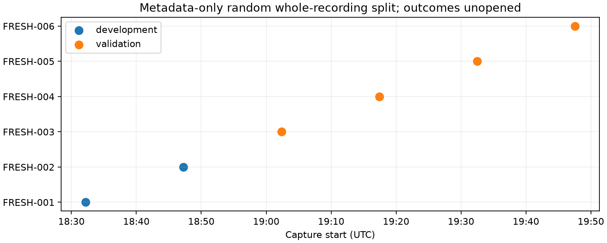

# Iteration 18: reserve a fresh randomized recording split

**Six newer published recordings are reserved without opening analysis
outcomes: two development and four validation.** Evaluation is pending;
this report claims no position accuracy or model improvement.

Membership includes every published recording starting in the fixed UTC
window **2026-10-08 [18:30, 20:00)** and finalized before its endpoint.
There is no localization, capture-quality or analysis-readiness admission
gate. The metadata-only reader verifies distinct IQ digests and no session
or IQ overlap with the 107 consumed development recordings or the six earlier
reserved recordings. No RF collection was requested or started.

Whole recordings are permuted with NumPy PCG64 seed **2026100818**. Both
receivers, all RF channels and all windows stay together. The first ceil(2N/3)
permutation entries are validation; the rest are development. The resulting
zero-based permutation is **[3, 2, 5, 4, 0, 1]**. By chance, its validation
members are the final four chronological recordings; the seed was not rerolled.

| Label | Session | Assignment |
|---|---|---|
| FRESH-001 | scan-fw-818f5d3b8ca6cbbe | Development |
| FRESH-002 | scan-fw-fd728d9087fe35e2 | Development |
| FRESH-003 | scan-fw-f5bf95a1570bece0 | Validation |
| FRESH-004 | scan-fw-e43a5641cecd1863 | Validation |
| FRESH-005 | scan-fw-a43bbffc6826cdc5 | Validation |
| FRESH-006 | scan-fw-f7f863971e4aa0b8 | Validation |

The six earlier LATER-001..006 recordings retain their original frozen
chronological-cohort designation and remain unopened. This new random split
does not relabel that earlier cohort or erase its sampling history.

Before opening validation outcomes, freeze the candidate and acceptance
criteria. Fit any cross-recording preprocessing on development data only.
Use matched zero-c and fitted-c observations, banks, priors and budgets for
the forthcoming localization comparison; report frequency fit separately
from position accuracy. Four validation recordings are too few to establish
broad generalization by themselves, and randomizing scan assignments does
not prove that neighboring recordings are statistically independent.

The manifest records source and prior-cohort digests, metadata, permutation
and assignments. Its source hash and seeded permutation were independently
verified. The frozen reader has one cosmetic Ruff E501 line-length warning;
its scientific source is retained as executed rather than silently changed.
The figure decodes and `integrity.json` seals the reservation artifacts.

The best completed fixed-prior development mean remains 1.004952 km.
Production analysis and PNG rendering are unchanged. This reservation
prepares the next validation stage; it does not complete the active goal.
