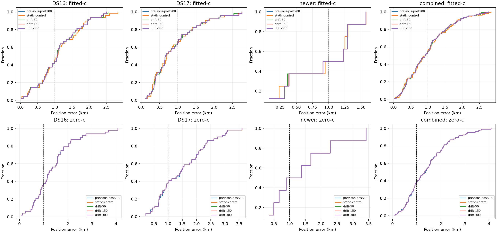
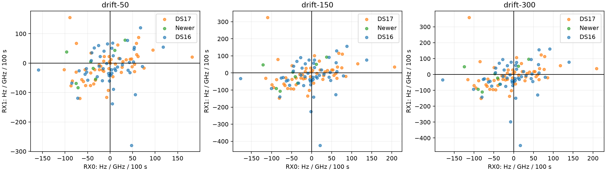

# Iteration 19: time-varying RF stretch crosses the development mean target

**The frozen rule selects drift-50: 0.993195 km mean over all 107 development
recordings, versus 1.004952 km for the static model.** Worst error falls from
2.835 to 2.763 km. All three new priors pass the predeclared development gates;
the least flexible passing variant is selected, not the one with the smallest
observed mean.

This crosses 1 km by only 6.8 metres. It is not fresh validation or proof that
the full goal is complete. DS16 alone remains above 1 km, and a supplementary
103-scan stationary paired subset has mean 1.001676 km. No new model is deployed.

## Hypothesis and frozen model

The source, protocol and five tests were published as `bf6a9a9a4` before
outcomes. Conditional residual regressions from iteration 16 suggested an
RF-by-time interaction on S41, especially RX1, but little such signal on
DS17-040. Those regressions are descriptive evidence, not hardware calibration
or independent validation; [motivation.json](motivation.json) preserves them.

The added receiver-specific correction is

`d_r × ((RF − RF_center) / 1 GHz) × ((t − t_center) / 100 s)`.

Each d_r has a zero-mean Gaussian prior with sigma **50, 150 or 300
Hz/GHz/100 s**. These priors are soft. A separate hard outer bound is ±1000
in those units. The static control locks both d_r values to zero.
The original shared static c term remains fitted in the fitted-c arm.

The strict zero-c arm locks **the original static c and both new d_r terms
exactly to zero**. All 428 zero-c fits satisfy those locks, and their results
are identical across the four variants. The new model cannot reintroduce a
learned RF stretch under a different name in this ablation.

All variants and both arms share observations, pruned satellite banks, the
post-200 fitted-c physical/clock seed, zero initial new coefficients, 200/100 Hz
smooth-clock priors, 2-second relative timing prior, ±60 Hz/s affine receiver
slope bounds, and 20-second/600-iteration budgets. This adds frequency-dependent
time variation; the ±60 bound still applies specifically to the affine
receiver slope, not every derivative of the full smooth correction.
This is a conditional RF ablation, not independent candidate searches.

## Complete development comparison

| Fitted-c mean error, km | Static | drift-50 | drift-150 | drift-300 |
|---|---:|---:|---:|---:|
| DS16, 48 | 1.132295 | 1.112132 | 1.109107 | 1.108852 |
| DS17, 51 | 0.903526 | 0.898735 | 0.899913 | 0.900481 |
| Consumed newer, 8 | 0.887485 | 0.881760 | 0.883911 | 0.884254 |
| **Combined, 107** | **1.004952** | **0.993195** | **0.992561** | **0.992742** |

| Combined fitted-c metric | Static | drift-50 | drift-150 | drift-300 |
|---|---:|---:|---:|---:|
| Median error, km | 0.925567 | 0.924123 | 0.923046 | 0.922948 |
| p95 error, km | 2.234540 | 2.157131 | 2.159476 | 2.159834 |
| Worst error, km | 2.835493 | 2.762679 | 2.762393 | 2.762336 |
| Converged new fits | 106/107 | 106/107 | 107/107 | 107/107 |
| Improved / worsened versus previous, >1 m | 0 / 0 | 63 / 41 | 65 / 41 | 64 / 42 |

Drift-50 reduces pooled mean by 11.76 metres, about 1.17%, relative to
post-200. Three scans remain within 1 metre of their previous result.
The looser drift-150 mean is only 0.63 metres better than drift-50; the frozen
selection rule therefore retains the tighter prior rather than chasing this
small development difference.

| Example, fitted-c km | Previous | drift-50 |
|---|---:|---:|
| S41 | 2.835 | 2.544 |
| S37 | 2.581 | 2.412 |
| DS17-042 | 0.697 | 0.496 |
| DS17-043 | 0.299 | 0.113 |
| DS17-032 | 0.300 | 0.620 |
| DS17-038 | 0.259 | 0.400 |
| NEW-003 | 0.232 | 0.364 |
| DS17-040 | 2.754 | 2.763 |

The motivating S41 case improves, while DS17-040 does not. These are mixed
localization effects, not evidence that all failures share one hardware cause.

## Frequency fit, c ablation and convergence

| Combined metric, including fallbacks | Static control | drift-50 | drift-150 | drift-300 |
|---|---:|---:|---:|---:|
| Fitted-c mean position error, km | 1.004952 | 0.993195 | 0.992561 | 0.992742 |
| Zero-c mean position error, km | 1.455733 | 1.455733 | 1.455733 | 1.455733 |
| Fitted-c mean posterior RMS, Hz | 69.952 | 69.335 | 69.321 | 69.327 |
| Zero-c mean posterior RMS, Hz | 114.875 | 114.875 | 114.875 | 114.875 |

The incremental fitted-c frequency improvement is modest, about 0.62 Hz RMS.
Position accuracy is evaluated independently from frequency RMS and objective
values. Objectives under different priors are not used to choose per-scan
winners.

Static-control fitted-c is nonstationary on DS17-020; drift-50 is nonstationary
on DS17-044. Both use the frozen previous post-200 operational fallback.
Drift-150 and drift-300 converge in every fitted-c case. Zero-c is nonstationary
on DS17-020 and DS17-041 for all four variants, also using frozen fallbacks.
No failure is excluded from the primary aggregate.

The static fitted-c control reproduces the previous positions to numerical
precision. Zero-c starts from the shared fitted-c seed and can follow a
different nuisance path from the earlier zero-c experiment; its small
difference from the previous 1.457139-km mean is not an RF-drift benefit.

The strict paired comparison retains 103 scans stationary under both arms
and all reported policies, including the previous post-200 result. It excludes
DS17-020, DS17-041, DS17-044 and DS17-046. Static → drift-50 fitted-c mean is
**1.013603 → 1.001676 km**; zero-c remains **1.433743 km**. This subset is
slightly above 1 km, underscoring how narrow the pooled threshold crossing is.
The primary result remains the predeclared all-member operational comparison.

## Size of the fitted corrections

For drift-50, median d values are −2.80 on RX0 and −14.02 on RX1. The 95th
percentiles of absolute magnitude are **93.21 / 118.02**, and maxima are
**182.32 / 279.38 Hz/GHz/100 s**. No accepted coefficient reaches the ±1000
outer bound. A failed drift fit contributes zero new RF drift through its
static fallback in this operational distribution; raw values are also saved.

For scale, a coefficient of 100 at an RF offset of 0.375 GHz adds 0.375 Hz/s
of frequency change. This is distinct from the shared static c and the
receiver's affine clock slope. These coefficients remain conditional model
parameters, not independent measurements of Pluto or LNB hardware behavior.

## Decision and validation next

All new variants satisfy the frozen requirements: pooled mean below 1 km,
each cohort mean within 5% of previous, p95 and worst within 10%, and fitted-c
convergence at least 95%. Static control fails only the mean requirement.
The selected development candidate is **drift-50**.

Freeze this candidate and its full stage/fallback procedure before opening
newer outcomes. The randomized four-recording validation set from iteration 18
and the separately designated six-recording chronological challenge cohort
remain unopened. The two randomized development members also remain unopened.
The small validation sample must be reported honestly; do not merge cohorts
and describe them as one randomized holdout.

The uniform additive-region policy has been qualified on all 107 scans in
iteration 14. Its winners match these archived downstream inputs. Cold
execution of the integrated candidate, fresh evaluation, production integration,
deployment and live PNG verification remain required. The development mean
alone does not complete that work.

Five tests pass in both Python environments: zero-drift equivalence,
finite-difference physical/nuisance gradients, exact zero-c/static-control
locks and physical/extra-parameter bounds. Scripts pass Ruff. All input/source
digests, fallback-inclusive means, exact ablation locks and PNGs were verified.
`integrity.json` seals the report, source, protocol, results and figures.

Production bounded numerical recovery, fitted-c default and longest-16
per-track TLE review PNG rendering remain unchanged. No RF collection was
started; the active goal remains incomplete.
