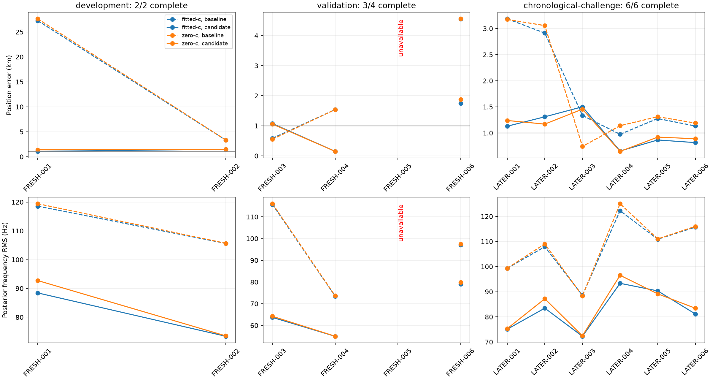
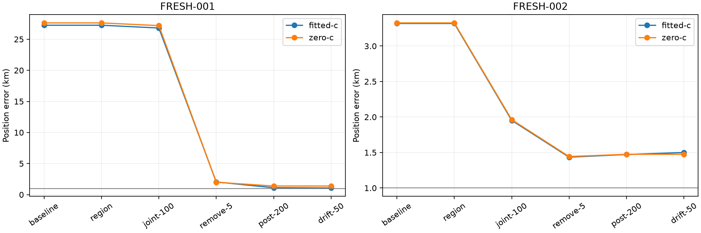

# Iteration 20: integrated drift-50 replay and first newer-data evaluation

**The assembled pipeline reproduces both consumed integration cases exactly,
but fresh validation has not passed.** Three of four randomly assigned holdout
scans completed, averaging **0.990235 km** versus **2.226795 km** for deployed
Hard60. The fourth has no published baseline yet and remains an explicit
evaluation failure. The separate six-scan chronological challenge averages
**1.045506 km**, down from **1.803253 km**. Neither result establishes a complete
fresh-data mean below 1 km. The candidate is not deployed.

## Frozen candidate and integration qualification

[Iteration 19](../2026_10_08_position_error_iter19/README.md) selected the least
flexible passing RF-time prior, drift-50, on 107 consumed development scans.
Its 0.993195 km development mean has only a 6.8-metre margin below the target.
This iteration assembles the complete stage sequence rather than combining
independently archived last-stage results:

1. Retain the ordinary regional finalists and add finalists with 25-km basin
   separation. Compare them using the unchanged Hard60 selection score;
   require convergence for extras and retain the original on ties.
2. Jointly fit position and smooth receiver clocks with 100/50-Hz clock priors.
3. Remove satellite candidates whose fitted relative timing exceeds 5 seconds,
   retaining every observation; refit with the same clock prior.
4. Refit with 200/100-Hz clock priors.
5. Add the receiver-specific RF-by-time coefficient, with a zero-mean Gaussian
   prior of 50 Hz/GHz/100 s and outer bounds of ±1000 in those units.

Relative timing sigma remains 2 seconds, and each added affine receiver slope
remains bounded to ±60 Hz/s. The original 400-point 40/20/10/5-km grid and edge
priority are unchanged. Smooth-clock and RF-time terms mean that the affine
bound is not a bound on the total instantaneous frequency derivative.
Each local fit has the same 20-second/600-iteration budget. Fallbacks depend
only on numerical convergence, never reference error or cross-model scores.
[pipeline.py](pipeline.py) specifies all stages and fallbacks.

The initial joint fit deliberately preserves iteration 4's initialization;
later stages retain their previously tested timing re-projection behavior.
Before opening newer outcomes, the [integration protocol](integration-protocol.json)
required both calibration arms on S41 and DS17-008 to reproduce the qualified
results within 1 metre. Both passed with **zero difference in position vectors,
clock coefficients, and position error**:

| Consumed case | Fitted-c error, km | Zero-c error, km |
|---|---:|---:|
| S41 | 2.544189 | 3.677601 |
| DS17-008, originally 152.840 km | 2.534893 | 1.831831 |

These are stage-integration checks using sealed regional results, not cold
regional searches or fresh validation. Full 107-scan assembled regression and
production integration remain future work.

## Assignment and validation rules

The [validation protocol](validation-protocol.json), source hashes and passing
integration records were pushed in `e8c55bf48` **before opening any newer
outcomes**. Numerical sources were unchanged afterward. Summary plotting later
made the unavailable member explicit without changing numerical evaluation.

The six FRESH recordings use the reproducible whole-scan random assignment
frozen in [iteration 18](../2026_10_08_position_error_iter18/README.md): PCG64 seed
2026100818, two development and four validation scans. Receivers, channels and
windows stay together. No recording is selected or replaced based on readiness
or error. The two development cases qualified execution only; no parameters
were retuned from their results before opening the four validation members.

The separate LATER-001–006 cohort was frozen chronologically in iteration 8.
It remains a **chronological challenge**, not randomized validation. Its
results are not pooled with the randomized group to manufacture a pass.

The primary randomized gates require all four assigned members to complete,
fitted-c mean below 1 km and no worse than the deployed baseline, worst error
within 1.1 times baseline, and converged final drift-50 fits on all four. The
first gate fails; the available-three average is descriptive, not a passing
four-scan validation. This small validation size would remain a substantial
limitation even if every gate passed.

## Position error: every assigned member

| Member | Role | Baseline fitted, km | Candidate fitted, km | Candidate zero-c, km |
|---|---|---:|---:|---:|
| FRESH-001 | Development | 27.252917 | 1.071269 | 1.389940 |
| FRESH-002 | Development | 3.317820 | 1.500308 | 1.474913 |
| FRESH-003 | Random validation | 0.584151 | 1.073600 | 1.057172 |
| FRESH-004 | Random validation | 1.539189 | 0.150132 | 0.148367 |
| FRESH-005 | Random validation | **Unavailable** | **Unavailable** | **Unavailable** |
| FRESH-006 | Random validation | 4.557046 | 1.746974 | 1.877894 |
| LATER-001 | Chronological challenge | 3.187287 | 1.128548 | 1.238707 |
| LATER-002 | Chronological challenge | 2.913760 | 1.309155 | 1.169494 |
| LATER-003 | Chronological challenge | 1.334973 | 1.501303 | 1.455574 |
| LATER-004 | Chronological challenge | 0.973981 | 0.653991 | 0.646518 |
| LATER-005 | Chronological challenge | 1.276152 | 0.865251 | 0.919886 |
| LATER-006 | Chronological challenge | 1.133369 | 0.814786 | 0.889231 |

| Group | Complete / assigned | Fitted mean before → after, km | Zero-c mean before → after, km |
|---|---:|---:|---:|
| New development | 2/2 | 15.285369 → 1.285788 | 15.476306 → 1.432427 |
| Random validation, available only | **3/4** | 2.226795 → 0.990235 | 2.218211 → 1.027811 |
| Chronological challenge | 6/6 | 1.803253 → 1.045506 | 1.768791 → 1.053235 |

All 11 completed cases reach a converged final drift-50 fit in both arms. All
88 local fits converge. No case selects the additional regional finalist;
the original candidate regions win under the unchanged score. Thus the new
improvements here come from the local clock/timing/model stages. The separate
DS17-008 rescue still demonstrates why distinct regional finalists must survive.

## Frequency fit is a separate result

| Group | Fitted RMS before → after, Hz | Zero-c RMS before → after, Hz |
|---|---:|---:|
| New development, 2 | 112.097 → 80.906 | 112.544 → 83.118 |
| Random validation, available 3 only | 95.395 → 65.924 | 95.695 → 66.370 |
| Chronological challenge, 6 | 107.448 → 82.598 | 108.125 → 84.010 |

These are means of per-scan posterior frequency RMS, not position metrics or
comparable penalized objectives across changing models. FRESH-003 worsens from
0.584 to 1.074 km despite substantially better frequency fit. LATER-003 also
worsens. Better in-sample frequency fit alone is not evidence of localization
improvement.

Every local stage uses a matched c ablation: shared observations, candidate
bank, other priors, initialization and search budget. Zero-c fixes both the
original static c and the two new RF-time coefficients exactly to zero. All
44 zero-c stage records pass those locks. Banks and seeds are derived from
the fitted-c stages, so this is a **conditional calibration ablation**, not two
independent end-to-end candidate searches. Reference locations enter error
reporting after inference and never select candidates or tune parameters.

## What changed on the two development recordings

FRESH-001 remains at 26.809 km after the first joint-clock fit. Removing eight
timing-inconsistent satellite candidates while retaining all observations
reduces it to 2.042 km; the post-200 stage reaches 1.114 km and drift-50 reaches
1.071 km. The largest rescue is therefore candidate cleanup followed by a new
fit, not the small RF-time term.

FRESH-002 improves to 1.435 km after removing four candidates, then moves to
1.472 km with post-200 and 1.500 km with drift-50. The later stages do not improve
every scan. Choosing the best stage using known position error would leak the
reference into inference and was not done.

## Unavailable member, operational state, and next work

FRESH-005 is `scan-fw-a43bbffc6826cdc5`. Its pinned recording and tracking inputs
are present, but Hard60's public status is pending. A live production worker
owns its regional checkpoint writer lease. A diagnostic invocation of the
unchanged standard CLI waited on that lease; it was terminated, leaving the
production worker untouched. [unavailable-diagnosis.json](unavailable-diagnosis.json)
records the observation. The original failed evaluation remains immutable.

When that publication completes, evaluate the **identical frozen candidate**
and report the fourth result as a separate completion, preserving the initial
failure and assignment. Then investigate FRESH-003 and the remaining errors as
consumed diagnostic cases; any tuned variant will need new independent
validation. The six chronological cases still miss the target on average.

No new RF collection, QNAP writes, scientific fixture changes, runtime contract
changes, or candidate deployment occurred. Existing Hard60 numerical recovery
and the longest-16 per-track PNG deployment remain intact. The persistent goal
is active. Public-port imports, both integration replays, source/input digest
checks, exact-grid checks, c locks, Ruff checks and the rendered report figures
were verified. This report does not substitute for a cold integrated run,
component tests, production rollout or live WebUI rendering verification.

Machine-readable outputs are in [summary.json](summary.json), `results/`,
`baselines/`, `regions/`, and `integration/`. Large resumable checkpoints are
kept locally and excluded from publication. [integrity.json](integrity.json)
binds the published artifacts.
