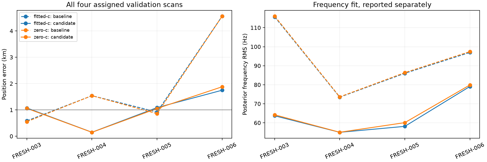

# Iteration 21: complete the randomized holdout without changing the model

**All four assigned holdout scans are now evaluated. The frozen drift-50
pipeline averages 1.014419 km, versus 1.899848 km for deployed Hard60: a 46.6%
improvement, but a failure of the predeclared below-1-km gate.** Worst error
falls from 4.557046 to 1.746974 km. All four final fitted-c fits converge.
The research candidate remains undeployed and the persistent goal remains active.

## What this iteration changes

Only availability. FRESH-005, `scan-fw-a43bbffc6826cdc5`, lacked a published
Hard60 baseline during [iteration 20](../2026_10_08_position_error_iter20/README.md).
Its existing production worker subsequently completed that analysis.
[protocol.json](protocol.json) and [complete_member.py](complete_member.py) were
published as `2b40f281d` before evaluating the missing member. They bind the
unchanged numerical sources, original assignment, original failure, and prior
results. No model, prior, candidate selection, initialization, search budget,
or convergence fallback changed. No new radio collection was started.

The other three holdout results are reused unchanged. The original first-attempt
availability failure remains recorded in iteration 20; this report does not
rewrite that outcome or replace the missing scan. The completed numerical
comparison still fails on its own merits, so availability is not the only
reason the candidate has not passed validation.

## Complete position comparison

Assignment remains the whole-scan PCG64 split with seed 2026100818, frozen in
iteration 18. Both receivers and all channels/windows stay together. No
member was selected, substituted or omitted using its error.

| Assigned member | Baseline fitted, km | Candidate fitted, km | Baseline zero-c, km | Candidate zero-c, km |
|---|---:|---:|---:|---:|
| FRESH-003 | 0.584151 | 1.073600 | 0.553543 | 1.057172 |
| FRESH-004 | 1.539189 | 0.150132 | 1.540914 | 0.148367 |
| FRESH-005 | 0.919006 | 1.086972 | 0.857738 | 1.053560 |
| FRESH-006 | 4.557046 | 1.746974 | 4.560176 | 1.877894 |
| **Mean, all four** | **1.899848** | **1.014419** | **1.878093** | **1.034248** |
| Median | 1.229097 | 1.080286 | 1.199326 | 1.055366 |
| Worst | 4.557046 | 1.746974 | 4.560176 | 1.877894 |

Two cases improve and two worsen. The large gains on FRESH-004 and FRESH-006
produce the aggregate improvement; they do not erase the regressions. The
four-scan sample is small, and crossing a threshold by a few metres would not
establish a precise population mean.

| Original numerical requirement, applied after completion | Result |
|---|---|
| All four assigned scans available | Pass now; initial attempt failed |
| Fitted mean strictly below 1 km | **Fail: 1.014419 km** |
| Fitted mean no worse than baseline | Pass |
| Worst error at most 1.1 times baseline | Pass |
| Converged final drift-50 fitted result on every scan | Pass |

The historical 107-scan development mean remains 0.993195 km. The six separately
reported chronological challenge scans remain at 1.045506 km. Those populations
are not pooled with the randomized four to manufacture a passing result.

## Matched calibration ablation and frequency fit

| Arm | Mean posterior frequency RMS before, Hz | After, Hz | Mean position error after, km |
|---|---:|---:|---:|
| Fitted-c | 93.053 | 63.975 | 1.014419 |
| Zero-c | 93.360 | 64.797 | 1.034248 |

Both arms share observations, satellite banks, other priors, initializations
and 20-second/600-iteration local-fit budgets. Zero-c locks the static c and
both RF-time coefficients exactly to zero at every stage. Candidate-bank and
seed construction remains fitted-c-derived, a conditional calibration ablation
rather than independent candidate searches. All four zero-c stages on the
completed member pass the locks, in addition to the 44 checks in iteration 20.

The fitted arm's lower frequency RMS and roughly 20-metre aggregate position
advantage over zero-c are separate measured effects. Frequency fit improves
on both regressing cases too; it is not a reliable proxy for localization.
Penalized scores from models with different priors or candidate banks are not
used to choose a supposedly superior position. Reference coordinates are used
only for post-fit evaluation.

## Where the new regression enters

The completed FRESH-005 fit is numerically converged throughout:

| Stage | Fitted-c error, km | Frequency RMS, Hz |
|---|---:|---:|
| Published baseline | 0.919006 | 86.025 |
| Joint clocks, 100/50-Hz priors | 0.881699 | 61.59 |
| Remove relative-timing outlier, same priors | 0.876649 | 61.40 |
| Loosen clock priors to 200/100 Hz | 1.094863 | 58.87 |
| Add RF-time drift-50 | 1.086972 | 58.13 |

One satellite candidate, 58883, is removed; every observation remains. The
largest degradation enters when the clock prior is loosened, while frequency
RMS improves. The RF-time stage slightly recovers position accuracy in this
case. The added regional finalist does not win, so this regression does not
come from discarding the original candidate region.

On FRESH-003, the first joint-clock stage already worsens error from 0.584 to
1.243 km; later stages recover only to 1.074 km. On FRESH-006, loosening the
clock prior helps substantially, from 2.403 to 1.746 km. These observations
identify stages for root-cause analysis; they do not prove a hardware fault or
justify choosing different priors using known position error.

## Next investigation and retained state

Use these now-consumed cases diagnostically to separate nuisance-clock/model
bias from missed optimizer minima. Profile the converged model near its fitted
position and at the reference, decompose data versus clock/timing penalties,
and inspect which satellite/receiver groups supply the spatial gradient. Any
reference-position fits must remain labeled oracle diagnostics and never enter
the deployable initializer or selection rule. A revised model needs a newly
reserved independent random holdout; these four are no longer fresh validation
for a variant tuned from their outcomes.

Full assembled regression over the original 107 scans, a genuinely cold run,
component integration/tests, deployment, and live corrected-PNG verification
remain outstanding for a qualified new candidate. Existing deployed Hard60
bounded recovery and longest-16 per-track TLE review PNG behavior remain intact.

Validation here includes frozen-source/input hashes, identical regional grid
coordinates, matched c locks, all eight new local fits converging, Ruff, and
visual inspection of the generated PNG. Large regional checkpoints remain
local. [summary.json](summary.json), [result.json](result.json), the two regional
documents and [integrity.json](integrity.json) preserve the evidence.
