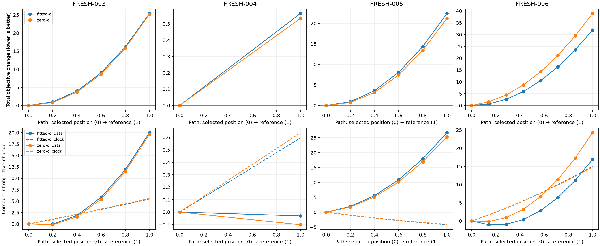

# Iteration 22: newer regressions are preferred by the fitted model

**The remaining newer errors are not explained by a simple missed local
minimum.** On all four now-consumed randomized validation cases, nuisance-only
profiles penalize the reference position relative to the fitted position.
Releasing position after fitting at the reference returns to the original
estimate in both calibration arms. This is diagnostic evidence of model/data
bias, not an operational positioning improvement or a proof of global optimality.

The qualified candidate remains unchanged: 0.993195 km mean on the original
107 development scans, **1.014419 km on the complete newer randomized four**,
and 1.045506 km on the separately labeled six chronological challenge scans.
The sub-kilometre validation gate remains failed. Nothing new is deployed.

## Frozen diagnostic design

[protocol.json](protocol.json) and [diagnose.py](diagnose.py) were pushed in
`4ce67c5e5` before execution. All four previously assigned validation cases are
included: the two regressions, the worst remaining error, and the strong
improvement control. They are now consumed diagnostic data, not fresh validation
for a model tuned using these findings.

The experiment reconstructs the exact frozen drift-50 model, observations,
candidate bank, receiver baseline, clock priors and fitted coefficients from
iterations 20–21. Reconstructed objectives must match archived objectives within
1e-6. Each path starts at the fitted-c position and ends at the reference in
steps no longer than 250 metres. Both c arms use the same path and initial
physical/clock seed. At each point, position is fixed and only nuisance
parameters are optimized, with the existing 20-second/600-iteration limit and
at most two warm retries. Position is released once at the reference endpoint.

All 44 fixed-position fits and eight released fits converged; no profile was
truncated. Zero-c locks the static c and both RF-time terms to zero. The
reference position is used **only for this oracle diagnostic** and is never
an operational initializer, a candidate-selection input or a reported new
positioning result. This experiment changes neither the regional grid nor
the ordinary candidate pipeline.

## Objective preference at the true position

Values below are **reference minus fitted-position** after nuisance refitting.
Positive total means the model prefers its spatially wrong estimate. Data
likelihood and prior penalties are separated; these are within-model comparisons.

| Case | Operational fitted error, km | Total delta | Data delta | Clock delta | Common + relative timing delta |
|---|---:|---:|---:|---:|---:|
| FRESH-003 | 1.073600 | +25.430 | +19.976 | +5.477 | −0.023 |
| FRESH-004, control | 0.150132 | +0.564 | −0.031 | +0.595 | +0.000 |
| FRESH-005 | 1.086972 | +22.431 | +26.693 | **−4.221** | −0.041 |
| FRESH-006 | 1.746974 | +31.869 | +16.921 | +15.035 | −0.088 |

The clock penalty includes the smooth clock and RF-time prior. FRESH-005 is
particularly informative: the reference needs **less** clock penalty, but its
data likelihood is worse by 26.693, overpowering that advantage. Thus this
case cannot be explained simply as a clock prior that is too tight. In
FRESH-006, both the data term and the clock penalty prefer the wrong position.
Timing penalties are small contributors to these endpoint differences.

The good FRESH-004 control has a shallow 0.564 objective difference; its data
term slightly favors the reference while its clock penalty slightly opposes
it. The magnitudes and mechanisms differ across scans, so a uniform change to
one prior is not an established remedy.

| Case | Zero-c total delta on the same path | Released fitted error, km | Released zero-c error, km |
|---|---:|---:|---:|
| FRESH-003 | +25.231 | 1.073600 | 1.057172 |
| FRESH-004 | +0.534 | 0.150131 | 0.148366 |
| FRESH-005 | +21.228 | 1.086972 | 1.053560 |
| FRESH-006 | +38.956 | 1.746974 | 1.877894 |

All released fitted objectives match the original fitted objective to within
6e-11. Released fitted position errors differ by less than 0.3 millimetres;
the zero-c releases also reproduce the previously observed zero-c solutions.
This strongly argues against solving these cases merely by starting nearer
the truth, extending the same local fit, or broadening the final grid. It does
not rule out every other minimum outside the sampled path.

## Which observation groups resist the true position?

Groups are fixed from the selected fitted-c solution: the most probable
satellite assignment must exceed 0.5, then observations are split by receiver.
Low-confidence observations remain in explicit unassigned groups. Assignments
are inferred and can be wrong; the following contributions do not prove a bad
satellite, receiver or hardware clock.

Largest positive data-NLL contributions to reference-minus-fitted preference:

| Case | Satellite / receiver | Windows | Data-NLL delta |
|---|---|---:|---:|
| FRESH-003 | 65056 / RX0 | 151 | +11.253 |
| FRESH-003 | 60366 / RX1 | 101 | +5.825 |
| FRESH-005 | 63462 / RX1 | 79 | +8.146 |
| FRESH-005 | 63383 / RX0 | 302 | +6.175 |
| FRESH-005 | 67924 / RX1 | 12 | +4.524 |
| FRESH-006 | 67847 / RX0 | 184 | +7.954 |
| FRESH-006 | 57772 / RX1 | 49 | +4.813 |

Opposing groups also exist. For example, FRESH-005 satellite 58858 / RX1 has
only five assigned windows but favors the reference by 6.734 NLL units.
FRESH-006 satellite 58859 / RX1 has four windows and favors it by 6.014.
The full signed contributions and counts are in [summary.json](summary.json).
They suggest inspecting group-specific residual structure rather than assuming
that the largest track count alone explains the bias. Unequal receiver
observation times also prevent interpreting these groups as simultaneous
receiver-clock measurements.

## Next tests and limits

The direct next step is to inspect residual mean, time dependence, association
confidence and cross-receiver agreement within the influential groups at the
selected and reference profiles. This can distinguish approximately constant
group offsets from trajectory mismatch or ambiguous satellite association.

Three model directions are worth separating rather than conflating:

1. Strongly regularized satellite-common offsets, if the two receivers support
   a common residual component. A previous simpler offset experiment did not
   solve the original cohort; any interaction with the now-joint clock model
   requires a new matched test, not an assumed improvement.
2. A regularized receiver contrast within each satellite group, only if the
   residual evidence supports it. This must be kept distinct from static or
   time-varying RF stretch and checked for position/clock degeneracy.
3. Association uncertainty or correlated-error treatment, if residual changes
   occur within tracks rather than as constant offsets. Prior density weighting
   already regressed the development cohort, so repeating that policy without
   a new measured mechanism is not justified.

These are hypotheses, not verified hardware explanations or deployed fixes.
Any prototype must retain matched zero-c/fitted-c observations, candidate banks,
other priors and budgets, use reference error only after inference, test the
full consumed development corpus, and obtain a new independent randomized
validation set before a fresh validation claim. Oracle profiles must never
be folded into operational initialization.

Frozen-source/input verification, reconstructed-objective checks, objective
decomposition sums, convergence checks, Ruff and visual PNG inspection passed.
Production Hard60 recovery and the longest-16 review-PNG deployment are unchanged.
[integrity.json](integrity.json) binds sources, protocol, raw results, summary
and visualization. The persistent sub-kilometre goal remains active.
