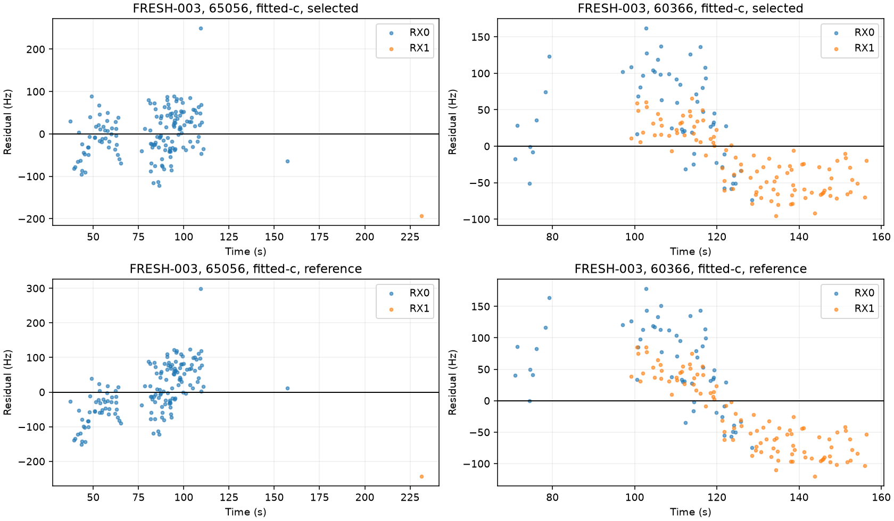
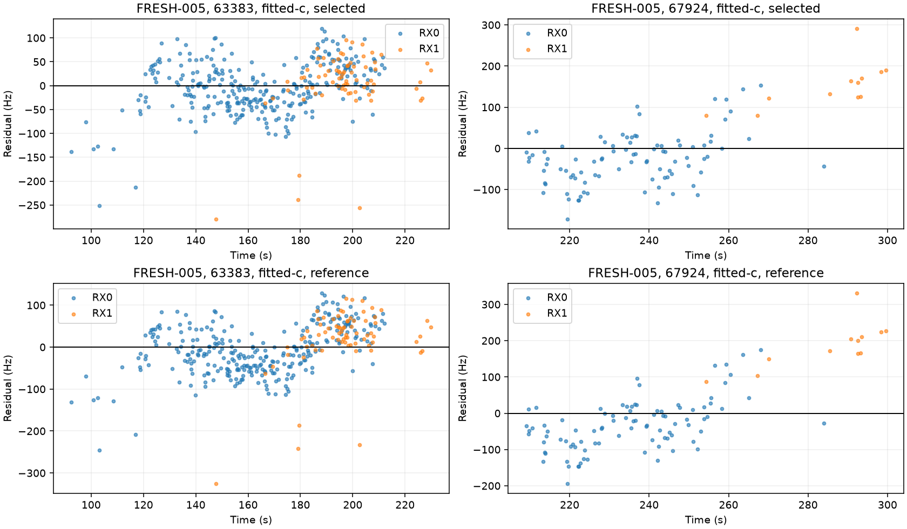
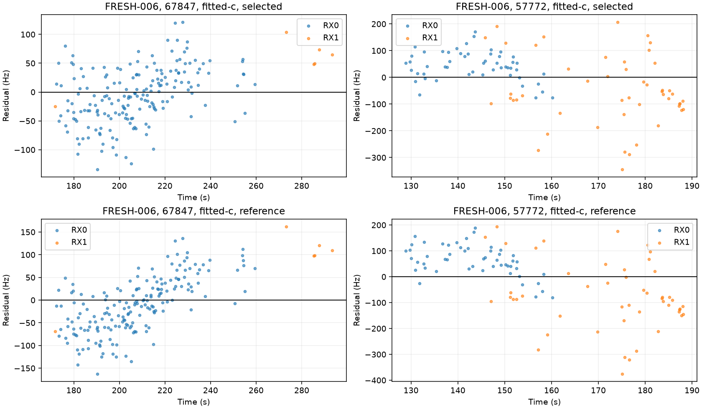
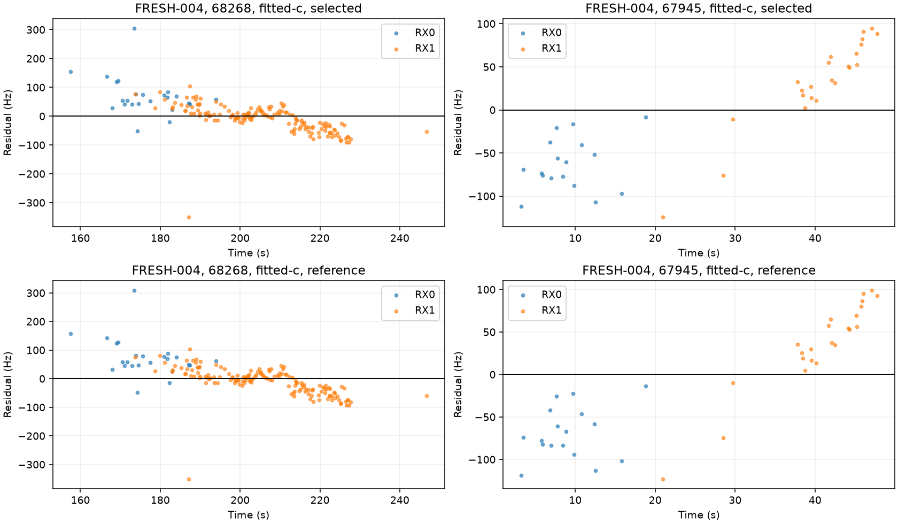

# Iteration 23: influential residuals contain time trends as well as offsets

**Constant satellite offsets alone do not describe the newer errors.** The
largest FRESH-003 group has an almost zero mean residual at the selected fit,
but its residual time trend becomes much stronger when position is fixed at
the reference. Similar behavior appears on FRESH-005 and FRESH-006. Some
receiver differences are measurable on coincident observations too, but several
apparently large differences come from unmatched times or very small groups.

This is a frozen residual diagnostic, with no new optimizer fits or operational
position changes. The candidate still averages 1.014419 km on the complete
newer randomized four and has not passed its sub-kilometre gate.

## Method and interpretation

Source and [protocol](protocol.json) were committed in `7fc0b561d` before
execution. The analysis reuses iteration 22's converged fixed-position nuisance
profiles at the selected and reference positions, in both calibration arms.
It reconstructs the original objective and verifies it against every archived
profile. All four now-consumed cases are included, including the accurate
FRESH-004 control.

Observation groups are fixed by the operational fitted-c satellite assignments,
requiring posterior probability above 0.5. Residuals remain conditional on those
assignments; they do not establish correct satellite identity. For plots, the
two satellites with the largest combined receiver contribution to iteration
22's reference-position data penalty are selected. Statistics are retained for
every group, not only the plotted groups.

Residual slope is a descriptive ordinary least-squares fit against observation
time within each satellite/receiver group. R² describes that group's variation;
it is not an independent validation statistic or a physical clock measurement.
Reference-position results are explicitly oracle diagnostics and never affect
operational candidate selection or initialization.

## Dominant time-dependent patterns

| Case / satellite / receiver | Windows | Selected mean, Hz | Reference mean, Hz | Selected slope, Hz/s | Reference slope, Hz/s | Reference linear R² |
|---|---:|---:|---:|---:|---:|---:|
| FRESH-003 / 65056 / RX0 | 151 | 1.25 | 4.49 | 0.64 | 2.16 | 0.42 |
| FRESH-003 / 60366 / RX1 | 101 | −20.51 | −27.38 | −2.02 | −3.17 | 0.77 |
| FRESH-005 / 63383 / RX0 | 302 | −2.46 | −6.01 | 0.63 | 0.94 | 0.18 |
| FRESH-005 / 67924 / RX0 | 92 | −25.35 | −32.44 | 1.54 | 2.40 | 0.30 |
| FRESH-006 / 67847 / RX0 | 184 | −5.96 | −11.49 | 0.99 | 2.05 | 0.44 |
| FRESH-006 / 57772 / RX0 | 52 | 43.64 | 63.18 | −1.63 | −3.33 | 0.25 |

The nearly centered 65056, 63383 and 67847 groups are a reason to test a
satellite-specific slope separately from a constant offset. A position change
can absorb some trajectory-shaped residual error, producing a better frequency
fit at the wrong location. This is an inference from the fitted profiles, not
proof that orbital prediction errors are the physical cause.

The good FRESH-004 control also contains offsets and trends: group 67945/RX1
has only 23 windows and a 7.60 Hz/s selected-fit trend with R² 0.92. Therefore
the existence of a trend is not itself a rule for rejecting a group or predicting
position failure. Any correction must be regularized and tested on controls.

## Receiver differences: matched times matter

Pairs require the same inferred satellite, channel, and observation time rounded
to a millisecond. Duplicate observations are averaged within receiver before
forming RX1-minus-RX0 residual differences. No nearest-time substitution is made.

| Case / satellite | Coincident pairs | Selected mean difference, Hz | Reference mean difference, Hz |
|---|---:|---:|---:|
| FRESH-003 / 60366 | 46 | −32.10 | −30.99 |
| FRESH-005 / 63383 | 55 | −25.22 | −23.46 |
| FRESH-006 / 57772 | 12 | −24.33 | −31.75 |

For FRESH-005 / 67924, the selected unpaired receiver means are −25.35 and
+152.22 Hz, but there are **zero coincident pairs** and only 12 RX1 windows.
That cannot be treated as a simultaneous 178-Hz hardware-clock difference.
FRESH-003 / 65056 has only one assigned RX1 window and zero pairs. The good
control's 68268 group has only four pairs, with about 200-Hz RMS difference,
which is insufficient to establish a stable offset.

These residual differences already condition on fitted receiver corrections.
They may reflect measurement error, association, channel effects or remaining
clock-model error; they are not isolated LNB drift measurements.

## Strict c comparison and next prototype

The same observations, fixed groups, candidate banks, profile path and nuisance
priors are used for both arms. Zero-c fixes static c and both RF-time coefficients
to zero. Its complete residual statistics are in `results/` and its plots are
[FRESH-003](FRESH-003-zero-c.png), [FRESH-004](FRESH-004-zero-c.png),
[FRESH-005](FRESH-005-zero-c.png), and [FRESH-006](FRESH-006-zero-c.png).
This remains a conditional calibration ablation, not independent searches.

The next controlled pilot will distinguish three mechanisms on these consumed
cases: a satellite-common constant offset, a satellite-common frequency slope,
and both together. Use zero-mean Gaussian priors and remove the shared satellite
mean so these terms cannot freely duplicate a receiver-wide offset or slope.
Hold receiver clock priors, affine ±60 Hz/s bounds, RF-time prior, banks,
observations, seeds and fit budgets fixed across variants and c arms. The
reference position must not enter any of those fits. Receiver-contrast terms
remain a separate hypothesis, not an automatic addition to the first pilot.

A successful small pilot would only justify a full consumed-corpus regression;
it would not replace newly reserved independent random validation. Stronger
frequency fit without better position accuracy will not count as success.

Ruff, pinned source/input checks, reconstructed objectives and visual inspection
of the plotted residuals were checked. Production and published scientific
fixtures remain unchanged. [integrity.json](integrity.json) binds the raw
statistics and visualizations. The persistent goal remains active.
