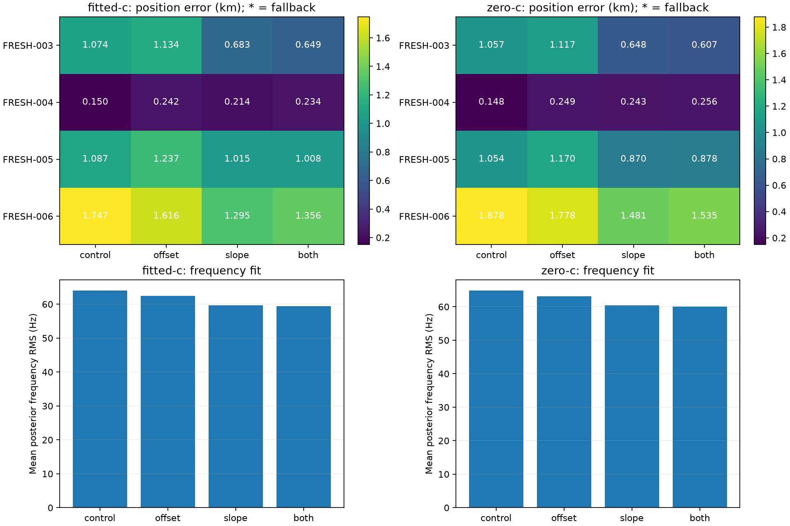

# Iteration 24: satellite-specific frequency slope passes the mechanism pilot

**A regularized satellite-common frequency slope reduces mean error from
1.014419 to 0.801668 km on the four consumed newer cases, a 21.0% improvement.**
Worst error falls from 1.746974 to 1.294613 km. All fits converge. The frozen
pilot rule selects the slope-only variant; constant offsets alone worsen
position accuracy despite improving frequency fit.

This is a mechanism pilot on cases already examined diagnostically. It is
**not fresh validation**, does not revise the earlier failed validation result,
and does not establish the goal as complete. No candidate was deployed.

## Hypothesis, model and frozen test

[Iteration 23](../2026_10_08_position_error_iter23/README.md) found important
groups with nearly centered residuals but strong time dependence. The new
correction is shared by both receivers for a satellite:

`predicted_frequency[r, k, t] += offset[k] + slope[k] × (t − center[k])`.

The control is the unchanged drift-50 model. Three hypotheses are tested:

| Variant | Added terms | Gaussian prior scale |
|---|---|---|
| offset | Satellite-common constants | 50 Hz |
| slope | Satellite-common linear time slopes | 1 Hz/s |
| both | Constants and slopes | 50 Hz and 1 Hz/s |

Each enabled term uses an orthonormal sum-zero satellite basis, preventing an
unpenalized common satellite component from duplicating a receiver-wide offset
or slope. The stated prior scales apply in that basis; the marginal standard
deviation for an individual satellite is scaled by `sqrt(1 − 1/K)` for K
satellites. Time centers are responsibility-weighted mean observation times
from the frozen operational fitted-c solution, computed once and shared by
all variants and both arms. No reference coordinate enters those centers.

The slope implementation stores coefficients in Hz/100 s with prior sigma 100.
The existing fitter's loose ±2000 nuisance-coefficient bounds therefore apply
in Hz/100 s for those coordinates. These are not per-satellite ±20-Hz/s bounds
after basis transformation. The ±60-Hz/s bound on added **receiver affine
slopes** remains unchanged, as do the 200/100-Hz smooth clock priors, 2-second
relative timing prior, RF-time sigma 50, candidate bank, observations and
physical search constraints. This is extra satellite model flexibility, not
a change to the receiver slope cutoff.

Both c arms and all variants start from the same operational fitted-c physical
and clock seed; new satellite coefficients start at zero. Each fit receives
20 seconds and 600 iterations, with no retries. Zero-c fixes static c and both
receiver RF-time coefficients exactly to zero, while retaining the same
non-RF satellite nuisance model as the fitted arm. These terms depend on
satellite identity and time, not RF frequency. This remains a conditional
calibration ablation using fitted-c-derived banks and seeds.

Sources, five tests and [protocol.json](protocol.json) were published in
`d67bb01b0` before outcomes. The gates require both arms to converge on every
case, fitted mean below 1 km and below control, and each fitted error at most
`control + max(0.25 km, 0.1 × control)`. The first passing variant in the fixed
offset, slope, both order is selected, preferring fewer added parameters.
Failure would fall back to control for operational metrics while still failing
the raw convergence gate. No fallback was needed.

## Position results

| Fitted-c case | Control, km | Offset, km | Slope, km | Both, km |
|---|---:|---:|---:|---:|
| FRESH-003 | 1.073600 | 1.134496 | 0.683023 | 0.648771 |
| FRESH-004, control case | 0.150132 | 0.242159 | 0.213984 | 0.233627 |
| FRESH-005 | 1.086972 | 1.236817 | 1.015054 | 1.008065 |
| FRESH-006 | 1.746974 | 1.616000 | 1.294613 | 1.355505 |
| **Mean** | **1.014419** | **1.057368** | **0.801668** | **0.811492** |

The slope variant improves three cases and worsens the accurate FRESH-004 by
63.9 metres. FRESH-005 remains slightly above 1 km. Both slope and combined
variants pass the pilot gates; offset alone fails the mean gates. The selected
slope variant also happens to have the lowest observed mean, but selection
follows the frozen rule rather than choosing the best individual fit by
reference error.

| Zero-c case | Control, km | Offset, km | Slope, km | Both, km |
|---|---:|---:|---:|---:|
| FRESH-003 | 1.057172 | 1.116792 | 0.648176 | 0.607115 |
| FRESH-004 | 0.148366 | 0.249040 | 0.242514 | 0.256153 |
| FRESH-005 | 1.053561 | 1.169855 | 0.869580 | 0.877584 |
| FRESH-006 | 1.877895 | 1.778333 | 1.480832 | 1.534736 |
| **Mean** | **1.034248** | **1.078505** | **0.810275** | **0.818897** |

Zero-c improves similarly under the slope model. Thus the pilot effect does
not require changing c or secretly enabling RF-time stretch in the zero-c arm.
Control warm refits reproduce the previous positioning results to well below
one metre; tiny zero-c differences reflect the newly shared warm seed.

## Frequency fit and parameter size

| Mean posterior frequency RMS, Hz | Control | Offset | Slope | Both |
|---|---:|---:|---:|---:|
| Fitted-c | 63.975 | 62.436 | 59.693 | 59.418 |
| Zero-c | 64.797 | 63.151 | 60.391 | 60.017 |

The offset variant improves frequency RMS but worsens mean localization. The
combined variant has the best frequency fit but a worse position mean than
slope-only. Frequency-fit and position effects must therefore remain separate;
penalized objectives across these different models do not select the winner.

Largest absolute physical satellite slopes in the selected fitted variant are
3.504, 2.076, 2.779 and 2.704 Hz/s for FRESH-003 through FRESH-006 respectively.
These are inferred nuisance corrections, not independently measured orbital
errors or LNB drifts. Their apparent utility supports testing the model further;
it does not prove the physical origin of the residual trends. Position and
satellite slopes can remain correlated even with the sum-zero gauge and prior.

## Validation and next step

All 32 fits converged, and all 16 zero-c fits preserve the static/RF-time locks.
Five component-owned prototype tests passed in development and production
Python: zero-correction equivalence, finite-difference physical and nuisance
gradients for all variants, sum-zero gauge, and fitter bounds/ablation locks.
The initial development pytest launcher lacked the repository import path;
the corrected `python -m pytest` invocation passed. A NumPy scalar serialization
issue in the reporting script was corrected without changing numerical sources
or rerunning the fits. Ruff and visual inspection of the generated PNG passed.

Next, freeze a slope-only versus control replay across **all 119 consumed
recordings**: the original 107 DS16/DS17/newer scans plus the 12 newer cases.
Include all failures and matched c arms; do not extrapolate this four-case gain
to the complete corpus. If it passes broad regression gates, reserve and evaluate
a new independent whole-scan random holdout before any deployment decision.
Full assembled execution, cold-run checks, component integration, deployment
and live PNG verification still remain for a qualified new pipeline.

Existing production Hard60 bounded recovery and longest-16 TLE review PNGs
remain untouched. Raw outcomes are in `results/`, with [summary.json](summary.json)
and [integrity.json](integrity.json) providing the reproducible report. The
persistent goal remains active.
