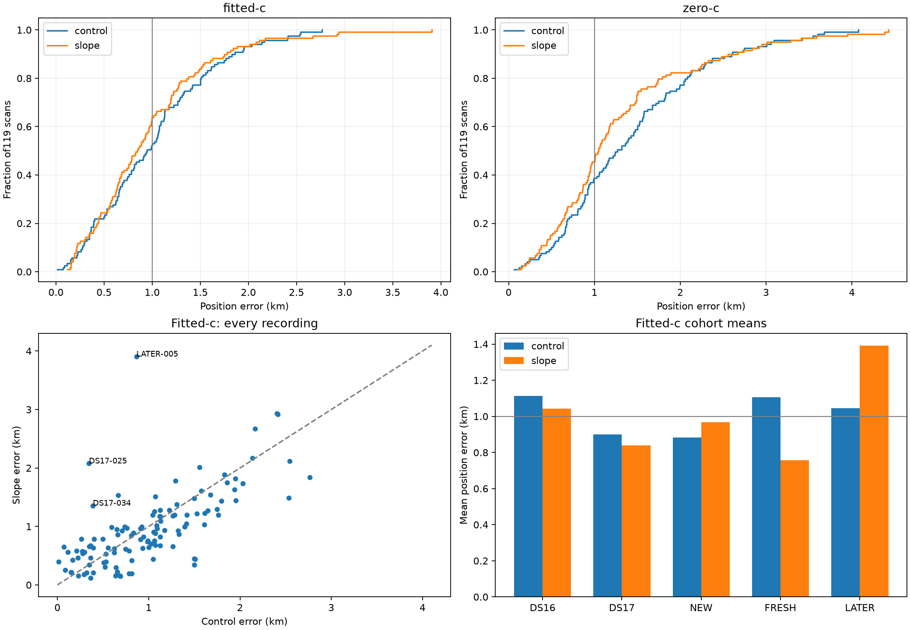

# Iteration 25: slope correction improves pooled mean but fails regression gates

**Reject the sigma-1-Hz/s satellite-slope candidate for promotion.** Across all
119 consumed recordings, fitted-c mean improves from **1.001464 to 0.953968 km**,
but worst error rises from **2.762679 to 3.905388 km** and two newer cohorts
regress beyond the predeclared 5% allowance. Crossing the pooled mean target
does not override the failed gates. Production remains unchanged.

## Frozen comparison and complete coverage

[protocol.json](protocol.json), [inputs25.py](inputs25.py) and [evaluate.py](evaluate.py)
were published as `cb08e2f6a` before execution. The control is the research
drift-50 candidate from iterations 19–21. The new model adds only the satellite-
common, sum-zero frequency slope from iteration 24, with Gaussian prior sigma
1 Hz/s in its orthonormal basis. Receiver affine slope bounds remain ±60 Hz/s;
all other clock/RF/timing priors and candidate banks remain fixed.

The 119 members comprise 48 DS16, 51 DS17, eight previously consumed NEW scans,
six FRESH scans and six LATER scans. Every member is now development/diagnostic
data. FRESH's earlier random assignment and LATER's chronological origin remain
recorded; neither is fresh validation for this tuned candidate.

The four sealed pilot comparisons are reused with file-hash verification;
the other 115 members receive new matched fits, totaling 476 fit records
(460 newly computed, 16 reused). Both c arms share observations, candidate bank,
time centers, initial physical/clock seed and 20-second/600-iteration budgets.
There are no retries. New satellite coefficients start at zero. Centers derive
only from the operational fitted solution's responsibilities, never reference
coordinates. Reference positions are used only for post-fit error reporting.

Seeds use converged operational drift-50 fitted results. DS17-044 instead uses
its converged post-200 fallback with zero initial RF-time coefficients. A failed
new fit would fall back to matched converged control, then the archived
operational result. Raw failures remain counted separately. All reconstructed
seed objectives that use the same prior agree with their archived values within
1e-6.

## All-member position accuracy

| Fitted-c cohort | Count | Control mean, km | Slope mean, km |
|---|---:|---:|---:|
| DS16 | 48 | 1.112132 | 1.043644 |
| DS17 | 51 | 0.898735 | 0.839233 |
| NEW | 8 | 0.881760 | **0.967468** |
| FRESH | 6 | 1.104876 | 0.756519 |
| LATER | 6 | 1.045506 | **1.391255** |
| **All consumed scans** | **119** | **1.001464** | **0.953968** |

The pooled improvement is 47.50 metres, or 4.74%. Sixty-eight recordings
improve and 51 worsen by more than one metre. The strong four-case pilot gain
does not generalize uniformly across the broader corpus.

| Fitted-c pooled metric | Control | Slope |
|---|---:|---:|
| Median error, km | 0.944917 | 0.843679 |
| p95 error, km | 2.139346 | 2.080637 |
| Worst error, km | 2.762679 | 3.905388 |
| Raw converged fits | 118/119 | 119/119 |
| Operational fallbacks | 1 | 0 |

The candidate passes completeness, mean, p95 and convergence requirements,
but fails both the cohort-mean guard and the worst-error guard. NEW worsens
9.72% and LATER 33.07%, exceeding the allowed 5%. Worst error worsens 41.36%,
exceeding the allowed 10%. These thresholds were not changed after outcomes.

Largest fitted-c regressions are LATER-005 (+3.040 km), DS17-025 (+1.732 km),
DS17-034 (+0.968 km), S24 (+0.864 km), and S02 (+0.575 km). Important improvements
include S03 (−1.153 km), DS17-048 (−1.067 km), FRESH-002 (−1.053 km), and the
formerly catastrophic DS17-008 (2.535 → 1.491 km). Both sides are retained.

## Strict c ablation and frequency fit

| Zero-c cohort | Control mean, km | Slope mean, km |
|---|---:|---:|
| DS16 | 1.409944 | 1.353330 |
| DS17 | 1.508093 | 1.288430 |
| NEW | 1.393619 | 1.301018 |
| FRESH | 1.166974 | 0.769630 |
| LATER | 1.053235 | 1.280008 |
| **All119** | **1.420674** | **1.288872** |

All 238 zero-c records lock static c and both receiver RF-time coefficients
exactly to zero. Satellite slopes remain matched, non-RF nuisance terms in
both arms. This is a conditional calibration ablation with fitted-c-derived
banks and seeds, not independent candidate searches.

| Mean posterior frequency RMS, Hz | Control | Slope |
|---|---:|---:|
| Fitted-c | 70.018 | 64.545 |
| Zero-c | 111.174 | 105.517 |

Frequency fit improves while the worst position and two fitted-c cohort means
worsen. Zero-c worst error also rises, from 4.074 to 4.425 km. Frequency RMS
and penalized scores are not proxies for location accuracy or criteria for
selecting across different models.

All 238 slope fits converge. Control fails independent stationarity on
DS17-044 fitted-c and DS17-043/S06/S14 zero-c, using the predeclared archived
fallbacks. The fitted control mean reproduces the prior operational mean to
numerical precision; zero-c warm refits change it by about 0.21 metres.

## Largest failure: flexibility recruits observations with a large slope

LATER-005 worsens **0.865251 → 3.905388 km**, despite frequency RMS improving
90.328 → 78.172 Hz and a converged stationarity residual of 8.39e-5. A post-hoc,
no-refit [decomposition](largest-regression.json) reconstructs both saved models
without reference-position inputs:

| Fitted-c quantity | Control | Slope |
|---|---:|---:|
| Data NLL | 38864.210 | 37868.327 |
| Total objective | 38919.807 | 38237.784 |
| Posterior signal mass | 2820.857 | 3008.780 |
| Unassigned windows, posterior threshold 0.5 | 540 | 372 |
| Satellite 51965 assigned windows | 97 | 269 |

Satellite 51965 gains 168.96 units of posterior signal mass, dominating the
additional explained observations. Its fitted physical frequency slope is
**−19.142 Hz/s**; satellites 60106 and 61965 receive +9.714 and +8.220 Hz/s.
The entire satellite-slope penalty is 329.360, smaller than the 995.884 data-NLL
gain. The model can therefore pay a substantial prior cost to explain many more
observations and move the position away from the reference.

This is not a numerical failure or clipping artifact: all fits converge and no
satellite-coordinate bound is reached. The largest fitted nuisance coordinate
is 1271.23 Hz/100 s, versus a loose bound of 2000. Physical per-satellite slopes
are a basis transformation and can exceed individual coordinate values. The
zero-c arm shows the same behavior: 51965 grows from 96 to 275 assigned windows
and obtains −20.419 Hz/s, with position error increasing to 3.409 km.

These are inferred associations, not proven satellite identities. The evidence
shows that this amount of model flexibility can recruit additional observations
and overpower the prior; it does not establish a physical −19-Hz/s satellite
or LNB error. The earlier small pilot never encountered this failure mode.

## Decision and next step

Keep the candidate undeployed and the newly reserved
[iteration26 holdout](../2026_10_08_position_error_iter26/README.md) unopened.
The next controlled experiment should test stronger satellite-slope priors:
**0.25, 0.5 and 0.75 Hz/s**, keeping the same model, seeds, banks, c ablation,
budgets and full119 gates. At unchanged coefficients these multiply the slope
penalty by 16, 4 and 1.78 respectively, directly addressing the measured excess
flexibility. This is a proposed test, not a claimed improvement. Use the
tightest passing prior, and obtain independent validation before promotion.

Published inputs/results are immutable. The five iteration24 numerical tests
remain applicable to the unchanged model and fitter. Source/input hashes,
reconstructed objectives, all238 c locks, complete119 membership, Ruff and the
rendered PNG were checked. No new RF acquisition, QNAP writes, public contract
changes or deployment occurred. Existing bounded Hard60 recovery and longest-16
per-track review PNG behavior remain intact. [summary.json](summary.json), raw
`results/`, and [integrity.json](integrity.json) preserve the full evidence.
The persistent goal remains active.
