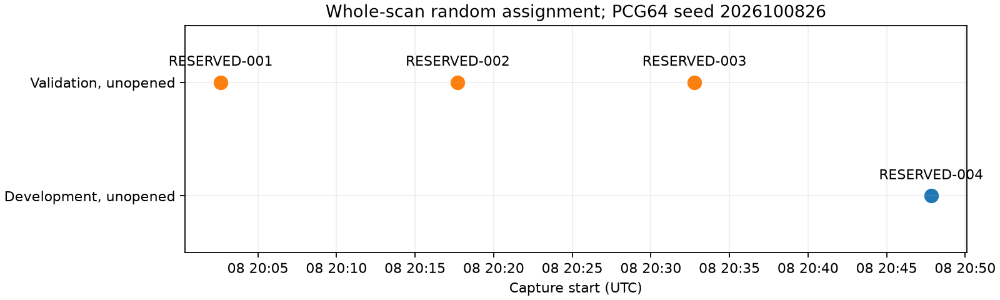

# Iteration 26: reserve another independent random whole-scan holdout

**Four newer recordings are frozen: one development and three validation. No
positioning outcomes have been opened.** This reservation was made while the
119-member consumed-corpus slope regression was running, before seeing its full
result. It is a metadata-only iteration, not a localization result or a passed
validation test.

The sampling frame is all published adaptive recordings whose capture starts
fall in **2026-10-08 [20:00, 21:10) UTC**, and whose publication finished by
21:10 UTC. One additional recording was excluded solely because publication
finished after that fixed cutoff. No analysis-readiness, frequency-fit or
position-error filter was applied.

PCG64 seed **2026100826** produces index permutation `[1, 0, 2, 3]`; the first
`ceil(2N/3)` indices are validation. Both receivers, all channels and every
window in a recording remain together. By chance the validation assignments
are the first three captures in chronological order; the assignment was not
rerolled or relabeled as a time holdout.

| Label | Session | Assigned role |
|---|---|---|
| RESERVED-001 | `scan-fw-f1a32cacd910c005` | Validation |
| RESERVED-002 | `scan-fw-8d37c3b59f1ca7d1` | Validation |
| RESERVED-003 | `scan-fw-d406a510f5473348` | Validation |
| RESERVED-004 | `scan-fw-c17fbfacad538641` | Development |

Both session IDs and uncompressed IQ digests are disjoint from the entire 119
consumed-member corpus; the four new IQ digests are unique. The public recording
store was accessed read-only. No new recording was requested or started.

Keep all four outcomes unopened until a candidate and validation criteria are
frozen. If the current slope candidate fails its full development regression,
retain these outcomes for a subsequently qualified candidate. Any cross-scan
preprocessing must use development data only; no tuning on validation outcomes.
Three validation recordings are a small sample and cannot establish a precise
population mean, even if a future numeric gate passes.

[freeze.py](freeze.py), [newer-random-split.json](newer-random-split.json), the
plotting source and [integrity.json](integrity.json) preserve the cutoff, seed,
assignment, exclusions, manifest/IQ hashes and source hashes. Production remains
unchanged and the sub-kilometre goal remains active.
