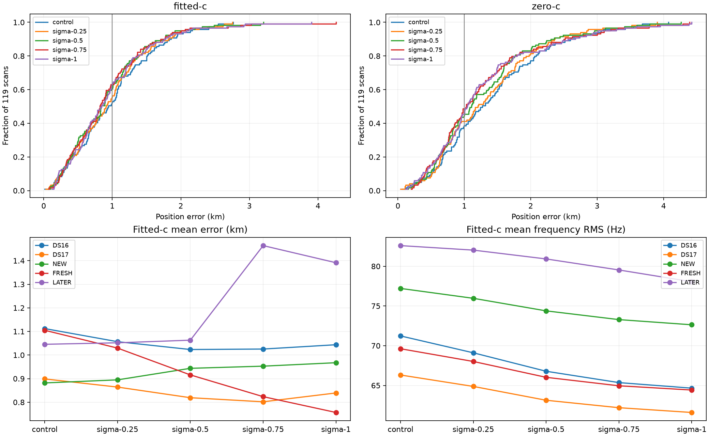

# Iteration 27: tighter satellite-slope prior passes development gates

**Select the 0.25-Hz/s Gaussian satellite-slope prior for independent validation.**
Across all 119 consumed recordings, fitted-c mean error improves from
**1.001464 to 0.961650 km**, p95 from **2.139346 to 1.996970 km**, and worst
error from **2.762679 to 2.750798 km**. It passes every predeclared development
gate. This is a development result, not independent validation or deployment.

## What changed and what stayed fixed

[protocol.json](protocol.json), [slope_prior.py](slope_prior.py),
[evaluate.py](evaluate.py), and numerical tests were published in `f30677efa`
before execution. The three variants change only the Gaussian prior on the
sum-zero satellite-common frequency slope: sigma **0.25, 0.5, or 0.75 Hz/s**
in the orthonormal satellite basis. These are soft priors, not hard physical
slope caps. The receiver affine slope bound remains **±60 Hz/s**.

The control is the drift-50 research pipeline from iterations 19–21, with
matched control refits from iteration 25. The previous sigma-1 results are
reused unchanged for context. All observations, pruned candidate sets, timing
and clock priors, initial seeds, and 20-second/600-iteration fit budgets are
matched. Satellite time centers are reconstructed from the fitted operational
seed's responsibilities and verified against iteration 25 within 1e-9 seconds.
New coefficients start at zero. There are no retries. Reference coordinates
are used only for error reporting, never operational initialization or fitting.

There are 714 new fits: 119 scans × three priors × two c arms. All 119 scans
are consumed development/diagnostic data: 48 DS16, 51 DS17, eight NEW, six
FRESH, and six LATER. Earlier random and chronological assignments retain their
historical meaning; none is newly independent validation for this tuned model.

## Accuracy and qualification

| Fitted-c metric | Control | Sigma 0.25 | Sigma 0.5 | Sigma 0.75 | Sigma 1, previous |
|---|---:|---:|---:|---:|---:|
| Mean error, km | 1.001464 | **0.961650** | 0.927052 | 0.936625 | 0.953968 |
| Median, km | 0.944917 | 0.908886 | 0.840365 | 0.819545 | 0.843679 |
| p95, km | 2.139346 | **1.996970** | 1.932662 | 2.007084 | 2.080637 |
| Worst, km | 2.762679 | **2.750798** | 3.204798 | 4.262794 | 3.905388 |
| Raw converged fits | 118/119 | 118/119 | 119/119 | 119/119 | 119/119 |
| All development gates pass | — | **Yes** | No | No | No |

The selected prior improves pooled mean by 39.81 metres (3.98%). Eighty-eight
scans improve and 30 worsen by more than one metre; one uses its unchanged
control fallback. Individual regressions remain: passing pooled and cohort
checks does not mean every recording improves.

| Cohort | Control mean, km | Sigma 0.25 | Sigma 0.5 | Sigma 0.75 |
|---|---:|---:|---:|---:|
| DS16, 48 | 1.112132 | 1.056582 | 1.023385 | 1.025382 |
| DS17, 51 | 0.898735 | 0.864203 | 0.819111 | 0.801824 |
| NEW, 8 | 0.881760 | 0.894774 | 0.943701 | 0.952846 |
| FRESH, 6 | 1.104876 | 1.029443 | 0.915758 | 0.823582 |
| LATER, 6 | 1.045506 | 1.051875 | 1.062988 | 1.463799 |

Frozen gates require complete119 coverage, fitted mean below both 1 km and
control, every cohort mean within 5% of control, pooled p95/worst within 10%
of control, and at least 95% raw fitted convergence. Selection is the tightest
passing prior in the fixed order 0.25, 0.5, 0.75. Sigma 0.5 and 0.75 both fail
the NEW-cohort guard and worst-error guard; 0.75 also fails LATER. Their lower
pooled means do not override these failures. No thresholds changed afterward.

## Remaining failures and the original search-region case

| Recording | Control, km | Sigma 0.25 | Sigma 0.5 | Sigma 0.75 |
|---|---:|---:|---:|---:|
| DS17-008, formerly about 153 km | 2.534893 | 2.616195 | 2.205054 | 0.829848 |
| DS17-038, largest 0.25 regression | 0.399693 | 1.038040 | 0.925079 | 0.819545 |
| S37, worst 0.5 result | 2.412443 | 2.389225 | 3.204798 | 2.871349 |
| LATER-005, previous association failure | 0.865251 | 1.053255 | 1.622332 | 4.262794 |

The earlier additive-region fix remains part of the upstream pipeline: retain
ordinary finalists, add spatially distinct finalists, and compare using the
unchanged regional score. This experiment does not rerun or undo that search.
The original 153-km error is not recurring here, but the selected prior does
not improve DS17-008's remaining local error. Choosing the 0.75 result for that
individual recording using its reference error would be an oracle policy and
is not proposed.

The tighter prior substantially contains LATER-005's previous large regression,
although it still worsens relative to control. A soft prior permits large
corrections if the likelihood improvement pays for them; sigma is not a maximum
allowed slope. The [saved-fit diagnostic](diagnostics.json) reconstructs raw
objectives and satellite association masses for the largest regression under
each new prior, DS17-008, and LATER-005. It performs no optimization and uses no
reference-position inputs; case selection is explicitly post-hoc.

For LATER-005, satellite 51965's fitted slope is −0.833, −4.406, and
−16.079 Hz/s under the three new priors. Its posterior mass gain over control
is respectively 8.09, 27.48, and 170.00. Thus the tightest prior sharply
limits the measured association shift, whereas 0.75 again permits a large
shift. No satellite coefficient reaches its outer coordinate bound. These
are inferred associations, not proven satellite identities or physical drift
measurements. DS17-038's 0.25 regression occurs with a largest satellite slope
of only 0.978 Hz/s and a modest 13.91-unit mass gain for satellite 58473;
small nuisance corrections can still move position appreciably.

## Matched c ablation and frequency fit

| Zero-c metric | Control | Sigma 0.25 | Sigma 0.5 | Sigma 0.75 |
|---|---:|---:|---:|---:|
| Mean position error, km | 1.420674 | 1.345831 | 1.284874 | 1.280472 |
| p95, km | 3.059100 | 2.842526 | 2.977686 | 3.115408 |
| Worst, km | 4.073590 | 3.902727 | 4.263626 | 4.392279 |
| Raw converged fits | 116/119 | 117/119 | 119/119 | 118/119 |

All 357 new zero-c fits lock static c and both receiver RF-time coefficients
exactly to zero. Non-RF satellite slopes remain matched nuisance terms in both
arms. This is a conditional calibration ablation using fitted-derived banks
and seeds, not independently selected searches.

| Mean posterior frequency RMS, Hz | Control | Sigma 0.25 | Sigma 0.5 | Sigma 0.75 |
|---|---:|---:|---:|---:|
| Fitted-c | 70.018 | 68.351 | 66.405 | 65.230 |
| Zero-c | 111.174 | 109.916 | 108.038 | 106.635 |

Frequency fit improves as flexibility grows, while worst position errors can
increase. Neither frequency RMS nor penalized scores across changed models
were used as evidence of better localization.

Four new fits fail independent stationarity: sigma 0.25 on S48 fitted-c
(0.001095), S44 zero-c (0.003654), and DS17-032 zero-c (0.001378); sigma 0.75
on DS17-004 zero-c (1.804142). Each uses the predeclared matched operational
control fallback. Raw failures remain visible in the summary and result files.
The acceptance threshold remains 0.001; it was not loosened for near misses.

## Decision and next iteration

Freeze the fully assembled sigma-0.25 candidate and validation criteria before
opening the [iteration26 reserved recordings](../2026_10_08_position_error_iter26/README.md).
First verify implementation on its one assigned development recording, then
evaluate all three assigned validation recordings without retuning or dropping
failures. Three scans are a small validation sample; a passing mean would not
establish precise population accuracy.

The [integration review](integration-notes.md) identifies the required versioned
contract, numerical modules, publication and rendering work after qualification.
Production is unchanged: bounded Hard60 recovery and longest-16 per-track TLE
review PNGs remain deployed. No new RF collection, QNAP writes, or changes to
published contracts occurred. The goal remains active.

All 411 frozen source/input hashes were verified; derivative tests pass in
development and production environments (3 each). Ruff, strict c locks,
complete membership, rendered PNG, and reconstructed diagnostic objectives
were checked. All four evaluation processes completed successfully. See
[summary.json](summary.json), `results/`, and [integrity.json](integrity.json)
for the retained evidence.
