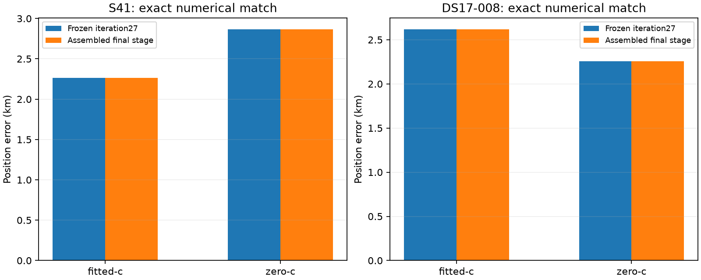

# Iteration 28: assembled stage reproduces results; reserved baseline unavailable

**The selected sigma-0.25 stage reproduces both consumed canaries exactly in
both c arms. Independent validation has not run.** The assigned development
recording has no published Hard60 baseline yet, so its first attempt is retained
as failed and the three validation outcomes remain unopened. No candidate is
qualified for deployment by this iteration.

## Frozen candidate and numerical checks

Commit `b78cd015b` published [protocol.json](protocol.json),
[extension.py](extension.py), [evaluate.py](evaluate.py), and the freezing source
before any reserved-outcome access. It retains all upstream regional and joint
clock behavior from iteration20, then adds the matched control refit and
sigma-0.25 satellite-slope stage qualified in iteration27. The two new stages
share the accepted fitted drift-50 seed, observations, pruned bank, all other
priors and 20-second/600-iteration budgets. If that seed did not converge, use
the accepted fitted post-200 stage, then remove-5, appending zero RF-time terms.
Nonstationary final fits fall back to converged matched control, then the prior
operational arm. An upstream early stop remains an early stop.

S41 and DS17-008, both consumed development cases, each run the control and
candidate in both c arms. All eight fits complete. All four candidate vectors,
nuisance coefficient arrays, objectives and reported errors match iteration27
**exactly**, stronger than the frozen 1e-6 tolerance. This checks final-stage
assembly on archived upstream inputs; it is not a cold end-to-end execution or
a fresh accuracy test. Earlier iteration20 separately checked upstream assembly.

Zero-c locks static c and both receiver RF-time coefficients to zero. Satellite
slopes remain matched non-RF nuisance terms. Fitted-derived banks and shared
seeds make this a conditional calibration ablation. The implementation never
uses reference positions as initialization or candidate-selection evidence.

## Preserved random assignment and first availability failure

The iteration26 assignment is unchanged: PCG64 seed 2026100826, four disjoint
whole recordings, RESERVED-004 development and RESERVED-001/002/003 validation.
No recording is substituted because analysis is pending.

RESERVED-004 is `scan-fw-c17fbfacad538641`. Its first attempt fails before
localization with `Frozen member has no published baseline; retain as unavailable`.
The original [result](results/RESERVED-004.json) remains immutable. The public
tracking-input adapter can load its existing observations, but Hard60 public
status is pending. The expected deployed configuration is still
`sha256:d1524c45e6e702008221d941240e7a0ac26f13feac87fef73e83f04c9c0a80f6`.

The existing production worker was observed computing the TLE-position-v3
stage, holding that component's writer lease; it was not interrupted. A
supplemental invocation of the unchanged standard regional-analysis CLI has
been started on the already recorded data, with a 500-second internal budget
and 540-second outer timeout. This is baseline completion, not RF collection,
a candidate deployment, or permission to overwrite an existing publication.
The public writer lease protects against concurrent publication.

The reserved development gate remains unresolved, so none of the three
validation position outcomes has been opened. [summary.json](summary.json)
records zero complete assigned validation members and `qualified=false`.
Missing validation results are not assigned artificial zero errors or silently
excluded from the denominator.

## Fixed validation gates and next step

The unchanged candidate must be evaluated on all three random validation scans.
Its fitted mean must be below 1 km and no worse than both published baseline
and matched research control. Its worst error must stay within 10% of each
comparator's worst, and every final fitted slope fit must converge. Retain all
failures and report both c arms and frequency RMS separately. The development
recording qualifies execution only; do not tune using its error. Three scans
remain too few for a precise population-mean claim even if these gates pass.

When the baseline is available, complete the identical frozen model in a
separate follow-up report, preserving this initial availability failure and
the random assignment. No model or threshold changes are justified by a
missing publication. The current failure is operational availability, not
evidence of poor positioning or failed numerical convergence.

Ruff checks, all 418 frozen source/input hashes, exact numerical canaries and
strict zero-c locks were verified. No runtime source, deployed configuration,
public persisted contract, or golden fixture changed. Existing bounded Hard60
recovery and longest-16 per-track review PNG behavior remain intact. This
iteration starts no RF acquisition and writes nothing to QNAP. Evidence is
sealed in [integrity.json](integrity.json). The persistent goal remains active.
