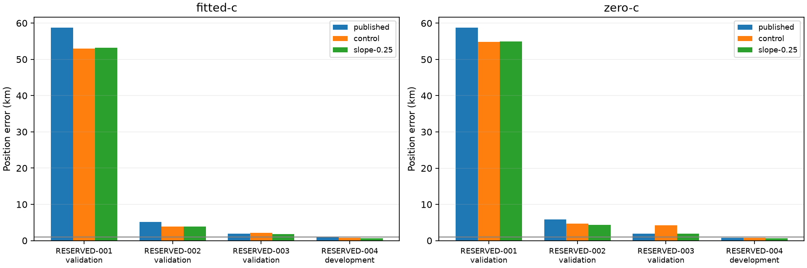
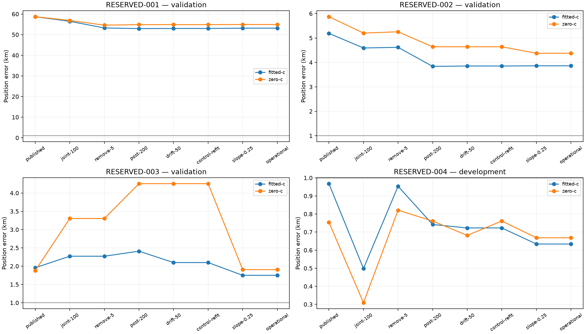

# Iteration 29: independent validation rejects the selected candidate

**Do not promote the sigma-0.25 candidate.** The three preassigned random
validation recordings have fitted-c errors **53.140, 3.862 and 1.750 km**, for
a **19.584 km mean**. The target gate fails despite every local fit converging.
The earlier 0.962-km result on 119 consumed development scans does not generalize
to this independent sample. Production remains unchanged.

## Unchanged completion and full membership

The model, whole-scan random split, budgets and gates were frozen in iteration28
before outcome access (`b78cd015b`). The availability-only completion source and
[protocol](protocol.json) were frozen as `0da476d0a`. Neither model nor thresholds
changed. Iteration28's original RESERVED-004 availability failure remains intact.

The standard baseline for RESERVED-004 completed after two bounded, checkpointed
CLI slices using the unchanged deployed Hard60 configuration. No production
worker was stopped, no publication overwritten, and no RF acquisition started.
The assigned development recording was then evaluated first; its completion
enabled all three validation evaluations. Its error was not used for tuning.
All four assigned recordings completed; none was replaced or omitted.

PCG64 seed **2026100826** and the iteration26 whole-recording assignment are
unchanged. Both receivers, all channels and all windows remain grouped. All
four recordings are disjoint from the previous119 by session and IQ digest.
Three validation scans are a small sample, but their observed failure is clear;
small sample size is not a reason to disregard it.

| Label | Session | Role | Sample rate |
|---|---|---|---:|
| RESERVED-001 | `scan-fw-f1a32cacd910c005` | Validation | 2.5 MS/s |
| RESERVED-002 | `scan-fw-8d37c3b59f1ca7d1` | Validation | 2.5 MS/s |
| RESERVED-003 | `scan-fw-d406a510f5473348` | Validation | 10 MS/s |
| RESERVED-004 | `scan-fw-c17fbfacad538641` | Development | 10 MS/s |

The two worst cases happen to use 2.5 MS/s. This tiny, unbalanced sample does
not establish sample rate as a cause or justify a rate-dependent policy.

## Position accuracy and fixed gates

| Fitted-c error, km | Published Hard60 | Matched research control | Sigma 0.25 |
|---|---:|---:|---:|
| RESERVED-001 | 58.693871 | 53.000325 | **53.140384** |
| RESERVED-002 | 5.189441 | 3.853648 | **3.861764** |
| RESERVED-003 | 1.957068 | 2.098171 | **1.749872** |
| **Validation mean** | **21.946793** | **19.650715** | **19.584006** |
| RESERVED-004, development only | 0.967945 | 0.722943 | 0.633902 |

The candidate passes completeness, mean-no-worse-than-comparators, worst-error
guards and final-fit convergence. It **fails mean below 1 km**. Lower mean than
the already poor baseline is insufficient. The other two validation cases alone
average 2.806 km, so missing the target is not confined to one catastrophic case.
No individual case is removed from the official validation mean.

The four opened recordings are now consumed diagnostic data for future model
development. Across all123 currently consumed recordings, the selected model's
descriptive fitted mean is **1.413189 km** (zero-c 1.805086 km), combining the
fixed iteration27 outputs with these four outputs. This aggregate is not a
replacement for the failed independent validation result. Any revised model
needs a new independent evaluation.

## Where the large error persists

All four recordings retain their original regional winner; the additional
sep25 finalist search does not change any selected arm under the unchanged
regional score. Both regional searches use the identical ordered400 grid.
The 53-km failure is already present before the new slope correction:

| RESERVED-001 fitted stage | Error, km |
|---|---:|
| Published regional winner | 58.693871 |
| Initial joint-clock fit | 56.466255 |
| Remove timing-inconsistent candidates, retain observations | 53.246334 |
| Post-200 joint clock | 52.940877 |
| Drift-50 RF-time correction | 53.000325 |
| Matched control refit | 53.000325 |
| Satellite slope sigma 0.25 | 53.140384 |

Fifteen candidates are removed from RESERVED-001, but the position remains in
the wrong region. This is not a failed-convergence fallback: all stages satisfy
the independent stationarity test. The slope stage slightly worsens the final
position, but does not originate the catastrophic error.

On the development recording, initial joint fitting reaches 0.498315 km, pruning
then worsens it to 0.953489 km, and later stages recover to 0.633902 km. This
illustrates that the fixed sequence does not improve every individual stage.
The known reference error was not used to choose the best stage.

The next diagnosis should inspect all saved coarse points, ordinary finalists
and additional finalists for RESERVED-001. Determine whether the correct region
was sampled, whether it survived regional final fitting, and whether selecting
one regional winner before joint-clock fitting discards a recoverable branch.
That is a hypothesis to test, not an established root cause from these errors.
Also retain the 3.862- and 1.750-km cases for model/data mismatch investigation.

## Strict calibration ablation and separate frequency-fit evidence

| Zero-c error, km | Published Hard60 | Matched control | Sigma 0.25 |
|---|---:|---:|---:|
| RESERVED-001 | 58.726514 | 54.864086 | 54.922335 |
| RESERVED-002 | 5.873396 | 4.640663 | 4.375685 |
| RESERVED-003 | 1.876009 | 4.255707 | 1.905270 |
| **Validation mean** | **22.158639** | **21.253485** | **20.401097** |
| RESERVED-004, development only | 0.754649 | 0.761187 | 0.668460 |

| Validation mean posterior frequency RMS, Hz | Published | Control | Sigma 0.25 |
|---|---:|---:|---:|
| Fitted-c | 111.652 | 94.031 | 89.387 |
| Zero-c | 125.473 | 105.681 | 103.110 |

Frequency fit improves while localization remains unacceptable. Every local
stage uses matched observations, bank, other priors, shared fitted-derived
initialization and 20-second/600-iteration budgets for the two arms. Static c
and both receiver RF-time coefficients are exactly zero in all24 zero-c local
fits. Satellite slopes remain matched non-RF nuisance terms. This is a
conditional calibration ablation, not independently chosen candidate banks.

All48 local fits converge, with no numerical fallback or local retry. The
zero-c control refit on RESERVED-004 changes its solution from the earlier
zero-c drift stage because both new arms start from the shared fitted seed;
it is not seeded from the earlier zero-c optimum. That matched initialization
was frozen before the outcomes.

## Verification and decision

All424 frozen source/input hashes, unchanged protocol settings, complete random
membership, identical grid receipts, strict c locks, convergence records and
rendered figures were checked. The first availability failure is preserved.
The current code is an offline checkpoint-backed experiment, not an integrated
runtime deployment or cold end-to-end verification. Do not claim live WebUI
PNGs show this experimental candidate.

No runtime source, public contract or scientific golden fixture changed.
Previously deployed bounded Hard60 recovery and longest-16 per-track review
PNGs remain intact. QNAP remains read-only. The goal remains active, and no
candidate promotion is justified by this iteration. See [summary.json](summary.json),
`results/`, `baselines/`, `regions/`, and [integrity.json](integrity.json).
