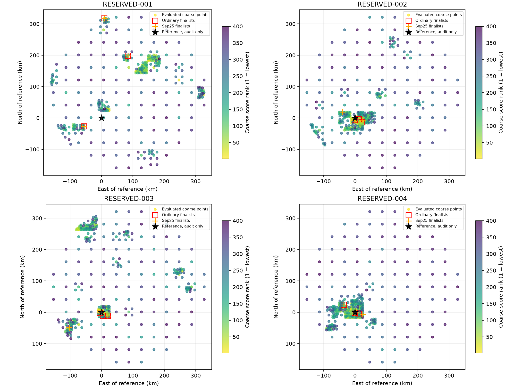

# Iteration 30: the 53-km failure loses the correct area before regional final fitting

**RESERVED-001 is a coarse search/ranking failure before the retained regional
finalists, not simply a good regional fit discarded by the final joint model.**
The grid evaluates a converged point 7.105 km from the reference, but none of
the retained regional fits is closer than 54.403 km. Increasing finalist
separation from12.5 to25 km selects exactly the same three distant regions.
Preserving those three regions through more final fitting would not by itself
restore the missing near-reference branch.

This is a post-hoc archive-only diagnosis, with no new localization fits or
operational changes. Known coordinates are used only to label audit distances
and center this visualization. They are not offered as an operational seed.
All four recordings were opened in iteration29 and are now consumed diagnostic
data. The independent validation failure remains unchanged.

## Where coverage is lost

RESERVED-001 is `scan-fw-f1a32cacd910c005`. Its nearest evaluated grid point is
`east=-80, north=-80 km` relative to the configured Sacramento prior. It belongs
to the initial40-km grid and lies **7.105090 km** from the reference. Its coarse
fit converges with score31318.958, ranked **23rd of121 initial40-km points** and
**191st of400 evaluated points** (180th among converged points).

The adaptive search spends its finer coverage elsewhere:

| Grid spacing | Nearest evaluated point to reference, km |
|---|---:|
| 40 km | **7.105090** |
| 20 km | 31.131159 |
| 10 km | 26.069775 |
| 5 km | 23.494689 |

The nearest5-km-grid fit is also nonconverged. There is no evaluated point within
5 km of the reference. Of the scored points within25 km, the initial40-km point
has the lowest score, but it does not become a regional finalist.

The three retained centers are **318.624, 61.473 and 215.741 km** from the
reference. Their coarse scores are29145.139,29173.361 and29322.576 respectively.
All are already more than25 km apart, so the wider-separation replay adds no
different center on this recording. Across both replays and all c/start arms,
the closest final position is **54.402540 km**, from a fitted-c zero-timing start;
the chosen fitted result is58.693871 km. Joint fitting subsequently reaches
53.140384 km, as reported in iteration29.

This evidence localizes the first observable search failure: a near-reference
coarse point exists but coarse ranking and adaptive refinement do not preserve
that area for regional final fitting. It does **not** yet explain why its score
is worse, prove that fitting it would recover the reference, or establish that
the reference would have better final likelihood. Those require numerical
diagnostics on the discarded branch.

## The other recordings fail differently

| Recording | Nearest grid point, km | Overall coarse-score rank | Nearest ordinary finalist center, km |
|---|---:|---:|---:|
| RESERVED-001 | 7.105090 | 191 | 61.473354 |
| RESERVED-002 | 1.578897 | 4 | 6.525495 |
| RESERVED-003 | 1.578897 | 16 | 5.668707 |
| RESERVED-004 | 1.578897 | 1 | 1.578897 |

RESERVED-002 samples the correct area at5-km spacing and retains a nearby region,
yet its nearest converged fitted regional solution is5.189441 km away; the joint
pipeline reaches3.861764 km. This is not the same gross coverage failure as001.

RESERVED-003 has a converged **0.566746-km** fitted-c regional solution from the
zero-timing start at `point:-92.5:-82.5`, but its score37276.962 is substantially
worse than the selected solution's score. The selected regional solution is
1.957068 km away and the later pipeline reaches1.749872 km. Here an apparently
accurate start does exist but loses under the model score. Selecting it by
known error would be oracle selection and is not a proposed fix.

RESERVED-004 has good near-reference coverage and a good selected solution.
Its closest fitted regional alternative is0.930717 km, compared with the chosen
0.967945 km; the subsequent fixed pipeline reaches0.633902 km. Better archive
error alone is not evidence that an alternative should be operationally chosen.

## Next controlled diagnosis

1. For RESERVED-001, compare the discarded existing `(-80,-80)` coarse branch
   with the retained `(-142.5,-107.5)` branch through identical calibration,
   association and local fitting budgets. Keep matched zero-c/fitted-c arms.
   Explicitly label the discarded point selection an oracle diagnostic: it is
   chosen here because of known reference proximity, not a deployable policy.
2. Determine whether the near branch becomes a converged competitive fit. If it
   does, test a reference-independent coverage policy, such as preserving a
   fixed number of distinct initial-grid regions before adaptive pruning. If it
   does not, investigate coarse calibration/association and model preference
   before spending a larger search budget.
3. Separately carry the existing association and zero-timing starts for003
   through matched joint fits to distinguish initialization/association loss
   from a model that intrinsically prefers the worse position. Preserve scores
   and position errors separately; do not choose by reference error.

None of these proposed tests has yet established a deployable improvement.
Do not interpret this audit as evidence that simply increasing the number of
retained final basins will fix the problem. Any revised model or search policy
must retain the full123 consumed-case regression and obtain new independent
validation before promotion.

[audit.py](audit.py) reads only the eight sealed baseline/additional-region
documents. It verifies identical ordered grids, records input/source hashes,
computes spherical coordinate distances consistently with the pipeline, and
records every grid point and final start in [audit.json](audit.json). Both
c arms and all start outcomes are retained; there is no c-dependent refitting
in this archive-only audit. Ruff and the rendered figure were checked.
No RF collection, QNAP writes, runtime changes, contract changes or deployment
occurred. [integrity.json](integrity.json) seals this report. The goal remains active.
