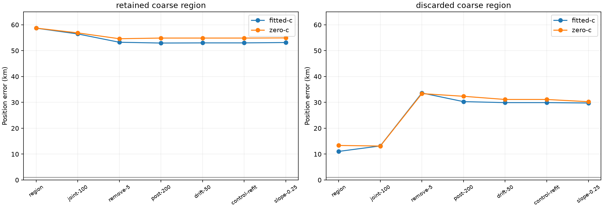

# Iteration 31: fitting the discarded region does not solve the catastrophic case

**Broader region retention alone is insufficient on RESERVED-001.** Explicitly
fitting the discarded coarse point7.105 km from the reference produces an
11.047-km regional winner, then a **29.765-km** final joint result. This is better
than53.140 km but remains unacceptable, and the near region was selected using
known reference proximity. It is an oracle diagnostic, not a deployable fix or
an improvement to the official validation result.

## Frozen test and retained-region reproduction

[Protocol](protocol.json) and numerical sources were published as `5a850249d`
before the new fits. The two existing points are `(-142.5,-107.5)` and `(-80,-80)`
km relative to the configured prior. Both use identical observations, calibration
algorithm,60-second association budget,20-second/600-iteration local budgets,
receiver affine bounds±60Hz/s, timing priors and downstream joint-fit sequence.
Both regional search disks are fixed at25km. A native40km cell would otherwise
use28.284km; this diagnostic deliberately uses the stricter matched radius.

The retained point runs first as an implementation check. Its regional winners
reproduce the published vectors, candidate identities, selection scores and
errors within1e-5. Its downstream operational vectors, nuisance coefficients,
objectives and errors match iteration29 within1e-5; reported final errors match
exactly. Only after that check passes is the discarded point run.

The discarded point is explicitly chosen using reference proximity. No known
coordinates enter calibration, association or local optimization after that
oracle choice. Intermediate data are private experiment dictionaries, not
published V2 documents falsely claiming reference-free inference. No public
contract is changed or new runtime result published.

## What happens along the discarded branch

| Fitted-c stage | Retained region error, km | Discarded region error, km |
|---|---:|---:|
| Selected regional fit | 58.693871 | 11.046875 |
| Initial joint clock | 56.466255 | 13.1683 |
| Remove timing-inconsistent candidates | 53.246334 | **33.6380** |
| Post-200 joint clock | 52.940877 | 30.2905 |
| Drift-50 | 53.000325 | 29.9096 |
| Sigma-0.25 satellite slope | **53.140384** | **29.765178** |

The retained association contains21 satellites and removes15, leaving6. The
discarded association contains32 and removes18, leaving14. All observation
windows remain in both pipelines. The near branch's largest position jump
occurs at pruning/refitting, not at the later satellite-slope stage. All24
downstream joint fits converge. This localizes the regression to a stage; it
does not establish that any particular removed satellite was correctly or
incorrectly identified.

The retained regional fitted selection score is26623.690, versus28665.475 for
the discarded branch. Thus the unchanged regional criterion would still prefer
the distant retained branch, even if the additional region were available.
Scores after pruning use different candidate banks and are reported as
diagnostics, not used here to define a new cross-branch selection policy.

## A closer start is discarded within the near region

| Discarded-region fitted-c start | Error, km | Regional objective | Converged |
|---|---:|---:|---|
| Association | 11.046875 | 28659.403 | Yes |
| Zero timing | **3.191206** | 30666.393 | Yes |
| Own continuation | 11.046875 | 28659.403 | Yes |

The zero-timing start is much closer but pays about2007 objective units more.
The fixed pipeline therefore chooses the association start before joint clock
fitting. Choosing the closer start by reference error is not an operational
solution. The next controlled test should carry both standard starts through
the same joint sequence before comparing their outcomes. This will test whether
early selection loses a useful initialization or whether the later model also
prefers/moves to a wrong solution. The existing accurate-but-worse-score start
on RESERVED-003 is a second relevant case for that diagnosis.

## Matched c ablation and separate frequency fit

| Final quantity | Retained region | Discarded region |
|---|---:|---:|
| Fitted-c error, km | 53.140384 | 29.765178 |
| Zero-c error, km | 54.922335 | 30.266371 |
| Fitted-c posterior frequency RMS, Hz | 110.911 | 136.548 |
| Zero-c posterior frequency RMS, Hz | 109.312 | 139.546 |

The branch with lower position error has worse frequency RMS. Frequency fit is
not a proxy for localization accuracy. Within each branch, both c arms share
observations, bank, seed rules, priors and budgets. Zero-c fixes static c and
both receiver RF-time coefficients wherever present. Region-specific upstream
calibration/association is fitted-c-conditioned and may produce different banks
between branches; this is a conditional within-branch ablation.

Of12 regional-start fits, one fails independent stationarity: discarded-region
zero-c association, residual0.010061. The predeclared own-continuation start
converges to essentially the same point at residual0.000651 and is eligible.
There are no unplanned retries, discarded failures, or downstream numerical
fallbacks. Both new calibration postfits converge; coarse fits are reused from
the existing immutable checkpoints.

## Decision

Do not increase the operational finalist count based on a claim that this fixes
the case: this diagnostic does not achieve that. First test delayed selection
between the existing association and zero-timing starts through the joint
pipeline, while preserving the known coverage problem as a separate issue.
Any eventual reference-independent policy still needs the full123 consumed-case
regression and new independent validation. Iteration29's failed validation is
unchanged, and the goal remains active.

All431 frozen source/input hashes, retained-region reproduction, c locks, Ruff
and the rendered figure were checked. Both diagnostic processes exited normally.
No RF acquisition, QNAP writes, production changes, public-contract changes or
deployment occurred. See [summary.json](summary.json), `results/`, and
[integrity.json](integrity.json) for the preserved results and provenance.
