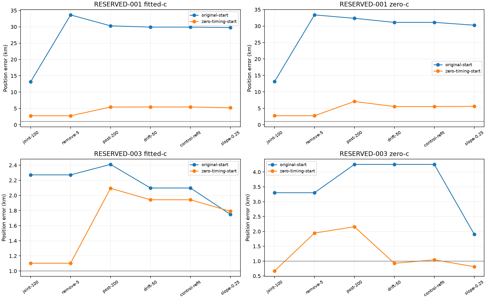
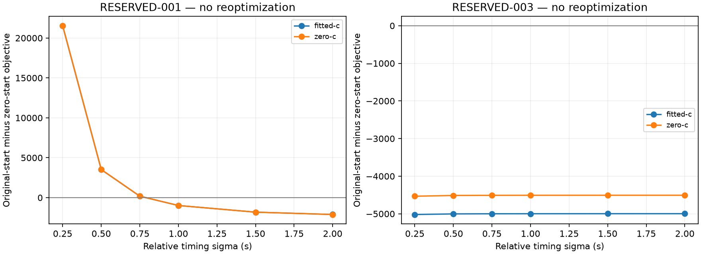

# Iteration 32: delayed start selection helps one diagnostic branch, but does not solve localization

**Carrying the existing zero-timing start through joint fitting improves the
oracle-selected RESERVED-001 region from29.765 to5.226 km.** It still misses the
target, and the region itself was chosen using reference proximity. On
RESERVED-003, fitted-c error slightly worsens1.750→1.790 km. This does not qualify
a new operational policy or alter the failed independent validation result.

## Frozen initialization-only comparison

Sources and [protocol](protocol.json) were published as `971721a48` before the
new fits. Both cases keep the same observations, regional satellite bank,
receiver calibration, joint models, priors, bounds, stage budgets and numerical
fallbacks. The only change is to carry the existing converged zero-timing
regional result into the joint pipeline instead of the regional score winner.
No new regional search or local regional fitting occurs. Sealed original-start
controls from iterations29/31 are reused unchanged.

RESERVED-001 uses the discarded `(-80,-80)` coarse region from iteration31;
its oracle selection remains explicitly part of the scope. RESERVED-003 uses
the same operational region `(-92.5,-82.5)` as before. Both are consumed
diagnostic cases, selected for investigation after validation failure.

As in the frozen pipeline, subsequent c arms share the fitted initialization.
The zero-c regional result is retained as its regional fallback; it is not used
as a separate seed for the subsequent zero-c joint fit. Thus this preserves the
existing conditional ablation rather than silently giving each arm different
initialization rules.

## Outcomes

| Case and arm | Original-start final error, km | Zero-timing-start final error, km |
|---|---:|---:|
| RESERVED-001, fitted-c | 29.765178 | **5.225788** |
| RESERVED-001, zero-c | 30.266371 | **5.593729** |
| RESERVED-003, fitted-c | 1.749872 | **1.790408** |
| RESERVED-003, zero-c | 1.905270 | **0.813397** |

The official RESERVED-001 operational error remains53.140 km, because neither
this oracle region choice nor a new start-selection policy has been deployed
or validated. Replacing it in a cohort mean with the5.226-km diagnostic result
would be misleading. The full123 consumed-case aggregate from iteration29 is
not changed by this experiment.

For001, the zero-timing regional start is3.191 km away; joint100 reaches2.761 km.
No satellite exceeds the pruning threshold, so all32 candidates remain and the
fitted pruning refit stays at2.761 km. Loosening the smooth-clock prior at
post200 worsens it to5.428 km; the later stages finish at5.226 km. In contrast,
the association-start branch had removed18 candidates and moved to33.638 km.
Initialization changes both the local solution and the subsequent pruning
decision, not merely the optimizer's reported iteration count.

For003, the zero-timing regional start is0.567 km away, but joint100 moves it to
1.103 km and post200 to2.094 km before finishing1.790 km. No candidates are
removed from this branch either. A start with low reference error does not
guarantee that the fixed model will preserve that accuracy.

## Why the initial joint model prefers the worse001 solution

A post-hoc [decomposition](decomposition.json) reconstructs the two saved
joint100 minima on the **same bank, calibration and model** for each case.
It performs no additional fitting. The reconstructed objectives match within
1e-6, and data, relative timing, common timing and clock terms sum to the total.

| RESERVED-001 fitted joint100 | Original start | Zero-timing start |
|---|---:|---:|
| Position error, km | 13.1683 | 2.760800 |
| Data negative log likelihood | 28011.186 | 30575.838 |
| Relative timing penalty | 384.158 | 8.939 |
| Clock penalty | 119.054 | 39.715 |
| Relative satellite timing RMS, seconds | **9.800** | **1.495** |

The worse-position solution wins about2565 data-likelihood units and pays only
about375 extra relative-timing units plus79 extra clock units. Its total
objective is lower by2110.102. This is a converged alternative favored by the
current model, not evidence that the optimizer mistakenly selected a larger
value of the same objective. These inferred timing shifts are not established
physical satellite clock or ephemeris errors.

At the saved parameter vectors, changing relative timing sigma from2s to0.75s
would make the001 zero-start solution better by182.905 objective units; at0.5s,
the margin is3518.189. This is **fixed-vector sensitivity, not a reoptimized
result or promised position improvement**. A fit under the new prior can move
to another solution, so an actual controlled experiment is required.

The same explanation does not transfer to003. Its two fitted joint100 solutions
have timing RMS1.206 versus1.247 seconds, with penalties5.092 versus5.442, while
the data-NLL difference is about4968. Stronger timing regularization does not
reverse their saved-vector ordering. A universal claim that timing priors solve
all remaining failures is unsupported.

## Frequency fit and strict c ablation

| Final posterior RMS, Hz | Original start | Zero-timing start |
|---|---:|---:|
| RESERVED-001 fitted-c | 136.548 | 111.964 |
| RESERVED-001 zero-c | 139.546 | 113.945 |
| RESERVED-003 fitted-c | 66.862 | 83.212 |
| RESERVED-003 zero-c | 98.800 | 103.554 |

Frequency and position improvements are not interchangeable:003 zero-c improves
position while worsening frequency RMS. All24 new joint-stage fits converge.
All12 zero-c stage records retain static c and both RF-time terms exactly zero;
within each start, both arms share observations, bank, other priors, seed rules
and20-second/600-iteration budgets. There are no new retries or fallbacks.

Different initialization can change the later pruned bank and responsibility-
derived satellite time centers. Therefore the final objectives are retained
as diagnostics, not used here as a new cross-branch selector. The joint100
decomposition above deliberately compares the same unchanged model before
those downstream differences.

## Next test and decision

Keep production unchanged. Test relative timing sigma **0.5,0.75 and1s** against
the2s control on both recorded initializations, with matched c arms and budgets,
before considering broader search changes. At that initial joint100 stage the
bank/model is common, so converged starts can be compared by their unchanged
within-variant objective without reference-error selection. Retain003 as a
counterexample rather than testing only the case predicted to benefit.

This remains a diagnostic on consumed data. Any promising change needs a
reference-independent search/selection policy, the full123-case regression,
and new independent validation. The current tests do not justify deployment
or a claim of sub-kilometre generalization.

All436 frozen source/input hashes, c locks, convergence records, reconstructed
objectives, Ruff and rendered figures were checked. Both fit processes and the
decomposition completed normally. No new RF, QNAP writes, runtime/public-contract
changes or deployment occurred. The goal stays active. See [summary.json](summary.json),
`results/`, and [integrity.json](integrity.json) for preserved evidence.
