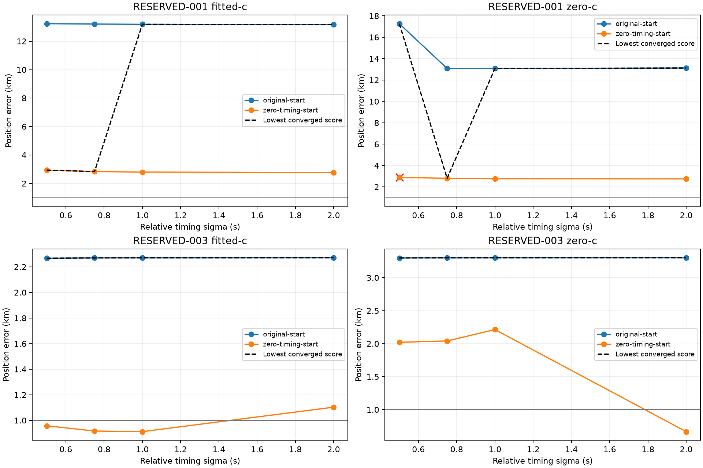

# Iteration 33: tighter timing priors change one basin choice, but miss the target

**Relative timing sigma0.75s makes score-based selection choose the better
initialization on the oracle-selected RESERVED-001 region:13.168→2.832km fitted-c
and13.123→2.811km zero-c.** It still misses1km. RESERVED-003 remains about2.27km
under fitted score selection at every tested prior. No setting qualifies a
general localization fix, and production remains unchanged.

## Frozen test and matched controls

Commit `f06cae0a8` published [protocol.json](protocol.json) and numerical sources
before execution. Two consumed cases, two existing regional initializations,
four timing priors and two c arms produce32 new initial-joint100 fits. Only
relative satellite timing sigma changes:2s control versus0.5,0.75 and1s.
Common timing sigma3s, smooth-clock prior100Hz, affine receiver slopes±60Hz/s,
candidate bank, observations, calibration and20-second/600-iteration budgets
remain fixed. There are no extra retries or downstream pruning/refitting.

The eight sigma2 controls reproduce saved physical vectors, clock coefficients,
objectives and errors within1e-5. For each sigma and c arm, choose the lowest
objective among converged starts; ties favor the original start. Reference
error never selects a start. Only scores under the same model and prior are
compared; different sigmas are not selected by their differently penalized scores.

RESERVED-001 still uses the reference-guided discarded region from iteration31.
These results do not replace its official53.140-km validation error. RESERVED-003
uses its unchanged operational region. Both recordings are already consumed
diagnostic data, not new validation.

## Selected position errors

| Case/arm, error km | Sigma2s | Sigma1s | Sigma0.75s | Sigma0.5s |
|---|---:|---:|---:|---:|
| RESERVED-001 fitted-c | 13.168349 | 13.191291 | **2.832367** | 2.936958 |
| RESERVED-001 zero-c | 13.123086 | 13.073955 | **2.810593** | **17.267771** |
| RESERVED-003 fitted-c | 2.271942 | 2.271034 | 2.270092 | 2.267375 |
| RESERVED-003 zero-c | 3.302760 | 3.301930 | 3.301061 | 3.298585 |

For001, sigma0.75 switches both arms to the zero-timing initialization, agreeing
with the direction suggested by iteration32's fixed-vector sensitivity. The
result is not sub-kilometre accuracy, however. Tightening sigma also does not
pull the association-start fitted minimum toward the reference: that branch
remains13.17–13.23km away across the sweep. The benefit is a change in ranking
between minima, not universal improvement of every minimum.

At sigma0.5, the001 zero-timing zero-c fit has error2.884408km but fails independent
stationarity at0.061075. It is ineligible; the other converged start is17.267771km
away and is selected. The failure is retained and the threshold is not relaxed.
All other31 fits converge. No accurate-looking nonstationary result is silently
used to improve a reported mean.

For003, the zero-timing fitted branch reaches0.958,0.917 and0.912km at sigma0.5,
0.75 and1s respectively, but continues to lose on objective to the roughly2.27km
branch. Selecting those sub-kilometre values using the reference would be oracle
selection. Stronger timing priors do not resolve its model preference.

## Timing magnitude, fit quality and c ablation

At sigma0.75,001's selected fitted solution has relative timing RMS1.483s,
versus9.800s for the sigma2-selected solution. These are soft Gaussian priors,
not hard timing cutoffs: a0.75s prior does not force each fitted shift below0.75s.
The association-start branch retains a large timing RMS even when penalized
more strongly, consistent with a separate local association mode.

| Selected frequency RMS, Hz | Sigma2s | Sigma0.75s |
|---|---:|---:|
| RESERVED-001 fitted-c | 149.093 | 136.147 |
| RESERVED-001 zero-c | 150.896 | 138.313 |
| RESERVED-003 fitted-c | 85.104 | 85.105 |
| RESERVED-003 zero-c | 107.693 | 107.692 |

Frequency-fit changes are reported separately from position. All16 zero-c fits
lock static c exactly to zero. This initial joint100 model has no RF-time terms
to restore under another name. The two c arms share the fitted-derived bank,
calibration, seed rules, other priors and budgets within each initialization.
This remains a conditional calibration ablation.

## Interpretation and next investigation

The refits support excessive relative timing freedom as one cause of bad
score selection on001. They also demonstrate its limits: even the better
selected basin stays near2.8km, and003's selected error barely changes.
Do not roll a new timing default into production from these two cases.

Before expanding this sweep across the corpus, investigate independent
receiver-pair consistency of the competing clock solutions. The same satellite
observed at the same RF/time should have a common Doppler term, so paired
frequency differences can provide evidence about relative receiver calibration
without reference-position inputs. Exact time/RF coincidences are only
candidate pairs, not proof of common identity; compare multiple hypotheses,
preserve unmatched rows and include a mismatched-time control before treating
such evidence as a fitting constraint. This is a proposed diagnostic, not an
established clock fault or validated solution.

The single-scan goal remains unmet. Any revised policy needs full123 consumed
regression and new independent validation; the failed iteration29 holdout and
its published aggregate remain unchanged. No RF collection, QNAP writes,
runtime/contract changes or deployment occurred. All441 frozen hashes,
control reproductions, c locks, Ruff and the rendered figure were checked.
Both evaluation processes exited normally. [summary.json](summary.json), raw
`results/`, and [integrity.json](integrity.json) preserve all outcomes.
