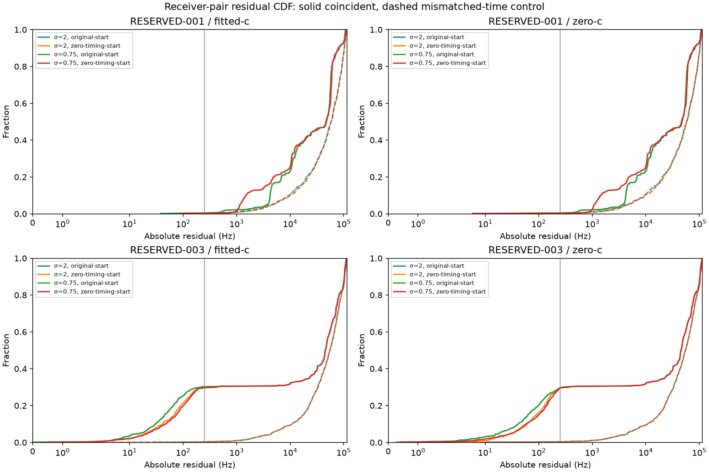
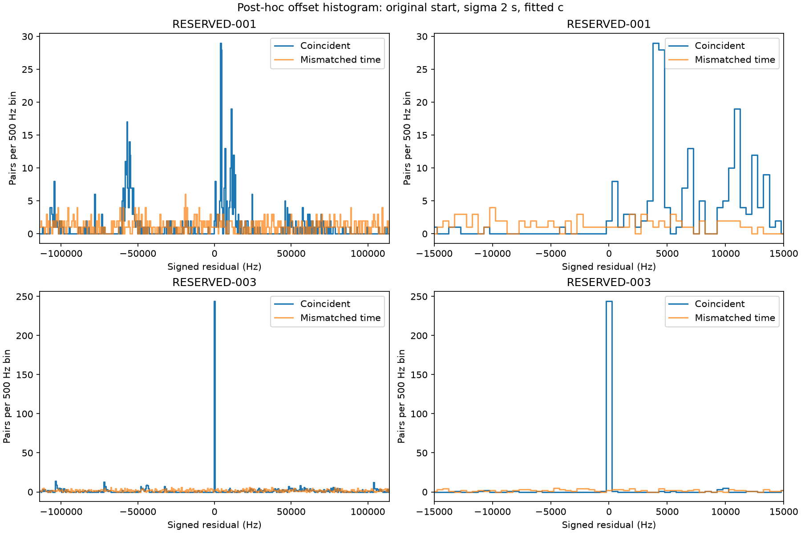

# Iteration 34: simultaneous receiver measurements expose unresolved clock structure

**The two failed scans behave differently. RESERVED-003 has a strong near-zero
receiver-pair residual component; RESERVED-001 has displaced components under
the tested clock solutions. Neither finding yet supplies a safe clock constraint
or a demonstrated localization improvement.** Production remains unchanged.

## Frozen diagnostic

Commit `73f5811b2` froze [the protocol](protocol.json) and numerical source before
execution. We audit eight saved models per scan: relative timing sigma 2 and
0.75 seconds, original and zero-timing starts, and matched fitted-c/zero-c arms.
No optimization, pruning, new search, or reference-based pair selection occurs.
Saved objectives reconstruct within 1e-6. All 445 frozen source/input hashes
are checked by the reporting script.

Pairs require identical RF and the same rounded millisecond, with exactly one
observation from each receiver. Pairing does not use inferred satellite identity.
For each pair, a PCG64 seed 2026100834 control selects an observed RX1 singleton
at the same RF but at least 30 seconds away. The mapping is identical across
clock hypotheses. Controls reuse observations and are correlated: these are
descriptive comparisons, not independent trials or a significance test.

Subtract each saved model's receiver/RF nuisance prediction, then wrap RX1−RX0
at the frequency estimator's alias period, 1/(4.4 microseconds), approximately
227,273 Hz. No satellite Doppler is subtracted. Coincident signals of the same
identity should largely cancel common Doppler, but coincidence alone does not
establish that identity.

| Scan | Observations | Time/RF groups | Unmatched groups | Singleton pairs | Null eligible |
|---|---:|---:|---:|---:|---:|
| RESERVED-001 | 2299 | 1783 | 1267 | 516 | 516 |
| RESERVED-003 | 2936 | 2130 | 1324 | 806 | 806 |

There are no multiple-row paired groups. Inference observations are unchanged.
The [complete count table](pair-counts.md) includes every arm and initialization;
[raw results](results/) retain pair indices, time separations and residual arrays.

## What the measurements say

For RESERVED-001, sigma 2/original-start/fitted-c places only **2/516 pairs
within 250 Hz**, versus 1/516 for its mismatched-time control. The zero-timing
start gives 1/516 versus zero. Tightening sigma to 0.75 leaves these counts
unchanged. Zero-c shows similarly weak near-zero agreement. This does not prove
that common signals are absent or that the clocks are correct.

For RESERVED-003, the original fitted-c clock places **244/806 pairs within
250 Hz (30.27%)**, versus **2/806 (0.25%)** in its control. The zero-timing start
gives 239/806 (29.65%), versus 3/806. At 125 Hz the original solution has
224 pairs and the alternative 196. The original clock therefore has slightly
sharper pair agreement even though its initial joint position error is worse
(2.27 versus 1.10 km at sigma 2). Pair agreement alone does not rank localization
accuracy. Zero-c also retains a large near-zero component, 237/806 versus
236/806 for the two sigma 2 starts.

The median absolute residual is around 45–48 kHz because many paired detections
are different signals. That median must not hide the substantial near-zero
component in RESERVED-003 or be interpreted as a universal clock error.

## Post-hoc displaced-component inspection

The following histogram inspection was added after seeing the frozen near-zero
metrics. With 500 Hz bins and the sigma 2/original-start/fitted-c model,
RESERVED-001 has bins centered at **4,000 and 4,500 Hz containing 29 and 28
pairs**, versus 1 and 2 in the respective controls. Additional components occur
elsewhere, including around 11 kHz and −57 kHz. RESERVED-003 has 244 pairs in
the bin centered at zero, versus 2 in its control. Bin counts and centers are
saved in [posthoc-peaks.json](posthoc-peaks.json).

These displaced components warrant checking time and RF dependence before
trying a receiver-clock shift. They are not proof of a hardware fault, a unique
relative clock offset, or common satellite identity. A single global correction
may fail when components arise from different signal pairings.

## Decision and next experiment

Do not deploy a receiver-pair penalty from this audit. The same observations
already enter the likelihood; treating these differences as additional
independent measurements would double-count evidence. Next, diagnose whether
displaced components persist across time and RF, using RESERVED-003 as a control,
before defining clock initialization proposals without reference positions.

Both scans are consumed diagnostic data. RESERVED-001 still uses the explicitly
reference-guided region from iteration 31; these diagnostics do not replace its
official 53.140 km validation error. The research model's descriptive mean over
123 consumed recordings remains **1.413189 km fitted-c / 1.805086 km zero-c**;
the independent validation failed. The sub-kilometre goal remains unmet. Any
revised model needs full regression and new independent randomized validation.

No deployment, public contract, golden fixture, RF collection or QNAP data was
changed. The deployed hard60 numerical recovery and longest-16 review PNG limit
remain intact. Reproduce the figures with `python summarize.py` in this folder.
