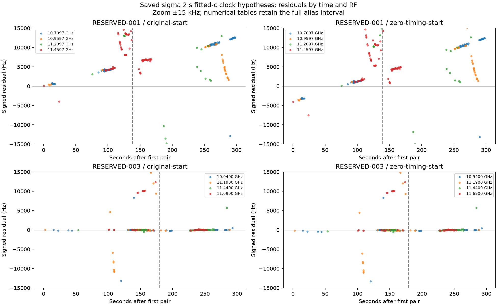

# Iteration 35: the displaced receiver residual changes with time

**A constant receiver-frequency shift is insufficient to explain the visible
RESERVED-001 residual structure. On the same RF channel, the strongest bin
changes from roughly 4 kHz early to 11 kHz late. RESERVED-003 retains a strong
near-zero component across RF channels and both time halves.** This is a
diagnostic finding, not a tested localization improvement or a hardware diagnosis.

## Method and validation

Commit `1794640c6` froze [structure.py](structure.py), [protocol.json](protocol.json)
and input hashes before running. This follows iteration 34's explicitly post-hoc
displaced-component observation. All sixteen saved hypotheses are audited:
two consumed scans, two starts, relative timing sigma 2 and 0.75 seconds, and
matched fitted-c/zero-c arms. No new observations, fitting, region selection or
reference-position selection occurs.

The existing exact-time/RF singleton pairs are split at their median time, then
stratified by exact RF using that same time split. These chronological halves
are diagnostic strata, **not validation partitions**. Histograms use the previous
500 Hz bins across the full alias interval; ties select the lowest signed bin.
The figure zooms to ±15 kHz but the [numerical results](results.json) retain all
residuals through their full-range histogram summaries. Modes are selected maxima,
not unbiased estimates; control counts at those bins are descriptive only.

All source/input hashes passed, all sixteen hypotheses produced output, and
Ruff checks passed. Pair counts remain 516 and 806. No numerical sources from
earlier experiments were changed.

## Quantified findings

Sigma 2 seconds, fitted-c:

| Scan/start | Stratum | Pairs | Modal bin, Hz | Pairs in bin | Null at same bin |
|---|---|---:|---:|---:|---:|
| 001 original | early | 258 | 4000 | 26 | 1 |
| 001 original | late | 258 | 11000 | 17 | 1 |
| 001 original | 10.7097 GHz early | 90 | 4000 | 20 | 1 |
| 001 original | 10.7097 GHz late | 79 | 11000 | 15 | 0 |
| 001 zero-timing | 10.7097 GHz early | 90 | 1000 | 19 | 0 |
| 001 zero-timing | 10.7097 GHz late | 79 | 10500 | 12 | 0 |
| 003 original | early | 403 | 0 | 122 | 1 |
| 003 original | late | 403 | 0 | 122 | 1 |

RESERVED-001 has several coherent-looking branches. The positive branch moves
over time, and visually similar residuals occur at adjacent times across multiple
RF channels. The same-RF early/late comparison rules out changing RF composition
as the sole explanation for that modal shift. It does not establish that the
early and late modes are the same physical signal. Other branches around
−57 kHz, for example, also contribute substantial counts.

The alternative zero-timing initialization changes the early residual substantially
but leaves a large late residual. Thus choosing that initialization alone has not
solved the receiver consistency problem. Zero-c gives the same qualitative result:
at 10.7097 GHz the original solution's mode changes from 4.5 to 11 kHz, while
the zero-timing solution changes from 1 to 10.5 kHz.

For RESERVED-003/original/fitted-c, every RF/time stratum has its mode at zero.
Across the four complete RF strata, the zero-bin counts are 44/213, 56/148,
92/159 and 52/286. Both time halves contribute 122 near-zero pairs. The zero-c
arm also retains the component, with 120 early and 117 late pairs within 250 Hz.
One zero-c RF/time stratum has a modal tie with a distant component: a histogram
mode alone is not a reliable identity classifier.

## Consequence for the search-region investigation

Earlier work showed that preserving the discarded RESERVED-001 region is not
enough: its final model can still prefer an inaccurate position, with receiver
and satellite timing adjustments absorbing discrepancies. This audit identifies
a concrete unresolved discrepancy to test before expanding search budgets again.

The next bounded prototype should generate multiple time-dependent relative-clock
initializations from receiver-pair structure without reference positions, retain
the original initialization, and compare matched c arms under the unchanged
likelihood. It should test both receiver anchors: pair differences constrain
relative clocks, not the absolute clock. A robust circular line-consensus proposal
is a reasonable first test; competing branches and aliases must be retained,
not silently assigned common identities. Any added pair likelihood would require
accounting for reuse of the original observations rather than assuming independent
new evidence.

No accuracy claim changes. The research model's descriptive 123-scan mean remains
**1.413189 km fitted-c / 1.805086 km zero-c**, and the independent validation
failure remains. The reference-guided region in RESERVED-001 is still an oracle
diagnostic. A successful prototype here would need full regression and new
independent randomized validation before promotion.

Production hard60 numerical recovery, fitted-c default, longest-16 review PNGs,
public contracts, QNAP data and golden fixtures are unchanged. No RF collection
was started. This report and its visualizations are publication artifacts only.
