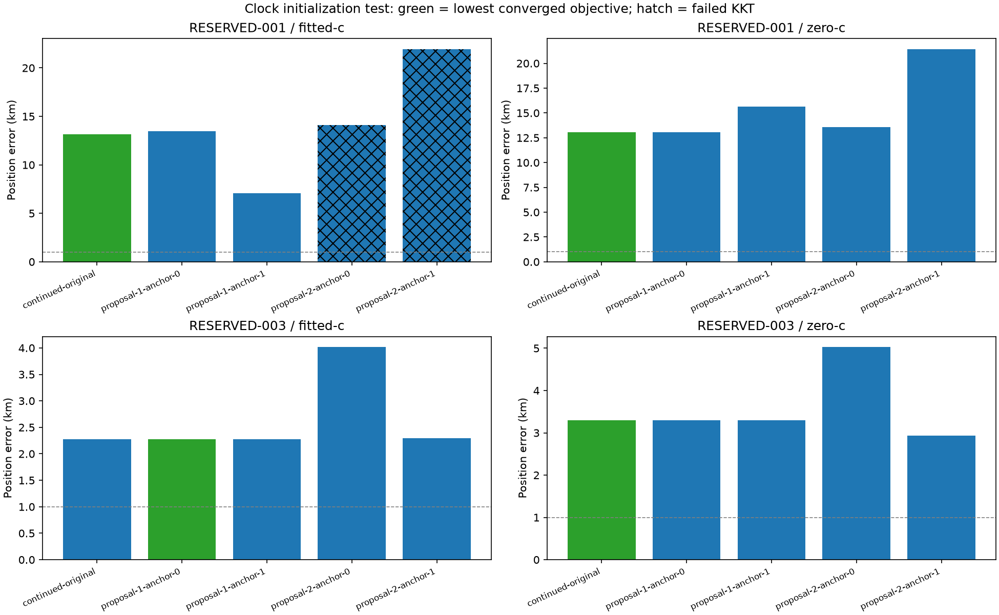

# Iteration 36: paired-clock starts do not improve score-selected localization

**Receiver-pair line consensus finds a 41.57 Hz/s residual trend in RESERVED-001.
One clock initialization improves its initial joint-fit error from 13.17 to
7.05 km, but loses under the unchanged objective. Score-selected errors remain
13.17 km and 2.27 km for the two fitted-c cases.** This prototype is not promoted.

## Frozen experiment

Commit `a426371f9` froze the numerical sources, [protocol](protocol.json) and
451 input/source hashes before execution. We use the two consumed diagnostic
cases from iterations 31–35. RESERVED-001 retains its explicitly oracle-selected
region; no result here replaces its official 53.140 km validation failure.

The same receiver-pair residuals generate circular line proposals. Search slopes
from −120 through +120 Hz/s in 1 Hz/s increments, find the densest 500 Hz circular
intercept window, and perform three local line refinements. Keep the two strongest
supports whose membership Jaccard overlap is below 0.5. Require at least four
pairs spanning at least 30 seconds. This is a deterministic proposal heuristic,
not an identity estimator or likelihood term.

Each proposal preserves either RX0 or RX1 and changes the other receiver's affine
intercept and slope. Seeds outside the existing ±60 Hz/s per-receiver bound are
rejected rather than clipped; none were rejected here. The proposal slope is a
**relative residual correction**, not an absolute fitted receiver drift.

All starts use the saved sigma 2/original-start fitted-c position, satellite timing
and smooth-clock coefficients. The control simply continues that saved fit. Both
c arms use identical starts except for the c=0 lock. Candidate bank, observations,
calibration, relative timing sigma 2 seconds, common timing sigma 3 seconds,
smooth-clock prior 100 Hz, 25 km local disk and 20-second/600-iteration per-fit
budgets remain matched. No receiver-pair penalty is added, so the observations
are not double-counted as independent extra evidence.

There are **20 new fits**: two cases × five starts × two c arms. More starts add
search cost; this is not a claim of improvement at unchanged total search budget.
No pruning or later pipeline stages run. Select the lowest converged objective
within each case/arm; report error only after selection.

## Pair-derived proposals

Intercepts are evaluated at the observation time center.

| Case | Proposal | Intercept Hz | Slope Hz/s | Support | Within-support RMS Hz |
|---|---:|---:|---:|---:|---:|
| RESERVED-001 | 1 | 6271.30 | 41.5694 | 103/516 | 107.55 |
| RESERVED-001 | 2 | 6072.03 | 36.6169 | 59/516 | 112.60 |
| RESERVED-003 | 1 | −24.15 | 0.2642 | 244/806 | 69.86 |
| RESERVED-003 | 2 | 2982.74 | −31.0469 | 71/806 | 120.28 |

Support is selected in-sample and must not be interpreted as independent
validation. Similar slopes in the two 001 proposals can represent adjacent
subsets of the same broad structure; Jaccard separation does not prove distinct
physical branches. The secondary 003 proposal can also describe different-signal
pairings. All masks are retained in [raw results](results/).

## Position and score results

| Case/arm | Continued control km | Selected km | Selected start |
|---|---:|---:|---|
| 001 fitted-c | 13.168349 | 13.168349 | control |
| 001 zero-c | 13.050868 | 13.050868 | control |
| 003 fitted-c | 2.271942 | 2.271942 | proposal 1, preserve RX0 |
| 003 zero-c | 3.302760 | 3.302760 | control |

The 003 fitted selection differs from the control only at numerical precision;
it is the same minimum. The 001 zero-c control is 13.050868 km, compared with
13.123086 km for the historical independently seeded zero-c fit in iteration 33.
This small change comes from continuing the shared fitted-c seed, not the new
pair proposal.

The most promising unselected 001 fitted candidate preserves RX1 and corrects
RX0 from proposal 1. It converges at **7.053362 km**, with objective **28771.194**,
versus **28514.443** for the control. Its posterior frequency RMS is lower
(138.807 versus 149.093 Hz), yet the complete likelihood/prior score is worse.
Frequency RMS alone does not establish a better model or guarantee position
accuracy. The paired zero-c candidate instead worsens to 15.617095 km.

All attempts, including higher-error and failed candidates, appear in
[candidates.md](candidates.md). Two 001 fitted-c proposal-2 fits fail independent
stationarity: 0.001151 and 0.004818 versus the unchanged 0.001 threshold. Their
14.09 and 21.93 km errors are not eligible for selection. The remaining 18 fits
converge. All ten zero-c fits preserve c exactly zero and every fitted receiver
slope respects hard60. No failures were retried or hidden.

## Verification, decision and next test

Three synthetic tests pass: alias-crossing line recovery with outliers, retaining
two distinct lines deterministically, and rejecting insufficient time span.
Ruff passes. Runtime checks verify all 451 frozen hashes and reconstruct the
starting saved objective within 1e-6. Reporting verifies every c=0 lock, slope
bound and stationarity eligibility. Both execution processes completed normally.

Reject this as an operational improvement. It changes which minima are reachable,
but the unchanged score still selects the old failure. A bounded follow-up should
test interaction with the already studied zero-timing start and sigma 0.75-second
relative timing prior, keeping each prior's candidates and controls matched and
never selecting a prior by its differently penalized score. This separates a
remaining initialization barrier from a model-ranking problem.

The research model's descriptive 123-scan mean remains **1.413189 km fitted-c /
1.805086 km zero-c**; independent validation still fails. New independent random
validation and full regression remain required for any revised candidate.
Production defaults, deployment, longest-16 PNGs, contracts, golden fixtures and
QNAP data are unchanged. No new RF collection occurred.
