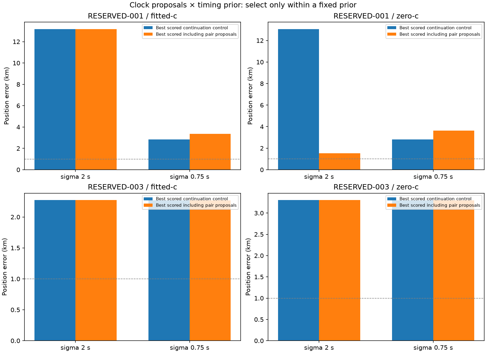

# Iteration 37: clock starts interact with timing priors and reveal a missed fitted minimum

**At sigma 2 seconds, paired-clock initialization improves the score-selected
RESERVED-001 zero-c result from 13.05 to 1.52 km. Fitted-c remains at 13.17 km.
At sigma 0.75 seconds, both arms select better scores but worse positions.**
This is not a general localization fix and is not promoted.

## Frozen matched experiment

Commit `81a28fed5` froze [the protocol](protocol.json), numerical source and
455 source/input hashes before execution. This extends iteration 36 with the
zero-timing source initialization at sigma 2 seconds, and both source
initializations at sigma 0.75 seconds. The 20 sigma 2/original-source fits from
iteration 36 are reused unchanged; **60 additional fits** complete the 80-fit
factorial comparison.

For each saved fitted-c initialization, derive two circular receiver-pair line
proposals with the unchanged iteration 36 generator. Try preserving each receiver
as anchor and retain the unmodified continuation control. Both c arms share each
seed except for the c=0 lock. Observations, satellite bank, calibration, common
timing sigma 3 seconds, smooth-clock prior 100 Hz, hard60 and per-fit budget
(20 seconds/600 iterations) remain matched. Local search disks are 25 km around
their respective saved position seeds; their centers differ between source
initializations. Additional starts incur additional search cost.

Select the lowest converged objective across both source initializations and
all clock starts **within each fixed prior and c arm**. Separately select the
best-scored continuation-only control across source initializations. Do not
compare differently penalized objectives across priors or choose by position
error. No new pair penalty or satellite-identity assumption enters the likelihood.

Both scans are consumed diagnostics. RESERVED-001 still uses the oracle-selected
region from iteration 31. No result here replaces its official validation error
or establishes a deployable search-region policy.

## Results

| Case | Sigma s | c | Continuation-only km | Including clock proposals km |
|---|---:|---|---:|---:|
| RESERVED-001 | 2 | fitted | 13.168349 | 13.168349 |
| RESERVED-001 | 2 | zero | 13.050868 | **1.517293** |
| RESERVED-001 | 0.75 | fitted | 2.832367 | **3.371813** |
| RESERVED-001 | 0.75 | zero | 2.800851 | **3.634018** |
| RESERVED-003 | 2 | fitted | 2.271942 | 2.271942 |
| RESERVED-003 | 2 | zero | 3.302760 | 3.302760 |
| RESERVED-003 | 0.75 | fitted | 2.270092 | 2.270092 |
| RESERVED-003 | 0.75 | zero | 3.301061 | 3.301061 |

The 001 sigma 2 zero-c winner comes from the zero-timing source, proposal 1,
preserving RX1 and correcting RX0. Its objective improves from 28532.100 to
28137.268, and posterior frequency RMS drops from 150.935 to 90.743 Hz.
The fitted-c counterpart from that same proposed seed converges at 2.725 km,
but its objective 28893.9 still loses to the original fitted minimum at
28514.443 and 13.168 km.

At sigma 0.75, the selected fitted result improves objective 30679.055→28921.510
and RMS 136.147→92.387 Hz, while error worsens 2.832→3.372 km. The selected
zero-c result improves objective 30700.106→28880.754 and RMS 138.646→101.520 Hz,
while error worsens 2.801→3.634 km. Better frequency fit is not sufficient for
better localization. A 1.390 km zero-c candidate from the original source also
exists, but its objective 29661.9 loses; it is not substituted into the headline.

For 003, both timing priors retain the original-source minimum. The approximately
0.917 km fitted candidate at sigma 0.75 remains unselected. Additional clock
starts therefore do not resolve this case's model-ranking failure.

## Concrete numerical issue exposed

For 001, the best zero-c objective is lower than the best fitted-c objective
under **both** priors: 28137.268 versus 28514.443 at sigma 2, and 28880.754 versus
28921.510 at sigma 0.75. The fitted model includes c=0 as an allowed value and
uses the same likelihood and priors. These results therefore expose incomplete
exploration of the fitted model, rather than demonstrating that freeing c
intrinsically worsens the globally optimized score. Local convergence certificates
do not certify the global optimum.

Next, evaluate the selected zero-c vectors under the fitted model and run matched
bounded continuations from both selected arm solutions. This tests a specific
missed-minimum hypothesis. It should retain the original candidates, report any
change in local search disks, and separate score improvement from position error.
It does not justify automatically preferring either c arm by reference accuracy.

## Integrity and limitations

All 455 frozen hashes pass, starting saved objectives reconstruct within 1e-6,
and all 40 zero-c locks and all hard60 bounds pass. Of 60 new fits, 59 converge;
the remaining 001 sigma 0.75/original-source/proposal-2/RX0-anchor fitted run
fails stationarity at 0.003389 against the unchanged 0.001 threshold. Together
with iteration 36, 77/80 fits converge. Failed fits remain in the data and are
ineligible. No slope seeds were rejected and no fits were retried. Both processes
finished normally; Ruff passes. The proposal generator's three synthetic tests
were already passed in iteration 36 and its source is unchanged.

[summary.json](summary.json) retains every fit, convergence result and selection;
[comparison.md](comparison.md) names the winning starts. [Raw results](results/)
also retain every proposal mask, including failures. No new observation or
reference-position selection was used to generate clock proposals.

The descriptive research mean over 123 consumed recordings remains **1.413189 km
fitted-c / 1.805086 km zero-c**. Independent validation remains failed. These
initial-stage, oracle-region diagnostics are not a revised full-pipeline estimate.
Production hard60 recovery, fitted-c default and longest-16 review PNGs remain
unchanged. No contracts, golden fixtures, QNAP data or RF collection were changed.
