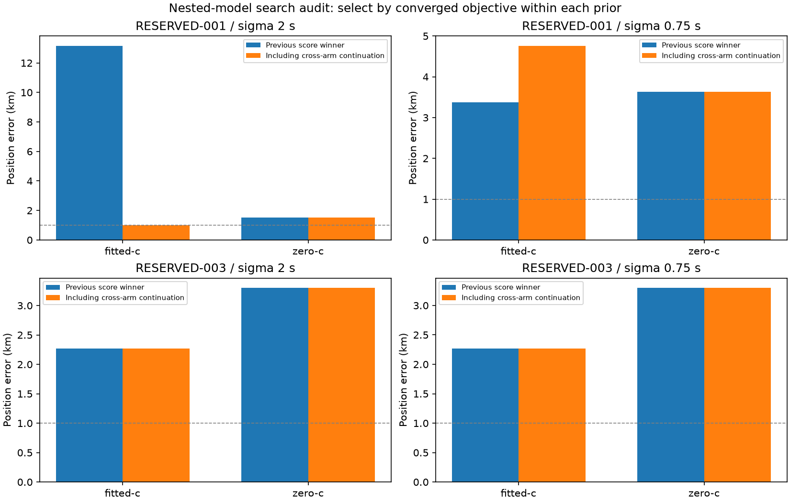

# Iteration 38: fitted-c had missed a better, nearly 1 km minimum

**Continuing the selected zero-c solution with c free reduces RESERVED-001's
sigma 2 fitted-c error from 13.168349 to 0.998884 km and its objective from
28514.443 to 28061.005.** The same operation at sigma 0.75 improves objective
but worsens position to 4.763 km. RESERVED-003 is unchanged. This resolves a
specific local-search gap, not the full localization problem.

## Frozen test

Commit `c23755c72` froze [protocol.json](protocol.json), numerical source and
458 source/input hashes. At each of two timing priors and on each of two consumed
cases, take the best converged fitted-c and zero-c solutions from iteration 37.
Use each complete solution—position, timing, affine clock and smooth-clock
coefficients—to initialize **both** c arms. This gives 16 new fits with matched
20-second/600-iteration budgets. No additional clock proposals are generated.

Observations, candidate bank, calibration, common timing sigma 3 seconds,
smooth-clock prior 100 Hz and hard60 are unchanged. Each pair shares a 25 km
search disk centered on its seed winner. This recenters the disk relative to
earlier runs and adds search budget; it is not a fixed-total-budget comparison.
Retain the old winner unless a converged continuation has lower objective under
the same prior. Ties favor the old result. No reference error selects candidates.

All eight saved seed objectives reconstruct within 1e-6 under the shared objective.
In particular, c=0 is a feasible fitted-model value, but its nonzero c gradient
does not make it a stationary fitted solution. At 001 the c gradients at the
zero-c seeds are 0.8633 and 0.9229 for sigma 2 and 0.75 respectively; we actually
optimize with c free rather than labeling the constrained solution converged.

## Score-selected results

| Case | Sigma s | c | Before km | After km | Before objective | After objective |
|---|---:|---|---:|---:|---:|---:|
| 001 | 2 | fitted | 13.168349 | **0.998884** | 28514.443 | 28061.005 |
| 001 | 2 | zero | 1.517293 | 1.517293 | 28137.268 | 28137.268 |
| 001 | 0.75 | fitted | 3.371813 | **4.762771** | 28921.510 | 28180.987 |
| 001 | 0.75 | zero | 3.634018 | 3.634018 | 28880.754 | 28880.754 |
| 003 | 2 | fitted | 2.271942 | 2.271942 | 31852.700 | 31852.700 |
| 003 | 2 | zero | 3.302760 | 3.302760 | 32387.303 | 32387.303 |
| 003 | 0.75 | fitted | 2.270092 | 2.270092 | 31883.812 | 31883.812 |
| 003 | 0.75 | zero | 3.301061 | 3.301061 | 32417.861 | 32417.861 |

The 001 sigma 2 fitted winner has posterior frequency RMS **85.853 Hz**, down
from 149.093 Hz, with stationarity **0.00000719** against the 0.001 threshold.
Its affine RX0/RX1 slopes are **−54.566 / −4.779 Hz/s**, both inside hard60,
and fitted c is **−175.601 Hz/GHz**. This is consistent with the earlier measured
relative-clock discrepancy having been absorbed by a wrong local minimum.
It does not independently establish physical clock truth or satellite identity.

The sigma 0.75 fitted winner has RMS 92.739 Hz versus 92.387 Hz before, despite
improving the full objective substantially. Its worse 4.763 km position shows
again that either a lower objective or one frequency-fit summary is insufficient
to claim general localization improvement.

The zero-c arms remain unchanged by selection. An additional 001 sigma 0.75
zero-c continuation reaches 2.757 km from the fitted seed, but its objective
28917.320 loses to 28880.754. It is not substituted for the selected 3.634 km.
All attempts remain in [raw results](results/); [selected.json](selected.json)
and [comparison.md](comparison.md) retain selection provenance.

## What is and is not fixed

The earlier fitted-c versus zero-c score ordering was a local-search limitation:
the free-c solver could reach a lower objective once given the other arm's basin.
It was not evidence that freeing c inherently worsens the global optimum.
Continuing the old fitted seed alone leaves the old minimum unchanged.

The new 0.998884 km result is only about a metre below the nominal 1 km threshold.
It is an **initial joint-fit diagnostic within an oracle-selected region**,
not an operationally selected full-pipeline result. RESERVED-001's official
53.140 km validation failure and the descriptive 123-scan means remain unchanged:
**1.413189 km fitted-c / 1.805086 km zero-c**. Independent validation remains failed.

Before drawing conclusions about timing-prior strength, the next search audit
should also carry discovered minima across the two priors, re-evaluate and refit
under each target prior separately. A post-hoc fixed-vector check suggests the
sigma 2 fitted solution may have a better sigma 0.75 score than that prior's
current winner; this needs direct model evaluation and bounded refitting.
No prior should be selected by comparing differently penalized objectives.
After the minima audit, test downstream pruning/refitting and a reference-free
region policy; the current oracle region cannot be silently promoted.

## Checks and deployment status

All 458 hashes, eight reconstructed seed objectives, eight strict c=0 locks and
all hard60 bounds pass. All 16 fits converge without retries; both processes
completed normally. Ruff passes and the rendered figure was inspected. No
production component changed, so no component test suite or deployment is implied.

Production hard60 numerical recovery, fitted-c default and longest-16 review PNGs
remain intact. No contracts, golden fixtures, QNAP paths or new RF recordings
were changed. The sub-kilometre goal remains open.
