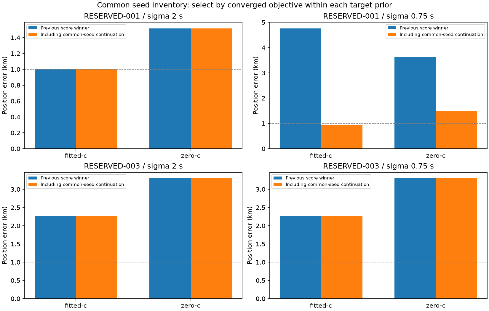

# Iteration 39: equalizing the seed inventory resolves another missed minimum

**With the same four saved solutions available to both timing priors,
RESERVED-001's sigma 0.75 fitted-c result improves from 4.762771 to 0.926306 km.
Sigma 2 remains at 0.998884 km. RESERVED-003 remains around 2.27 km.** Earlier
apparent prior sensitivity was partly a difference in discovered minima.

## Frozen comparison

Commit `e17566d47` froze [protocol.json](protocol.json), numerical source and
461 source/input hashes. Each target prior receives all four iteration 38
winners: both source priors and both c arms. Every seed initializes both target
c arms. Across two cases, this makes **32 new fits**.

The complete seed vectors and smooth-clock coefficients are identical between
target-prior runs. Observations, candidate banks, calibration, common timing
sigma 3 seconds, smooth-clock prior 100 Hz, hard60 and per-fit budgets of
20 seconds/600 iterations remain matched. Each seed defines the same 25 km
local disk across target priors and c arms. These disks are recentered relative
to older experiments and additional fits add search cost.

Direct evaluation at each target prior matches the saved source objective plus
the exact relative-timing penalty change within 1e-6. This checks all 16
seed/target-prior combinations. Select only lower-objective converged fits under
each target prior and arm, retaining its previous winner otherwise. No score
comparison across target priors or reference-error selection occurs.

## Selected position errors

| Case | Target sigma s | c | Previous km | Common-seed km |
|---|---:|---|---:|---:|
| 001 | 2 | fitted | 0.998884 | 0.998884 |
| 001 | 2 | zero | 1.517293 | 1.517293 |
| 001 | 0.75 | fitted | 4.762771 | **0.926306** |
| 001 | 0.75 | zero | 3.634018 | **1.482579** |
| 003 | 2 | fitted | 2.271942 | 2.271942 |
| 003 | 2 | zero | 3.302760 | 3.302760 |
| 003 | 0.75 | fitted | 2.270092 | 2.270092 |
| 003 | 0.75 | zero | 3.301061 | 3.301061 |

For 001 at sigma 0.75, the fitted objective improves **28180.987→28131.508**;
the zero-c objective improves **28880.754→28209.477**. The selected fitted minimum
is reached from both sigma 2 seeds, to numerical precision. The selected zero-c
result comes from the sigma 2 fitted seed. A 1.473800 km zero-c alternative has
slightly worse objective 28209.605 and is not substituted into the headline.

Conversely, continuing the older sigma 0.75 fitted minimum under sigma 2 retains
a 4.713 km local solution with objective 28114.828, worse than the selected
0.999 km solution's 28061.005. Merely changing priors does not remove the need
to retain competing minima. Tiny changes among the 003 results are numerical
precision, not substantive accuracy gains.

## Interpretation and next step

The earlier sigma 0.75 failure was not a clean measure of the prior's physical
suitability: its solver had missed a better basin. Giving both priors identical
discovered starts improves the fairness of this local comparison. It does not
prove global optimality or establish which prior generalizes to new scans.

Both 001 fitted results are now below 1 km in this diagnostic, but the sigma 2
result is only marginally below that threshold. The original region was selected
using reference proximity in iteration 31. Therefore neither result replaces
the official 53.140 km validation failure or demonstrates a reference-free
operational rescue. The entire search and model sequence used these consumed
cases for development; none of these outcomes is independent validation.

Next, continue the recovered sigma 2 solution through the existing remove-5,
post-200, RF-time drift-50 and satellite-slope-0.25 stages, with a reproduced
historical control. This will test whether downstream stages preserve or destroy
the recovered position before attempting a reference-free search-region policy.
Keep sigma 2 fixed for that test to isolate the initialization change.

## Verification and unchanged deployment

All 461 hashes, 16 seed objective reconstructions, 16 strict zero-c locks and
hard60 bounds pass. **31/32 fits converge.** The zero-c fit targeting sigma 2 from
the sigma 0.75 zero-c seed fails stationarity at 0.467392; it is retained in the
raw data and ineligible. No failed fit is retried. Both processes finished
normally, Ruff passes and the rendered visualization was inspected.

[Raw results](results/) contain every attempt and seed audit.
[selected.json](selected.json) and [comparison.md](comparison.md) record the
retained winners and sources. All reports and images are publication artifacts;
no production component changed.

The descriptive research means remain **1.413189 km fitted-c / 1.805086 km zero-c
over 123 consumed recordings**, with independent validation still failed.
Production hard60 recovery, fitted-c default and longest-16 review PNGs remain
unchanged. No contracts, golden fixtures, QNAP data or RF collection changed.
