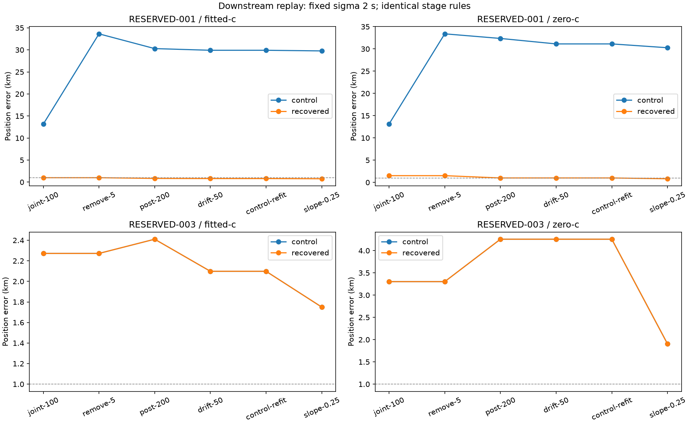

# Iteration 40: recovered clocks survive downstream analysis and prevent destructive pruning

**The recovered RESERVED-001 solution finishes the research pipeline at
0.759079 km fitted-c / 0.819865 km zero-c. Its reproduced historical control
finishes at 29.765178 / 30.266371 km.** The recovered fit removes no satellite
candidates; the old fit removes 18 of 32. RESERVED-003 remains unchanged.

## Frozen experiment and reproduced controls

Commit `e5638eeba` froze [protocol.json](protocol.json), numerical sources and
465 input/source hashes. The iteration 20 pipeline is copied with one explicit
entry-point change: accept a supplied initial joint-fit result, verify its
objective, then run the original downstream stages and fallbacks unchanged.
The iteration 28 satellite-slope extension is reused unchanged.

For each case, first replay the historical initial joint solution as a canary.
Then supply the best sigma 2 solutions from iteration 39. Relative timing sigma
remains **2 seconds** throughout; common sigma remains 3 seconds. Observations,
initial bank, calibration, stage budgets, hard60, pruning threshold and convergence
fallbacks remain fixed. The downstream fitted solution seeds both c arms at each
stage, exactly as in the earlier pipeline. This is not a new per-arm search policy.

Both historical controls reproduce every downstream vector, clock coefficient,
objective and position error within 1e-5, with identical convergence and candidate
banks. The supplied joint objectives reconstruct within 1e-6. These checks cover
the pipeline adaptation as well as the extension.

There are **40 new fits**, five downstream stages × two routes × two cases ×
two c arms. The eight supplied initial joint results are reused. Each fit retains
its existing 20-second/600-iteration budget. No failed fit is retried and no stage
is chosen by reference error or by comparing scores across different models.

## RESERVED-001 trajectory

| Stage | Historical fitted km | Recovered fitted km | Historical zero-c km | Recovered zero-c km |
|---|---:|---:|---:|---:|
| Initial joint-100 | 13.168349 | 0.998884 | 13.123086 | 1.517293 |
| Remove timing offsets >5 s | 33.637971 | 0.998884 | 33.388775 | 1.517293 |
| Post-200 clock fit | 30.290451 | 0.835654 | 32.354102 | 1.000672 |
| RF-time drift-50 | 29.909559 | 0.801217 | 31.125238 | 1.000672 |
| Matched control refit | 29.909559 | 0.801217 | 31.125239 | 1.000672 |
| Satellite slope-0.25 | **29.765178** | **0.759079** | **30.266371** | **0.819865** |

The historical initial fit assigns relative timing offsets exceeding 5 seconds
to 18 satellite candidates. Removing them leaves 14 of the original 32 and
pushes the fitted position from 13.17 to 33.64 km. The recovered initial fit
triggers **zero removals**, keeps all 32 candidates and preserves its position
through that stage. Subsequent clock/RF-time/satellite refits then improve it.

This supplies a concrete failure chain: an incorrect clock/position minimum can
produce misleading satellite timing offsets; pruning based on those offsets
can amplify the error. It does not establish that every removed satellite was
physically present. Candidate membership and common-signal identity are still
model hypotheses.

Final posterior frequency RMS falls from **136.548 to 81.157 Hz fitted-c**, and
from **139.546 to 89.111 Hz zero-c**. Both fit and position improve on this route.
The historical and recovered routes have different downstream banks as a
consequence of pruning, so their final objectives are not used to select a route.
Within each route, the fitted-c/zero-c ablation uses matched banks and seeds.

## Control case and integrity

RESERVED-003 removes no candidates on either route. Its final errors reproduce
**1.749872 km fitted-c / 1.905271 km zero-c**, to numerical precision. The recovered
seed was already effectively the same minimum; the downstream sequence does not
resolve this remaining model/position error.

All **40 new fits converge**. All 465 frozen hashes pass, both historical canaries
pass, and zero-c checks preserve both static c and the RF-time coefficients at
zero where present. Ruff passes and the rendered stage plot was inspected. Both
execution processes completed normally. [stages.md](stages.md) contains every
stage/arm error, RMS and convergence result; [raw results](results/) retain all
vectors, clocks, removed candidates and fallbacks. [operational.json](operational.json)
records the offline experiment's final outputs, not deployed results.

## What remains before an operational rescue

The recovered 001 route still starts in the **reference-guided region selected
in iteration 31**. It is not evidence that the current regional search can find
or select this solution without knowing the answer. The official 53.140 km
independent-validation error is therefore unchanged. The 29.765 km control here
is the earlier forced-region diagnostic, not that official operational baseline.

The next test must remove this oracle dependency: define a bounded, reference-free
inventory of coarse regions, preserve competing clock and position starts through
their joint fits, and assess selection before pruning. Initial coarse-score ranks
are not reliable lower bounds; iteration 30 found the near-reference coarse cell
at rank 23. Any search-budget policy designed using that observation is a
development choice requiring fresh independent validation. Do not silently insert
that one known cell or select the final region by position error.

The full research mean remains **1.413189 km fitted-c / 1.805086 km zero-c over
123 consumed recordings**, with independent validation failed. Oracle substitutions
are not included in that mean. A deployable candidate still needs full DS16/DS17
and newer-data regression, independent random validation, versioned integration
and actual new-scan/WebUI verification.

Production hard60 numerical recovery, fitted-c default and longest-16 review PNGs
remain unchanged. No public contracts, golden fixtures, QNAP data or RF collection
were changed. This iteration publishes offline evidence only.
