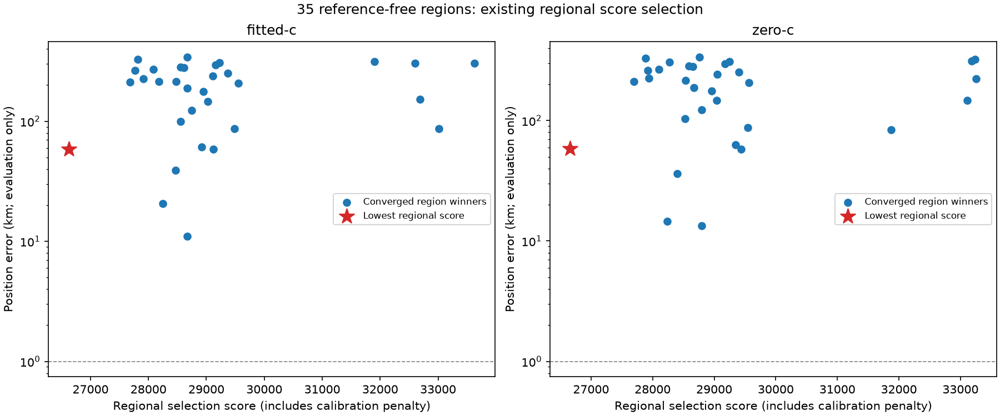

# Iteration 41: a reference-free region inventory reaches the useful cell, but selection still fails

**Expanding to 35 regions includes the previously oracle-selected cell naturally,
but the unchanged regional score still selects the original 58.69 km fitted-c
failure.** Region retention alone is insufficient. This iteration establishes a
bounded reference-free candidate inventory for the next joint-fit/scoring audit.

## Frozen inventory and execution

Commit `d5f4eae27` froze [protocol.json](protocol.json), region membership,
numerical source and 468 source/input hashes before execution. On the consumed
RESERVED-001 scan, take the 32 lowest scored cells from the original 40 km grid,
ordered by objective, east and north coordinates. Append the three ordinary
retained regions if distinct. All 35 are distinct here.

The inventory function reads no reference coordinates or position errors. Two
tests verify reference-field independence, deduplication, exclusion of finer cells
and coordinate tie-breaking. The choice of budget 32 is informed by the earlier
rank-23 diagnosis; this is an adaptive development experiment, not independent
validation or evidence that this budget will generalize.

Each point uses the existing iteration 31 numerical regional path: calibration,
association and association/zero-timing/own-continuation starts in both c arms,
with the same 25 km local disk and existing per-stage bounds. Each completed or
failed region is recorded once. There is no retry of a failed region. Invocations
are bounded to 600 seconds of work checked between immutable checkpoints; all
35 attempts finish in the first invocation, with **287.87 seconds** summed regional
work, excluding input loading. No RF collection is involved.

## Outcome

**32/35 regions complete** and contribute 192 regional final-fit attempts. Of
these fits, **161 converge and 31 fail the unchanged convergence check**. Each
completed region has eligible arm winners. Three regions stop in calibration:

| Coarse rank | Point east,north km | Failure |
|---:|---|---|
| 3 | (0,80) | prefit nonconvergence |
| 19 | (−40,80) | postfit nonconvergence |
| 21 | (160,0) | prefit nonconvergence |

These attempts remain in [raw results](results/) and are not removed from the
denominator or silently retried.

| Arm | Selected region | Selection score | Position error km |
|---|---|---:|---:|
| fitted-c | (−142.5,−107.5), ordinary retained region | 26623.690043 | **58.693871** |
| zero-c | (−142.5,−107.5), ordinary retained region | 26662.197576 | **58.726514** |

Selection uses the existing regional objective plus calibration penalty among
converged region winners. The selected region is unchanged from the published
baseline. These are regional-stage errors, not the later research pipeline's
53.140 km fitted-c validation error.

The useful cell **(−80,−80)** enters as coarse rank **23**, inventory index 22.
All six regional fits reproduce the earlier oracle-branch diagnostic within
1e-5 for vector and objective, with identical convergence. It was not inserted
by the canary; the check runs only after inventory construction.

Within that region, the usual arm selection gives **11.046875 km fitted-c** and
**13.357745 km zero-c**, the most accurate region winners in this inventory by
post-fit reference audit. Yet their regional scores rank only **14th and 16th**
among the 32 completed regions. The accurate-looking zero-timing start also
remains available in the raw fits; it is not selected by reference error.

Thus the region can be reached with a reference-free rule, but neither the
correct clock minimum nor the winning region has been established by this phase.
The previous 0.759 km downstream result is not substituted into these rankings.

## Next discriminator: bank and clock consistency

The successful regions have candidate banks ranging from **21 to 38 satellites**;
their union contains **145**. The current likelihood's per-satellite detection
weight depends on bank size. This is a model difference worth isolating before
interpreting joint scores across regions. It is not yet demonstrated to explain
the wrong selection, and raw regional scores remain the official comparison here.

A next bounded diagnostic should separate two effects: changing the candidate
weight normalization at fixed predictions, and evaluating the retained solutions
against a common candidate bank. Any common-bank refit must preserve observations,
timing priors and matched c arms, and must account explicitly for added candidates
and their timing initialization. Receiver-pair clock proposals should remain
reference-free and competing minima should survive until this comparison.

The region inventory and [summary.json](summary.json) preserve all memberships,
scores, failures and the 145-satellite union for reproducible follow-up.
[regions.md](regions.md) lists every region winner. No operational model change
or improvement in mean position error is claimed.

## Verification and unchanged status

All 468 hashes pass, the two inventory tests pass, the six-fit canary passes,
and all 96 zero-c regional fits keep c exactly zero. Ruff passes and the rendered
figure was inspected. The execution process completed normally. An import-name
collision caught during test collection was fixed before freezing or executing
the experiment; no frozen numerical source was subsequently modified.

The research means remain **1.413189 km fitted-c / 1.805086 km zero-c over 123
consumed recordings**. Independent validation still fails. This development scan
does not provide fresh validation, even though the inventory rule excludes
reference position. Full regression and new random independent validation remain
required before promotion.

Production hard60 recovery, fitted-c default and longest-16 review PNGs remain
unchanged. No contracts, golden fixtures, QNAP data or RF collection changed.
