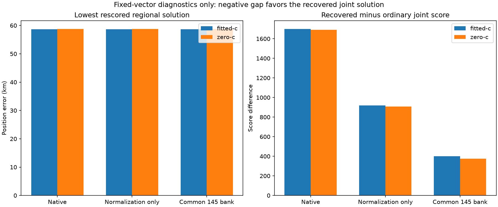

# Iteration 42: satellite-bank differences explain much of the score gap, but not its sign

**At fixed solutions, a common 145-satellite bank reduces the recovered solution's
fitted-c score disadvantage from 1698.44 to 400.92, but the distant solution still
wins.** The regional winner also remains at 58.69 km. Bank effects are substantial,
yet they are not a complete explanation or an operational localization fix.

## Frozen audit

Commit `28fe62d2d` froze [protocol.json](protocol.json), numerical sources and
509 source/input hashes before execution. We audit **68 saved solutions**: the
64 arm winners from the 32 successful regions in iteration 41, plus four initial
joint solutions covering the ordinary and recovered branches in both c arms.
The union bank contains all 145 satellite IDs from that reference-free regional
inventory. No new optimization or position selection occurs.

Each saved solution receives three evaluations:

1. **Native:** reproduce its original bank and candidate weights.
2. **Normalization only:** retain its original prediction and visibility columns,
   but replace detection-budget/bank-size with detection-budget/145. This is an
   artificial decomposition, not a complete common-bank model.
3. **Common bank:** predict all 145 candidates. Preserve the old candidates'
   relative timing shifts; assign newly added candidates zero relative shift and
   the existing common timing shift. Keep the physical receiver/RF nuisance
   prediction unchanged.

All timing, clock and external calibration penalties remain unchanged. Added
zero relative shifts add no relative-timing penalty. Regional solutions are
compared only with regional solutions; joint solutions only with joint solutions,
separately by c arm. We do not compare absolute scores across the three different
models to choose a model, nor use reference error for ranking.

## Quantified joint-fit gap

Positive values favor the distant ordinary joint solution. Position coordinates
are fixed, so these are score changes, not localization improvements.

| Scoring variant | Recovered minus ordinary, fitted-c | Recovered minus ordinary, zero-c |
|---|---:|---:|
| Native banks | 1698.436 | 1691.666 |
| Normalization only | 919.347 | 906.399 |
| Common 145 bank | **400.921** | **376.514** |

The fitted-c gap shrinks by about **76.4%** with the common bank, but never changes
sign. That percentage describes this score gap only; it is not a fraction of
position error explained or corrected.

Under the common bank, the ordinary fitted joint solution has score **29349.781**
at **56.466 km**, versus **29750.702** at **0.998884 km** for the recovered solution.
The zero-c scores are **29410.828** at **56.864 km**, versus **29787.342** at
**1.517293 km**. All coordinates are unchanged from their source fits.

The native fitted likelihood assigns signal responsibility mass 1909.0 to the
distant solution and 1547.7 to the recovered solution, despite the recovered
solution's lower posterior frequency RMS (85.85 versus 108.54 Hz). With the
common bank, masses are 1873.3 and 1598.7, and RMS values are 105.30 and 95.83 Hz.
The score balances detection/clutter probabilities and residuals, not RMS alone.

The recovered solution also has a smaller timing/clock penalty, **53.81 versus
360.97**. Its common-bank data NLL is nevertheless worse by about 708.08, leaving
the positive 400.92 total gap. This rules out a simple explanation that the
correct-looking solution loses only because its nuisance prior is more expensive.

## Regional ranking

All three scoring variants retain **region 33**, the ordinary retained region
centered at (−142.5,−107.5), in both c arms. Its fixed fitted-c position error is
58.693871 km and its zero-c error is 58.726514 km. The common bank therefore does
not by itself make the useful region win among the existing regional solutions.
[comparison.md](comparison.md) records winners and scores for every scope/arm/mode.

The fixed-vector comparison does not tell us what happens after optimizing the
additional candidates' timing parameters. It also does not certify convergence
under the modified bank. Source convergence flags describe the original fits only.

## Next controlled test

Refit the competing joint solutions with the common bank and a shared calibration
coordinate system. Different regional calibrations carry different affine clock
baselines, so raw residual slope coefficients should not be treated as the same
physical clock coordinate across regions. Transport each saved physical nuisance
prediction into one preselected calibration, verify that predictions and scores
are preserved, then apply matched bounds and search budgets. Any infeasible
transported seed should be reported rather than silently clipped.

This will distinguish a remaining fixed-vector optimization gap from a deeper
likelihood/identity-ranking problem. It will not, by itself, complete the
reference-free multiregion pipeline: the recovered starting solution is still
from the consumed diagnostic sequence, and a full policy must generate and retain
such starts without reference-error selection.

## Verification and unchanged status

Two tests pass: equivalence to the native likelihood including alias invariance,
and equality between normalization-only scoring and appending invisible columns.
Runtime checks reproduce all 68 original objectives/native NLLs and preserve old
prediction columns within 1e-6, with identical old visibility. All 34 zero-c
solutions retain c=0. All 509 frozen hashes pass. Ruff passes, the rendered plot
was inspected, and the execution process completed normally.

[results.json](results.json) retains all three NLLs, penalties, signal masses and
frequency RMS values for every solution; [summary.json](summary.json) retains
rankings and gaps. No fit or production component changed.

The descriptive research mean remains **1.413189 km fitted-c / 1.805086 km zero-c
over 123 consumed recordings**, with independent validation still failed.
Production hard60 recovery, fitted-c default and longest-16 review PNGs remain
unchanged. No public contracts, golden fixtures, QNAP data or RF collection changed.
