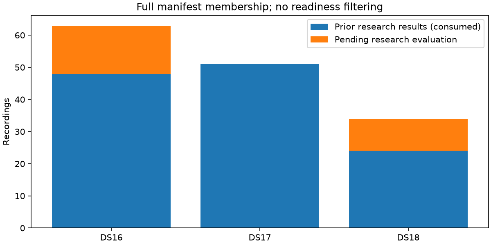

# Iteration 43: reconcile DS16, DS17 and the newly minted DS18

**The full comparison contains 148 distinct recordings, not the prior 123-recording
research pool.** Existing research results cover 48/63 DS16, 51/51 DS17 and 24/34
DS18 members. The remaining **15 DS16 and 10 DS18 recordings are explicitly pending**.
This report is a membership checkpoint, not a completed full-dataset evaluation.

## Authorities and exposure

DS18 authority is the user-specified manifest at
`/home/mouse9911/gits/leo-tracker-reduxredux/reports/2026_10_08_ds18_post_ds17/local/manifest.json`,
SHA-256 `894a6f4b7055e5f6bd602f94ce3acf7f722f204c68c2b521a06dfd6be35a7516`.
It contains 34 recordings with capture-start window **2026-10-08 14:36:56 UTC
inclusive through 23:08:51 UTC exclusive**, sealed by the cutoff. There are 33
published recordings and one firmware archive. No readiness or quality filter
changes membership.

DS16 uses `2026_10_08_ds16_last16h/manifest.json`, with 63 members. DS17 uses
`2026_10_08_position_error_iter01/ds17-manifest.json`, with 51. All source hashes
and absolute authority paths are retained in [membership.json](membership.json).
All 148 session IDs are distinct. The DS18 mint's separate verification records
cross-dataset IQ-digest disjointness; this reconciliation does not reread raw IQ.

The [complete member table](membership.md) includes every assigned member and
maps historical labels. DS16-M001…M063 are report inventory indices, not replacements
for the historical S01…S48 evaluation labels. The mapping preserves those labels.
DS17's original random development/validation assignments are retained as history;
all 51 are now consumed research data. DS18 includes all 24 previously evaluated
NEW/FRESH/LATER/RESERVED recordings. Their historical random or chronological roles
are preserved and none is relabeled unseen validation.

The other 25 recordings have no match in the reviewed research registry. That
is **not proof that their outcomes were never seen**: operational analysis may
already exist. They are pending descriptive evaluation, not a new holdout.

## Existing research results, with explicit subset denominators

These reuse the frozen sigma-0.25 satellite-slope research candidate from
iterations 27 and 29, including its convergence fallbacks. They exclude later
oracle-region substitutions. They are **not deployed-baseline metrics** or full
DS16/DS18 means. The original matched c arms are preserved.

| Dataset | Available/full membership | Pending | Fitted-c mean km | Zero-c mean km |
|---|---:|---:|---:|---:|
| DS16 | **48/63** | 15 | 1.056582 | 1.346702 |
| DS17 | **51/51** | 0 | 0.864203 | 1.417183 |
| DS18 | **24/34** | 10 | **3.293001** | **3.546150** |

| Dataset, available subset | Arm | Median km | p95 km | Worst km |
|---|---|---:|---:|---:|
| DS16, 48 | fitted-c | 1.013126 | 2.167960 | 2.750798 |
| DS16, 48 | zero-c | 1.162887 | 2.768553 | 3.902727 |
| DS17, 51 | fitted-c | 0.707882 | 2.008805 | 2.635226 |
| DS17, 51 | zero-c | 1.388078 | 2.793543 | 3.518910 |
| DS18, 24 | fitted-c | 1.122038 | 3.544980 | **53.140384** |
| DS18, 24 | zero-c | 1.209166 | 4.247016 | **54.922335** |

The DS18 tail includes the unresolved operational failure studied in recent
diagnostics. The 0.759 km oracle-region result is not used to replace it. The
prior pooled 123-recording mean therefore remains a consumed-subset statistic,
not a result covering these three complete manifests.

## Frozen evaluation continuation

[evaluation-plan.json](evaluation-plan.json) records all 25 pending IDs before
opening their numerical outcomes for this study. The candidate remains the
existing iteration 20 pipeline plus iteration 28 slope-0.25 extension, with
sigma 2 seconds, common timing sigma 3 seconds, hard60, additive regional replay
and established convergence fallbacks. Recent oracle-region/clock experiments
are not promoted into this benchmark.

For each missing recording, establish input readiness and a compatible deployed
hard60 baseline binding, then run matched zero-c and fitted-c research arms.
The unpublished firmware archive `scan-fw-4e603fa090384662` remains a DS18 member
even if an input or analysis is unavailable. No missing member may disappear
from coverage denominators.

The completed comparison must report, separately for each full dataset:

- Membership, completed/pending/unavailable/failed counts and every missing ID.
- Mean, median, p95 and worst error in both c arms, with clear denominators.
- Paired member-level regressions against the compatible deployed baseline.
- Convergence and fallback counts, plus frequency-fit/score effects separately
  from localization accuracy.
- DS16's prior 48 versus remaining 15, and DS18's consumed 24 versus remaining
  10, without turning either remainder into an unseen-validation claim.

**Paired deployed-baseline regressions and the 25 missing evaluations are not yet
complete.** Existing c-arm measurements are reused here only to establish coverage
and expose the dataset-specific tail. No new numerical localization outcomes
were opened or generated by this reconciliation.

## Verification and unchanged production

The DS18 manifest hash matches its supplied verification record. Membership counts
63/51/34, session disjointness, 123 prior mappings and all corresponding research
result bindings are asserted. Ruff passes. Source hashes and preserved exposure
assignments accompany every row. The script handles the archive's absent published
manifest digest explicitly, retaining its metadata/IQ digest binding instead of
excluding it.

Iteration 42's bank audit is published separately. Its proposed common-bank refit
remains a research follow-up; the new dataset coverage requirement takes priority
before claiming generalized improvement. Production hard60 recovery, fitted-c
default and longest-16 review PNGs remain intact. No QNAP path, golden fixture,
public contract or RF collection changed. The active goal remains incomplete.
