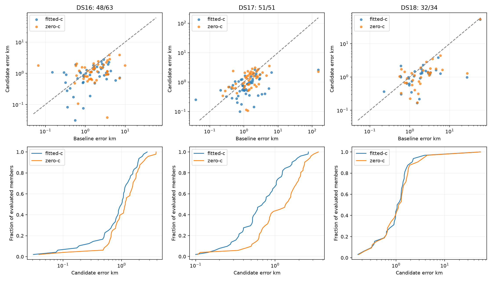

# Iteration 44: expand DS18 coverage and restore paired baselines

The frozen research candidate is compared with bounded-recovery hard60 on the
available matched members below. **These are subset statistics wherever the
coverage denominator is incomplete.** All 148 members remain in the inventory.
No new RF collection or production change was made.

| Dataset evaluated/full | Arm | Method | Mean km | Median km | p95 km | Worst km |
|---|---|---|---:|---:|---:|---:|
| DS16 48/63 | fitted-c | baseline | 1.886 | 1.518 | 4.186 | 7.314 |
| DS16 48/63 | fitted-c | candidate | 1.057 | 1.013 | 2.168 | 2.751 |
| DS16 48/63 | zero-c | baseline | 2.245 | 1.631 | 6.109 | 9.870 |
| DS16 48/63 | zero-c | candidate | 1.347 | 1.163 | 2.769 | 3.903 |
| DS17 51/51 | fitted-c | baseline | 4.477 | 1.132 | 4.789 | 152.840 |
| DS17 51/51 | fitted-c | candidate | 0.864 | 0.708 | 2.009 | 2.635 |
| DS17 51/51 | zero-c | baseline | 4.585 | 1.434 | 4.048 | 151.707 |
| DS17 51/51 | zero-c | candidate | 1.417 | 1.388 | 2.794 | 3.519 |
| DS18 32/34 | fitted-c | baseline | 4.490 | 1.792 | 15.516 | 58.694 |
| DS18 32/34 | fitted-c | candidate | 2.789 | 1.122 | 2.990 | 53.140 |
| DS18 32/34 | zero-c | baseline | 4.690 | 1.767 | 16.034 | 58.727 |
| DS18 32/34 | zero-c | candidate | 2.964 | 1.209 | 3.904 | 54.922 |

## Frequency fit and numerical qualification

Frequency RMS is reported separately from position accuracy. Baseline and research
objectives have different nuisance models and priors; their objective differences
are not a localization improvement metric. The unchanged stage sequence pairs c=0
and fitted-c with matched observations, candidate sets, priors, seeds and budgets;
c=0 also locks RF-time terms. Fitted-c is never selected using reference position.

| Dataset | Arm | Baseline RMS Hz | Candidate RMS Hz | Better/worse/tied | Failures/fallbacks |
|---|---|---:|---:|---:|---:|
| DS16 | fitted-c | 90.34 | 69.11 | 38/10/0 | 1/1 |
| DS16 | zero-c | 119.30 | 101.85 | 37/11/0 | 1/1 |
| DS17 | fitted-c | 79.96 | 64.88 | 39/12/0 | 0/0 |
| DS17 | zero-c | 130.49 | 122.87 | 28/23/0 | 1/1 |
| DS18 | fitted-c | 100.29 | 75.21 | 25/7/0 | 0/0 |
| DS18 | zero-c | 116.16 | 94.34 | 25/7/0 | 0/0 |

Position ties use a 1 m tolerance. Final raw failure counts describe the final
slope stage; earlier-stage convergence and fallbacks remain in original result
receipts. Missing convergence fields are explicit in summary.json, not counted
as success. The historical 24 DS18 cases are already consumed; registry absence
for ten others does not establish unseen validation.

## Sources and full membership

The final DS18 manifest matches SHA256
`894a6f4b7055e5f6bd602f94ce3acf7f722f204c68c2b521a06dfd6be35a7516`;
all 42 seal entries verified. The authority window and membership are unchanged.
DS16 baselines come from the archived integrated bounded-recovery replay; DS17
from its archived bounded-recovery documents; DS18 from digest-bound compatible
publications. Old live DS16/DS17 publications often predate recovery and are not
silently substituted. The eight new results use unchanged iterations 20+28,
frozen in protocol.json before execution. Oracle rescue experiments are excluded.

[summary.json](summary.json) retains every member, source binding, exposure label,
paired result, and gap. [input-gaps.json](input-gaps.json) records concrete source
checks. All 17 pending baseline cases have tracking inputs. DS18-034 was published
after minting; its initial assertion against the absent publication digest is
superseded by [archive-binding.json](archive-binding.json), which verifies the
published IQ digest against the sealed archive member. This does not change membership.
Full status inventory:

| Member | Session | Evaluation | Input / baseline gap |
|---|---|---|---|
| DS16-001 | scan-fw-ba4cd19379329520 | pending | tracking_inputs_ready |
| DS16-002 | scan-fw-a326fb07c0e9b6e2 | complete_prior_consumed | — |
| DS16-003 | scan-fw-1ad7f3926e9a03e5 | complete_prior_consumed | — |
| DS16-004 | scan-fw-3ad2719629e7c60d | complete_prior_consumed | — |
| DS16-005 | scan-fw-194e6f064a898b85 | complete_prior_consumed | — |
| DS16-006 | scan-fw-e90e71153f3be029 | complete_prior_consumed | — |
| DS16-007 | scan-fw-0b8d0887b97b192b | complete_prior_consumed | — |
| DS16-008 | scan-fw-59521cec45054a41 | pending | tracking_inputs_ready |
| DS16-009 | scan-fw-99f3c2befba57d44 | pending | tracking_inputs_ready |
| DS16-010 | scan-fw-aa77506012889211 | complete_prior_consumed | — |
| DS16-011 | scan-fw-8e8033677042ba97 | pending | tracking_inputs_ready |
| DS16-012 | scan-fw-9284d4f6ce040d80 | complete_prior_consumed | — |
| DS16-013 | scan-fw-330829d1e597d288 | pending | tracking_inputs_ready |
| DS16-014 | scan-fw-dbf401c02543f194 | complete_prior_consumed | — |
| DS16-015 | scan-fw-392b4f493b7c3c0e | pending | tracking_inputs_ready |
| DS16-016 | scan-fw-3b61d64df77251ca | complete_prior_consumed | — |
| DS16-017 | scan-fw-5fab2b5974ce6bfb | complete_prior_consumed | — |
| DS16-018 | scan-fw-13998828c952f265 | complete_prior_consumed | — |
| DS16-019 | scan-fw-96d70bdc5aef38ed | complete_prior_consumed | — |
| DS16-020 | scan-fw-151ee2be70b82235 | complete_prior_consumed | — |
| DS16-021 | scan-fw-389713be72cd8450 | complete_prior_consumed | — |
| DS16-022 | scan-fw-79f5280d20dd9e65 | complete_prior_consumed | — |
| DS16-023 | scan-fw-356acff46cd12764 | pending | tracking_inputs_ready |
| DS16-024 | scan-fw-0e40d0535caa0b16 | complete_prior_consumed | — |
| DS16-025 | scan-fw-6ad6175fa731231e | complete_prior_consumed | — |
| DS16-026 | scan-fw-320fa74020b04d85 | complete_prior_consumed | — |
| DS16-027 | scan-fw-84eb24f335b96c64 | complete_prior_consumed | — |
| DS16-028 | scan-fw-6cfa779ffd41637a | complete_prior_consumed | — |
| DS16-029 | scan-fw-d3b1edc33cb8210d | complete_prior_consumed | — |
| DS16-030 | scan-fw-de9320ef0602bad8 | complete_prior_consumed | — |
| DS16-031 | scan-fw-9f4e8b72d567c0bb | complete_prior_consumed | — |
| DS16-032 | scan-fw-eb9ba03847cd10fb | complete_prior_consumed | — |
| DS16-033 | scan-fw-0ffe1eede92820a9 | complete_prior_consumed | — |
| DS16-034 | scan-fw-90722ab71ea4e7bd | pending | tracking_inputs_ready |
| DS16-035 | scan-fw-2917f7344e48ba39 | complete_prior_consumed | — |
| DS16-036 | scan-fw-a8fbd8c43834a765 | complete_prior_consumed | — |
| DS16-037 | scan-fw-9061ae11d2702df3 | complete_prior_consumed | — |
| DS16-038 | scan-fw-d6e344d47603fb34 | complete_prior_consumed | — |
| DS16-039 | scan-fw-6f9e553db123bebd | complete_prior_consumed | — |
| DS16-040 | scan-fw-fedf239661900a5a | complete_prior_consumed | — |
| DS16-041 | scan-fw-85f7398f9b9461ec | pending | tracking_inputs_ready |
| DS16-042 | scan-fw-a52fc8f717bd9f76 | pending | tracking_inputs_ready |
| DS16-043 | scan-fw-c937db2e26dad0aa | complete_prior_consumed | — |
| DS16-044 | scan-fw-64163dfbcc531a50 | complete_prior_consumed | — |
| DS16-045 | scan-fw-58975d3328a47507 | pending | tracking_inputs_ready |
| DS16-046 | scan-fw-c6c51bfeb6a7c3d9 | pending | tracking_inputs_ready |
| DS16-047 | scan-fw-98990902df445215 | pending | tracking_inputs_ready |
| DS16-048 | scan-fw-7e51f48fa65d6f81 | complete_prior_consumed | — |
| DS16-049 | scan-fw-3bf66f35e3a07685 | complete_prior_consumed | — |
| DS16-050 | scan-fw-7e6fe9f57ae2562c | pending | tracking_inputs_ready |
| DS16-051 | scan-fw-899e83e995c96cdf | complete_prior_consumed | — |
| DS16-052 | scan-fw-7b796c5b898df6bf | complete_prior_consumed | — |
| DS16-053 | scan-fw-a88b75d9a4cad4ff | complete_prior_consumed | — |
| DS16-054 | scan-fw-4dbadefb5dadb59d | complete_prior_consumed | — |
| DS16-055 | scan-fw-5e190e43f0c8c9e2 | pending | tracking_inputs_ready |
| DS16-056 | scan-fw-8d94198baa058d67 | complete_prior_consumed | — |
| DS16-057 | scan-fw-6aa645776351507d | complete_prior_consumed | — |
| DS16-058 | scan-fw-4099ab8ea46fad71 | complete_prior_consumed | — |
| DS16-059 | scan-fw-aeea3ef6d81d637f | complete_prior_consumed | — |
| DS16-060 | scan-fw-19a8822932068f7a | complete_prior_consumed | — |
| DS16-061 | scan-fw-f8a93156e16bf663 | complete_prior_consumed | — |
| DS16-062 | scan-fw-ecb0b93df67421a9 | complete_prior_consumed | — |
| DS16-063 | scan-fw-82df8e587b0af01b | complete_prior_consumed | — |
| DS17-001 | scan-fw-94a135be557220a2 | complete_prior_consumed | — |
| DS17-002 | scan-fw-d52ab5a4255e6b69 | complete_prior_consumed | — |
| DS17-003 | scan-fw-0b7f58e4a4c5f248 | complete_prior_consumed | — |
| DS17-004 | scan-fw-489095a9b5fac6fa | complete_prior_consumed | — |
| DS17-005 | scan-fw-3556024e5a9aca59 | complete_prior_consumed | — |
| DS17-006 | scan-fw-ede4e78d97eba2b8 | complete_prior_consumed | — |
| DS17-007 | scan-fw-489c6a2a9c099f1f | complete_prior_consumed | — |
| DS17-008 | scan-fw-f6399482c82aa4ae | complete_prior_consumed | — |
| DS17-009 | scan-fw-3aeb80c956be3aa4 | complete_prior_consumed | — |
| DS17-010 | scan-fw-a8c6131bf5668000 | complete_prior_consumed | — |
| DS17-011 | scan-fw-b730e91a3bc15f50 | complete_prior_consumed | — |
| DS17-012 | scan-fw-90cf9bd2e3bdf17a | complete_prior_consumed | — |
| DS17-013 | scan-fw-3998f1ce91552465 | complete_prior_consumed | — |
| DS17-014 | scan-fw-80e0b5ff0c2281bd | complete_prior_consumed | — |
| DS17-015 | scan-fw-02fa8ae90161a54e | complete_prior_consumed | — |
| DS17-016 | scan-fw-cd431e86366d1a4c | complete_prior_consumed | — |
| DS17-017 | scan-fw-edfd1d12c2197eb2 | complete_prior_consumed | — |
| DS17-018 | scan-fw-9cc717ef20e35ab4 | complete_prior_consumed | — |
| DS17-019 | scan-fw-311f43e4ce6623c9 | complete_prior_consumed | — |
| DS17-020 | scan-fw-70960ed5154a66f4 | complete_prior_consumed | — |
| DS17-021 | scan-fw-9842f56a548dce0a | complete_prior_consumed | — |
| DS17-022 | scan-fw-e8dab4957e0fa180 | complete_prior_consumed | — |
| DS17-023 | scan-fw-ae430bd782cebf78 | complete_prior_consumed | — |
| DS17-024 | scan-fw-56d44c8114c78a9e | complete_prior_consumed | — |
| DS17-025 | scan-fw-69d773d8350f9180 | complete_prior_consumed | — |
| DS17-026 | scan-fw-ba074a45b06c3191 | complete_prior_consumed | — |
| DS17-027 | scan-fw-2c2cda36cd4299ab | complete_prior_consumed | — |
| DS17-028 | scan-fw-c7bfee3d5232d446 | complete_prior_consumed | — |
| DS17-029 | scan-fw-bac72677cbb520e7 | complete_prior_consumed | — |
| DS17-030 | scan-fw-57dc40c858e08df6 | complete_prior_consumed | — |
| DS17-031 | scan-fw-4a25a326be928fc1 | complete_prior_consumed | — |
| DS17-032 | scan-fw-a4acf9fc066cdde8 | complete_prior_consumed | — |
| DS17-033 | scan-fw-faf66389f66f36c5 | complete_prior_consumed | — |
| DS17-034 | scan-fw-21c4ca5e190aee20 | complete_prior_consumed | — |
| DS17-035 | scan-fw-89a46fa06eca3443 | complete_prior_consumed | — |
| DS17-036 | scan-fw-c60687ebcb2a8600 | complete_prior_consumed | — |
| DS17-037 | scan-fw-f19be4ee7443fdb4 | complete_prior_consumed | — |
| DS17-038 | scan-fw-de2ffd1076bbed84 | complete_prior_consumed | — |
| DS17-039 | scan-fw-007104def3cc4fb2 | complete_prior_consumed | — |
| DS17-040 | scan-fw-bb9c0b011134327c | complete_prior_consumed | — |
| DS17-041 | scan-fw-d763b0938d2c73d8 | complete_prior_consumed | — |
| DS17-042 | scan-fw-e1fe8a2e07277387 | complete_prior_consumed | — |
| DS17-043 | scan-fw-21442a5061e1b639 | complete_prior_consumed | — |
| DS17-044 | scan-fw-8e758884efd73e9f | complete_prior_consumed | — |
| DS17-045 | scan-fw-6a03003ca0a65459 | complete_prior_consumed | — |
| DS17-046 | scan-fw-9a65cd199e826d59 | complete_prior_consumed | — |
| DS17-047 | scan-fw-82ee62657e29d639 | complete_prior_consumed | — |
| DS17-048 | scan-fw-85e3bfb9e4cfcd46 | complete_prior_consumed | — |
| DS17-049 | scan-fw-0faabd2537f4fafd | complete_prior_consumed | — |
| DS17-050 | scan-fw-4a9c9e031c781aad | complete_prior_consumed | — |
| DS17-051 | scan-fw-da79d96a4515ec30 | complete_prior_consumed | — |
| DS18-001 | scan-fw-b299927c33fccc7a | complete_prior_consumed | — |
| DS18-002 | scan-fw-4e13bed3c09cadff | complete_prior_consumed | — |
| DS18-003 | scan-fw-c351a2d8f24c4455 | complete_prior_consumed | — |
| DS18-004 | scan-fw-0014cc103687b490 | complete_prior_consumed | — |
| DS18-005 | scan-fw-65e29ebee6f2a036 | complete_prior_consumed | — |
| DS18-006 | scan-fw-3d984efc721d4bc6 | complete_prior_consumed | — |
| DS18-007 | scan-fw-adcdd076e48cb2d8 | complete_prior_consumed | — |
| DS18-008 | scan-fw-db6e1b4079322617 | complete_prior_consumed | — |
| DS18-009 | scan-fw-1317eab1ab1dd263 | complete | — |
| DS18-010 | scan-fw-a7930b52d1b01dff | complete_prior_consumed | — |
| DS18-011 | scan-fw-c5558b9d9ba7691e | complete_prior_consumed | — |
| DS18-012 | scan-fw-7ce336d48ad3409b | complete_prior_consumed | — |
| DS18-013 | scan-fw-b8ccfda98272ebe0 | complete_prior_consumed | — |
| DS18-014 | scan-fw-5b1967c41451a971 | complete_prior_consumed | — |
| DS18-015 | scan-fw-19235796dc3f06a2 | complete_prior_consumed | — |
| DS18-016 | scan-fw-818f5d3b8ca6cbbe | complete_prior_consumed | — |
| DS18-017 | scan-fw-fd728d9087fe35e2 | complete_prior_consumed | — |
| DS18-018 | scan-fw-f5bf95a1570bece0 | complete_prior_consumed | — |
| DS18-019 | scan-fw-e43a5641cecd1863 | complete_prior_consumed | — |
| DS18-020 | scan-fw-a43bbffc6826cdc5 | complete_prior_consumed | — |
| DS18-021 | scan-fw-f7f863971e4aa0b8 | complete_prior_consumed | — |
| DS18-022 | scan-fw-f1a32cacd910c005 | complete_prior_consumed | — |
| DS18-023 | scan-fw-8d37c3b59f1ca7d1 | complete_prior_consumed | — |
| DS18-024 | scan-fw-d406a510f5473348 | complete_prior_consumed | — |
| DS18-025 | scan-fw-c17fbfacad538641 | complete_prior_consumed | — |
| DS18-026 | scan-fw-433aa9c47fea9cac | complete | — |
| DS18-027 | scan-fw-1d39b7f1cd0643aa | complete | — |
| DS18-028 | scan-fw-6c32f1804f9892a4 | complete | — |
| DS18-029 | scan-fw-4a5a8bdd0dd50f2d | complete | — |
| DS18-030 | scan-fw-317151cefa87e8ac | complete | — |
| DS18-031 | scan-fw-b68bdd7a7011688b | complete | — |
| DS18-032 | scan-fw-7c7196b249b7798a | complete | — |
| DS18-033 | scan-fw-713a66e116375e5d | pending | tracking_inputs_ready |
| DS18-034 | scan-fw-4e603fa090384662 | pending | None |
