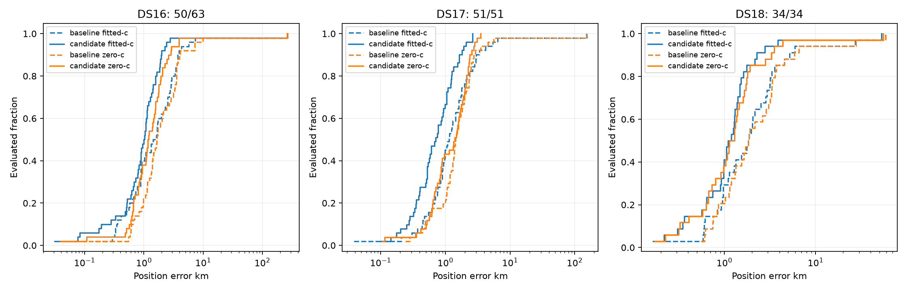

# Iteration 45: expanded DS16/DS17/DS18 descriptive benchmark

All 148 frozen members are accounted for below. Evaluated/full denominators are
explicit; incomplete coverage is never presented as a full-dataset mean. The
candidate remains the unchanged joint-clock, additive-region, timing-pruning,
RF-time and satellite-slope-0.25 sequence from iterations 20 and 28. None of the
later oracle-region rescue results replaces an operational result.

## Position accuracy

| Dataset evaluated/full | Arm | Method | Mean km | Median km | p95 km | Worst km |
|---|---|---|---:|---:|---:|---:|
| DS16 50/63 | fitted-c | baseline | 7.129 | 1.518 | 5.103 | 265.277 |
| DS16 50/63 | fitted-c | candidate | 6.343 | 1.013 | 2.334 | 265.789 |
| DS16 50/63 | zero-c | baseline | 7.511 | 1.655 | 7.205 | 264.604 |
| DS16 50/63 | zero-c | candidate | 6.585 | 1.184 | 3.428 | 261.743 |
| DS17 51/51 | fitted-c | baseline | 4.477 | 1.132 | 4.789 | 152.840 |
| DS17 51/51 | fitted-c | candidate | 0.864 | 0.708 | 2.009 | 2.635 |
| DS17 51/51 | zero-c | baseline | 4.585 | 1.434 | 4.048 | 151.707 |
| DS17 51/51 | zero-c | candidate | 1.417 | 1.388 | 2.794 | 3.519 |
| DS18 34/34 | fitted-c | baseline | 4.422 | 1.852 | 13.381 | 58.694 |
| DS18 34/34 | fitted-c | candidate | 2.739 | 1.140 | 3.168 | 53.140 |
| DS18 34/34 | zero-c | baseline | 4.618 | 1.856 | 13.926 | 58.727 |
| DS18 34/34 | zero-c | candidate | 2.918 | 1.209 | 3.818 | 54.922 |

## Paired regressions, convergence and frequency fit

Frequency-fit changes are separate from position accuracy. Models have different
nuisance terms and priors, so baseline/candidate objective differences are not
interpreted as accuracy improvement. Raw scores and all stage receipts remain in
the linked result JSON. c=0/fitted-c share observations, banks, priors, starts and
budgets within each frozen stage; c=0 additionally fixes RF-time terms to zero.
Reference coordinates enter error reporting after inference only.

| Dataset | Arm | Better/worse/tied | Base failed | Raw failed/fallback | RMS before → after Hz |
|---|---|---:|---:|---:|---:|
| DS16 | fitted-c | 39/11/0 | 0 | 1/1 | 90.92 → 70.73 |
| DS16 | zero-c | 39/11/0 | 0 | 1/1 | 120.44 → 103.83 |
| DS17 | fitted-c | 39/12/0 | 0 | 0/0 | 79.96 → 64.88 |
| DS17 | zero-c | 28/23/0 | 0 | 1/1 | 130.49 → 122.87 |
| DS18 | fitted-c | 27/7/0 | 0 | 0/0 | 101.06 → 75.65 |
| DS18 | zero-c | 27/7/0 | 0 | 0/0 | 116.13 → 93.90 |

Ties use 1 m tolerance. Final raw failures count the satellite-slope stage and
include inability to reach it; earlier-stage failures are preserved separately.
Full member-paired deltas are in summary.json. Largest fitted-c regressions:

| Member | Baseline km | Candidate km | Regression km |
|---|---:|---:|---:|
| DS18-028 | 0.597 | 2.159 | 1.563 |
| DS16-054 | 0.574 | 1.901 | 1.328 |
| DS16-058 | 0.149 | 1.083 | 0.934 |
| DS16-005 | 0.290 | 1.071 | 0.780 |
| DS16-014 | 0.329 | 0.909 | 0.580 |
| DS17-037 | 1.070 | 1.639 | 0.569 |
| DS17-040 | 2.079 | 2.635 | 0.556 |
| DS16-046 | 265.277 | 265.789 | 0.513 |
| DS17-038 | 0.547 | 1.038 | 0.491 |
| DS18-018 | 0.584 | 1.057 | 0.473 |

## Historical subsets and completion members

DS16's earlier 48 members and remaining 15 stay distinguishable. DS18's earlier
24 are consumed research data; its other ten lack registry matches, which is not
proof of unseen validation. No outcome-based membership filter was applied.

| Group evaluated/full | Arm | Baseline mean km | Candidate mean km |
|---|---|---:|---:|
| DS16-historical 48/48 | fitted-c | 1.886 | 1.057 |
| DS16-historical 48/48 | zero-c | 2.245 | 1.347 |
| DS16-completion 2/15 | fitted-c | 132.973 | 133.206 |
| DS16-completion 2/15 | zero-c | 133.876 | 132.310 |
| DS18-historical 24/24 | fitted-c | 5.486 | 3.293 |
| DS18-historical 24/24 | zero-c | 5.728 | 3.546 |
| DS18-completion 10/10 | fitted-c | 1.870 | 1.411 |
| DS18-completion 10/10 | zero-c | 1.955 | 1.409 |

## Provenance and operational status

The DS18 final manifest SHA256 is
`894a6f4b7055e5f6bd602f94ce3acf7f722f204c68c2b521a06dfd6be35a7516`.
Its sealed capture-start window and all 34 members are unchanged. DS18-034's
later publication is bound to its sealed IQ digest in iteration44/archive-binding.json.
The original pre-publication authority remains intact.

Baseline uses hard60 configuration
`d1524c45e6e702008221d941240e7a0ac26f13feac87fef73e83f04c9c0a80f6`.
Compatible publications are reused; other baselines are run in isolated storage,
at most four resumable 500-second slices per invocation. Production publications,
default settings and longest-16-track PNG rendering remain unchanged. No RF was collected.

Initial missing-output-directory errors happened before baseline fitting and are
retained in results/. Identical frozen retries live in retry/results/. A repaired
setup attempt is never silently erased. Numerical convergence failures use only
the pre-existing model fallbacks. Source, configuration and input bindings are
recorded with the results; full membership and coverage follows.

| Member | Session | Outcome | Fitted-c error km | Zero-c error km |
|---|---|---|---:|---:|
| DS16-001 | scan-fw-ba4cd19379329520 | setup_failed_retry_pending ValueError('pinned storage root contains an inaccessible or symlink component: local') | — | — |
| DS16-002 | scan-fw-a326fb07c0e9b6e2 | complete_prior_consumed  | 0.885 | 1.389 |
| DS16-003 | scan-fw-1ad7f3926e9a03e5 | complete_prior_consumed  | 0.082 | 0.623 |
| DS16-004 | scan-fw-3ad2719629e7c60d | complete_prior_consumed  | 0.884 | 2.036 |
| DS16-005 | scan-fw-194e6f064a898b85 | complete_prior_consumed  | 1.071 | 1.774 |
| DS16-006 | scan-fw-e90e71153f3be029 | complete_prior_consumed  | 0.522 | 0.640 |
| DS16-007 | scan-fw-0b8d0887b97b192b | complete_prior_consumed  | 1.278 | 0.821 |
| DS16-008 | scan-fw-59521cec45054a41 | setup_failed_retry_pending ValueError('pinned storage root contains an inaccessible or symlink component: local') | — | — |
| DS16-009 | scan-fw-99f3c2befba57d44 | complete  | 0.623 | 2.877 |
| DS16-010 | scan-fw-aa77506012889211 | complete_prior_consumed  | 0.189 | 0.845 |
| DS16-011 | scan-fw-8e8033677042ba97 | setup_failed_retry_pending ValueError('pinned storage root contains an inaccessible or symlink component: local') | — | — |
| DS16-012 | scan-fw-9284d4f6ce040d80 | complete_prior_consumed  | 1.826 | 1.563 |
| DS16-013 | scan-fw-330829d1e597d288 | pending  | — | — |
| DS16-014 | scan-fw-dbf401c02543f194 | complete_prior_consumed  | 0.909 | 0.485 |
| DS16-015 | scan-fw-392b4f493b7c3c0e | setup_failed_retry_pending ValueError('pinned storage root contains an inaccessible or symlink component: local') | — | — |
| DS16-016 | scan-fw-3b61d64df77251ca | complete_prior_consumed  | 0.173 | 1.926 |
| DS16-017 | scan-fw-5fab2b5974ce6bfb | complete_prior_consumed  | 1.200 | 1.774 |
| DS16-018 | scan-fw-13998828c952f265 | complete_prior_consumed  | 1.034 | 0.792 |
| DS16-019 | scan-fw-96d70bdc5aef38ed | complete_prior_consumed  | 1.985 | 2.592 |
| DS16-020 | scan-fw-151ee2be70b82235 | complete_prior_consumed  | 0.076 | 0.664 |
| DS16-021 | scan-fw-389713be72cd8450 | complete_prior_consumed  | 0.278 | 0.799 |
| DS16-022 | scan-fw-79f5280d20dd9e65 | complete_prior_consumed  | 0.597 | 3.903 |
| DS16-023 | scan-fw-356acff46cd12764 | pending  | — | — |
| DS16-024 | scan-fw-0e40d0535caa0b16 | complete_prior_consumed  | 1.030 | 0.039 |
| DS16-025 | scan-fw-6ad6175fa731231e | complete_prior_consumed  | 0.501 | 0.662 |
| DS16-026 | scan-fw-320fa74020b04d85 | complete_prior_consumed  | 1.127 | 2.052 |
| DS16-027 | scan-fw-84eb24f335b96c64 | complete_prior_consumed  | 1.122 | 1.081 |
| DS16-028 | scan-fw-6cfa779ffd41637a | complete_prior_consumed  | 1.333 | 1.450 |
| DS16-029 | scan-fw-d3b1edc33cb8210d | complete_prior_consumed  | 0.860 | 1.131 |
| DS16-030 | scan-fw-de9320ef0602bad8 | complete_prior_consumed  | 1.398 | 1.580 |
| DS16-031 | scan-fw-9f4e8b72d567c0bb | complete_prior_consumed  | 0.721 | 0.700 |
| DS16-032 | scan-fw-eb9ba03847cd10fb | complete_prior_consumed  | 1.558 | 1.499 |
| DS16-033 | scan-fw-0ffe1eede92820a9 | complete_prior_consumed  | 0.031 | 0.107 |
| DS16-034 | scan-fw-90722ab71ea4e7bd | setup_failed_retry_pending ValueError('pinned storage root contains an inaccessible or symlink component: local') | — | — |
| DS16-035 | scan-fw-2917f7344e48ba39 | complete_prior_consumed  | 1.879 | 1.885 |
| DS16-036 | scan-fw-a8fbd8c43834a765 | complete_prior_consumed  | 1.081 | 1.161 |
| DS16-037 | scan-fw-9061ae11d2702df3 | complete_prior_consumed  | 1.150 | 1.165 |
| DS16-038 | scan-fw-d6e344d47603fb34 | complete_prior_consumed  | 1.421 | 1.394 |
| DS16-039 | scan-fw-6f9e553db123bebd | complete_prior_consumed  | 0.996 | 1.117 |
| DS16-040 | scan-fw-fedf239661900a5a | complete_prior_consumed  | 0.478 | 0.504 |
| DS16-041 | scan-fw-85f7398f9b9461ec | pending  | — | — |
| DS16-042 | scan-fw-a52fc8f717bd9f76 | setup_failed_retry_pending ValueError('pinned storage root contains an inaccessible or symlink component: local') | — | — |
| DS16-043 | scan-fw-c937db2e26dad0aa | complete_prior_consumed  | 2.751 | 3.880 |
| DS16-044 | scan-fw-64163dfbcc531a50 | complete_prior_consumed  | 0.795 | 0.604 |
| DS16-045 | scan-fw-58975d3328a47507 | pending  | — | — |
| DS16-046 | scan-fw-c6c51bfeb6a7c3d9 | complete  | 265.789 | 261.743 |
| DS16-047 | scan-fw-98990902df445215 | pending  | — | — |
| DS16-048 | scan-fw-7e51f48fa65d6f81 | complete_prior_consumed  | 0.657 | 0.902 |
| DS16-049 | scan-fw-3bf66f35e3a07685 | complete_prior_consumed  | 1.567 | 1.665 |
| DS16-050 | scan-fw-7e6fe9f57ae2562c | pending  | — | — |
| DS16-051 | scan-fw-899e83e995c96cdf | complete_prior_consumed  | 2.389 | 2.437 |
| DS16-052 | scan-fw-7b796c5b898df6bf | complete_prior_consumed  | 0.940 | 0.932 |
| DS16-053 | scan-fw-a88b75d9a4cad4ff | complete_prior_consumed  | 0.816 | 1.214 |
| DS16-054 | scan-fw-4dbadefb5dadb59d | complete_prior_consumed  | 1.901 | 1.756 |
| DS16-055 | scan-fw-5e190e43f0c8c9e2 | pending  | — | — |
| DS16-056 | scan-fw-8d94198baa058d67 | complete_prior_consumed  | 2.266 | 2.864 |
| DS16-057 | scan-fw-6aa645776351507d | complete_prior_consumed  | 1.633 | 2.240 |
| DS16-058 | scan-fw-4099ab8ea46fad71 | complete_prior_consumed  | 1.083 | 0.672 |
| DS16-059 | scan-fw-aeea3ef6d81d637f | complete_prior_consumed  | 1.941 | 0.930 |
| DS16-060 | scan-fw-19a8822932068f7a | complete_prior_consumed  | 0.329 | 1.540 |
| DS16-061 | scan-fw-f8a93156e16bf663 | complete_prior_consumed  | 0.509 | 0.560 |
| DS16-062 | scan-fw-ecb0b93df67421a9 | complete_prior_consumed  | 0.682 | 1.090 |
| DS16-063 | scan-fw-82df8e587b0af01b | complete_prior_consumed  | 0.783 | 1.204 |
| DS17-001 | scan-fw-94a135be557220a2 | complete_prior_consumed  | 0.522 | 0.668 |
| DS17-002 | scan-fw-d52ab5a4255e6b69 | complete_prior_consumed  | 1.048 | 0.638 |
| DS17-003 | scan-fw-0b7f58e4a4c5f248 | complete_prior_consumed  | 0.605 | 0.626 |
| DS17-004 | scan-fw-489095a9b5fac6fa | complete_prior_consumed  | 0.281 | 0.828 |
| DS17-005 | scan-fw-3556024e5a9aca59 | complete_prior_consumed  | 1.814 | 1.758 |
| DS17-006 | scan-fw-ede4e78d97eba2b8 | complete_prior_consumed  | 0.877 | 0.875 |
| DS17-007 | scan-fw-489c6a2a9c099f1f | complete_prior_consumed  | 0.521 | 0.853 |
| DS17-008 | scan-fw-f6399482c82aa4ae | complete_prior_consumed  | 2.616 | 2.256 |
| DS17-009 | scan-fw-3aeb80c956be3aa4 | complete_prior_consumed  | 1.098 | 0.954 |
| DS17-010 | scan-fw-a8c6131bf5668000 | complete_prior_consumed  | 1.631 | 2.105 |
| DS17-011 | scan-fw-b730e91a3bc15f50 | complete_prior_consumed  | 0.776 | 0.417 |
| DS17-012 | scan-fw-90cf9bd2e3bdf17a | complete_prior_consumed  | 0.389 | 1.345 |
| DS17-013 | scan-fw-3998f1ce91552465 | complete_prior_consumed  | 0.100 | 0.342 |
| DS17-014 | scan-fw-80e0b5ff0c2281bd | complete_prior_consumed  | 0.491 | 0.893 |
| DS17-015 | scan-fw-02fa8ae90161a54e | complete_prior_consumed  | 0.336 | 0.501 |
| DS17-016 | scan-fw-cd431e86366d1a4c | complete_prior_consumed  | 1.232 | 1.323 |
| DS17-017 | scan-fw-edfd1d12c2197eb2 | complete_prior_consumed  | 0.401 | 0.704 |
| DS17-018 | scan-fw-9cc717ef20e35ab4 | complete_prior_consumed  | 0.143 | 0.851 |
| DS17-019 | scan-fw-311f43e4ce6623c9 | complete_prior_consumed  | 0.353 | 1.829 |
| DS17-020 | scan-fw-70960ed5154a66f4 | complete_prior_consumed  | 0.320 | 2.840 |
| DS17-021 | scan-fw-9842f56a548dce0a | complete_prior_consumed  | 1.337 | 1.513 |
| DS17-022 | scan-fw-e8dab4957e0fa180 | complete_prior_consumed  | 0.771 | 0.564 |
| DS17-023 | scan-fw-ae430bd782cebf78 | complete_prior_consumed  | 0.922 | 0.682 |
| DS17-024 | scan-fw-56d44c8114c78a9e | complete_prior_consumed  | 0.174 | 0.630 |
| DS17-025 | scan-fw-69d773d8350f9180 | complete_prior_consumed  | 0.250 | 2.261 |
| DS17-026 | scan-fw-ba074a45b06c3191 | complete_prior_consumed  | 0.349 | 0.106 |
| DS17-027 | scan-fw-2c2cda36cd4299ab | complete_prior_consumed  | 0.708 | 1.582 |
| DS17-028 | scan-fw-c7bfee3d5232d446 | complete_prior_consumed  | 1.205 | 1.701 |
| DS17-029 | scan-fw-bac72677cbb520e7 | complete_prior_consumed  | 0.755 | 3.081 |
| DS17-030 | scan-fw-57dc40c858e08df6 | complete_prior_consumed  | 0.850 | 0.747 |
| DS17-031 | scan-fw-4a25a326be928fc1 | complete_prior_consumed  | 1.548 | 1.974 |
| DS17-032 | scan-fw-a4acf9fc066cdde8 | complete_prior_consumed  | 0.600 | 2.366 |
| DS17-033 | scan-fw-faf66389f66f36c5 | complete_prior_consumed  | 0.581 | 1.891 |
| DS17-034 | scan-fw-21c4ca5e190aee20 | complete_prior_consumed  | 0.677 | 1.148 |
| DS17-035 | scan-fw-89a46fa06eca3443 | complete_prior_consumed  | 0.275 | 0.609 |
| DS17-036 | scan-fw-c60687ebcb2a8600 | complete_prior_consumed  | 1.254 | 1.471 |
| DS17-037 | scan-fw-f19be4ee7443fdb4 | complete_prior_consumed  | 1.639 | 1.578 |
| DS17-038 | scan-fw-de2ffd1076bbed84 | complete_prior_consumed  | 1.038 | 0.513 |
| DS17-039 | scan-fw-007104def3cc4fb2 | complete_prior_consumed  | 0.991 | 0.114 |
| DS17-040 | scan-fw-bb9c0b011134327c | complete_prior_consumed  | 2.635 | 2.109 |
| DS17-041 | scan-fw-d763b0938d2c73d8 | complete_prior_consumed  | 0.511 | 0.810 |
| DS17-042 | scan-fw-e1fe8a2e07277387 | complete_prior_consumed  | 0.535 | 2.747 |
| DS17-043 | scan-fw-21442a5061e1b639 | complete_prior_consumed  | 0.201 | 1.605 |
| DS17-044 | scan-fw-8e758884efd73e9f | complete_prior_consumed  | 1.038 | 2.081 |
| DS17-045 | scan-fw-6a03003ca0a65459 | complete_prior_consumed  | 0.399 | 1.650 |
| DS17-046 | scan-fw-9a65cd199e826d59 | complete_prior_consumed  | 0.936 | 1.388 |
| DS17-047 | scan-fw-82ee62657e29d639 | complete_prior_consumed  | 0.562 | 1.997 |
| DS17-048 | scan-fw-85e3bfb9e4cfcd46 | complete_prior_consumed  | 1.239 | 2.315 |
| DS17-049 | scan-fw-0faabd2537f4fafd | complete_prior_consumed  | 1.917 | 2.566 |
| DS17-050 | scan-fw-4a9c9e031c781aad | complete_prior_consumed  | 0.521 | 2.352 |
| DS17-051 | scan-fw-da79d96a4515ec30 | complete_prior_consumed  | 2.101 | 3.519 |
| DS18-001 | scan-fw-b299927c33fccc7a | complete_prior_consumed  | 1.272 | 0.315 |
| DS18-002 | scan-fw-4e13bed3c09cadff | complete_prior_consumed  | 0.305 | 0.406 |
| DS18-003 | scan-fw-c351a2d8f24c4455 | complete_prior_consumed  | 0.365 | 1.314 |
| DS18-004 | scan-fw-0014cc103687b490 | complete_prior_consumed  | 1.310 | 3.518 |
| DS18-005 | scan-fw-65e29ebee6f2a036 | complete_prior_consumed  | 0.905 | 0.732 |
| DS18-006 | scan-fw-3d984efc721d4bc6 | complete_prior_consumed  | 1.523 | 1.793 |
| DS18-007 | scan-fw-adcdd076e48cb2d8 | complete_prior_consumed  | 0.219 | 0.633 |
| DS18-008 | scan-fw-db6e1b4079322617 | complete_prior_consumed  | 1.258 | 1.647 |
| DS18-009 | scan-fw-1317eab1ab1dd263 | complete  | 1.477 | 1.603 |
| DS18-010 | scan-fw-a7930b52d1b01dff | complete_prior_consumed  | 1.187 | 1.287 |
| DS18-011 | scan-fw-c5558b9d9ba7691e | complete_prior_consumed  | 1.286 | 1.131 |
| DS18-012 | scan-fw-7ce336d48ad3409b | complete_prior_consumed  | 1.479 | 1.442 |
| DS18-013 | scan-fw-b8ccfda98272ebe0 | complete_prior_consumed  | 0.564 | 0.575 |
| DS18-014 | scan-fw-5b1967c41451a971 | complete_prior_consumed  | 1.053 | 1.114 |
| DS18-015 | scan-fw-19235796dc3f06a2 | complete_prior_consumed  | 0.743 | 0.800 |
| DS18-016 | scan-fw-818f5d3b8ca6cbbe | complete_prior_consumed  | 0.980 | 1.290 |
| DS18-017 | scan-fw-fd728d9087fe35e2 | complete_prior_consumed  | 1.375 | 1.355 |
| DS18-018 | scan-fw-f5bf95a1570bece0 | complete_prior_consumed  | 1.057 | 1.034 |
| DS18-019 | scan-fw-e43a5641cecd1863 | complete_prior_consumed  | 0.165 | 0.172 |
| DS18-020 | scan-fw-a43bbffc6826cdc5 | complete_prior_consumed  | 0.977 | 0.914 |
| DS18-021 | scan-fw-f7f863971e4aa0b8 | complete_prior_consumed  | 1.624 | 1.764 |
| DS18-022 | scan-fw-f1a32cacd910c005 | complete_prior_consumed  | 53.140 | 54.922 |
| DS18-023 | scan-fw-8d37c3b59f1ca7d1 | complete_prior_consumed  | 3.862 | 4.376 |
| DS18-024 | scan-fw-d406a510f5473348 | complete_prior_consumed  | 1.750 | 1.905 |
| DS18-025 | scan-fw-c17fbfacad538641 | complete_prior_consumed  | 0.634 | 0.668 |
| DS18-026 | scan-fw-433aa9c47fea9cac | complete  | 2.277 | 2.824 |
| DS18-027 | scan-fw-1d39b7f1cd0643aa | complete  | 0.990 | 0.326 |
| DS18-028 | scan-fw-6c32f1804f9892a4 | complete  | 2.159 | 1.712 |
| DS18-029 | scan-fw-4a5a8bdd0dd50f2d | complete  | 0.640 | 0.665 |
| DS18-030 | scan-fw-317151cefa87e8ac | complete  | 0.350 | 0.225 |
| DS18-031 | scan-fw-b68bdd7a7011688b | complete  | 1.400 | 1.389 |
| DS18-032 | scan-fw-7c7196b249b7798a | complete  | 0.925 | 0.984 |
| DS18-033 | scan-fw-713a66e116375e5d | complete  | 1.093 | 1.072 |
| DS18-034 | scan-fw-4e603fa090384662 | complete  | 2.794 | 3.291 |
