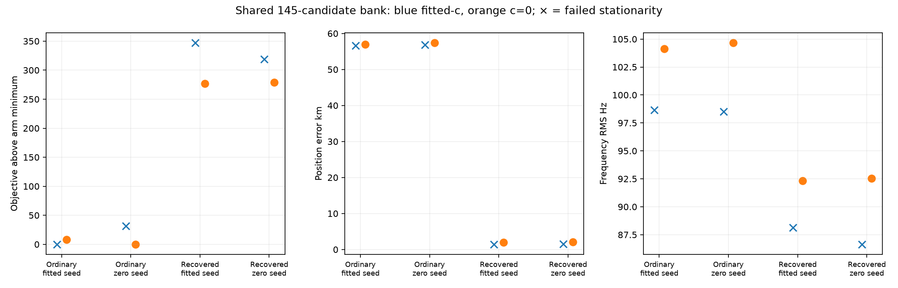

# Iteration 46: shared-bank joint refits retain the wrong zero-c winner

**The converged zero-c winner remains 57.382 km wrong.** The recovered branch is
1.976 km wrong but has a worse objective by 276.761. A common candidate bank and
receiver-clock frame do not resolve this consumed DS18 failure. All four fitted-c
refits fail the independent stationarity criterion despite optimizer success;
there is no qualified fitted-c winner in this experiment.

## Controlled experiment

Commit `a62d7b0c8` froze four saved starts: ordinary and recovered hypotheses,
each from its earlier fitted-c and zero-c solution. Each start receives both c
arms, for eight fits. All use the same 145-satellite union from iteration41,
ordinary regional calibration frame, sigma2/common3, initial joint-clock prior,
20-second/600-iteration budget and 25 km local disk around the supplied start.
The identical four-start bank is available to each arm; c=0 fixes the RF coefficient.

Transport preserves the physical nuisance prediction: the recovered calibration
differs by affine offsets 6080.087 and −818.522 Hz, and slopes 55.4085 and
5.88453 Hz/s. These are **coordinate corrections**, not newly measured hardware
drifts. Old clock bases are verified identical; old relative satellite timings
are preserved and new candidates receive zero relative timing. All four seeds
remain feasible without clipping under the shared-frame bounds.

Runtime assertions reproduce the previous native objectives, common-bank scores,
old prediction columns, visibility and physical receiver nuisance predictions.
Both c arms use matched banks, priors, seeds and budgets. Positions are used only
for post-inference error reporting. The recovered seed remains a consumed
diagnostic start, so this is not a reference-free operational rescue.

| Hypothesis | Source arm | Fit arm | Converged | Error km | Objective | RMS Hz | Stationarity |
|---|---|---|---|---:|---:|---:|---:|
| ordinary | fitted-c | fitted-c | False | 56.656346 | 29127.157 | 98.653 | 3.27703 |
| ordinary | fitted-c | zero-c | True | 57.000790 | 29206.181 | 104.117 | 5.89144e-05 |
| ordinary | zero-c | fitted-c | False | 56.835018 | 29158.471 | 98.520 | 0.162332 |
| ordinary | zero-c | zero-c | True | 57.382014 | 29197.792 | 104.659 | 0.000105726 |
| recovered | fitted-c | fitted-c | False | 1.439364 | 29474.162 | 88.127 | 0.0795899 |
| recovered | fitted-c | zero-c | True | 1.975713 | 29474.553 | 92.333 | 6.05708e-05 |
| recovered | zero-c | fitted-c | False | 1.554098 | 29445.893 | 86.641 | 5.76427 |
| recovered | zero-c | zero-c | True | 2.088101 | 29476.794 | 92.521 | 6.57553e-05 |

## What this establishes

The best converged ordinary zero-c score is 29197.792, versus 29474.553 for the
best recovered zero-c score. Its worse RMS (104.659 versus 92.333 Hz) and position
still win under the likelihood. Thus the remaining zero-c ranking failure is
not solely a fixed-vector failure to optimize the common bank. A better in-sample
frequency RMS alone does not imply a better objective or localization.

All fitted-c solver returns claim success but stationarity ranges 0.0796–5.7643,
above the 0.001 requirement. They stop in 13.6–17.4 seconds, before the time budget;
simply increasing the wall-clock allowance would not force continuation. The
retained failed iterates cannot be compared as converged model winners. A
separate, matched continuation/scaling audit is needed before interpreting the
fitted-c ranking. No arbitrary successful-looking iterate is promoted here.

This diagnostic changes no DS16/17/18 benchmark result and no production setting.
Full-dataset completion continues separately in iteration45; its newly uncovered
DS16-046 failure also makes any previous subset mean an incomplete summary.
The deployed bounded recovery, fitted-c default and longest-16-track PNG limit
remain unchanged. No new RF collection occurred.

[results.json](results.json) preserves all transported seeds, correction vectors,
fit outputs and convergence failures; [protocol.json](protocol.json) preserves
the source and input hashes. All four zero-c outputs retain c=0. Ruff passed and
the visualization was inspected.
