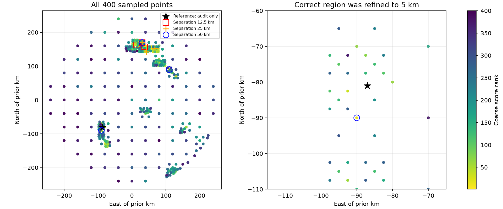

# Iteration 47: DS16-046 sampled the correct region, then discarded it

**The new 265 km failure is a region-retention failure, not simply a missing-grid
or numerical-convergence failure.** DS16-046 (`scan-fw-c6c51bfeb6a7c3d9`) lies
outside the earlier 48-member DS16 subset. Its bounded-recovery baseline error is
265.277 km fitted-c / 264.604 km zero-c; the frozen research candidate produces
265.789 / 261.743 km. Every research stage passes its convergence check.

The 400-point grid samples and refines the correct neighborhood through 40, 20,
10 and 5 km spacing. Its nearest evaluated point is 3.521 km from the reference
and converged. A converged point at (−90,−90) km, only 9.484 km from the reference,
ranks **13th** among all sampled points. The nearest 5 km point ranks 136th.

However, all three ordinary retained regions are near (30,170) km, far to the
northeast. The existing 25 km separation replay still retains three regions in
that same distant area. The later local fits cannot bridge roughly 265 km with
25 km local search disks. Timing pruning and clock refinements optimize this
already wrong branch; they do not recover the discarded region.

## Post-hoc retention replay, without fitting

The production `distinct_basins` function is replayed on exactly the saved scores.
The 12.5 and 25 km outputs exactly reproduce the archived retained regions.
Larger spacings below are exploratory diagnostics on this consumed case, not
independent validation and not localization results.

| Minimum separation km | Retained centers east,north km | Closest center to reference km |
|---:|---|---:|
| 12.5 | (30,170); (12.5,162.5); (37.5,157.5) | 263.047 |
| 25 | (30,170); (42.5,142.5); (67.5,152.5) | 258.316 |
| 40 | (30,170); (67.5,152.5); (-90,-90) | 9.484 |
| 50 | (30,170); (-90,-90); (110,90) | 9.484 |
| 75 | (30,170); (-90,-90); (110,90) | 9.484 |
| 100 | (30,170); (-90,-90); (110,90) | 9.484 |
| 150 | (30,170); (-90,-90); (160,-80) | 9.484 |

At 40 km separation, the correct neighborhood enters the third slot; at 50 km
it enters the second. This identifies a concrete candidate experiment: preserve
the existing regions and add widely separated regions through complete fitting,
then select by a matched model score. Merely preserving a good neighborhood does
not prove the final likelihood will select it, as the DS18 diagnostic shows.

No reference coordinates enter the replay's ranking or selection; they only
measure the audit distances afterward. The spacing sweep is informed by the
observed failure and must not be called a fresh validation. All c=0/fitted-c
benchmark values remain unchanged. No new fits, production changes or RF
collection occurred. Full-dataset completion continues in iteration45.

[audit.json](audit.json) contains every point, score, convergence flag, rank and
input digest. This audit explains where the accurate region was lost; it does
not yet explain why its coarse score was worse or guarantee an operational fix.
