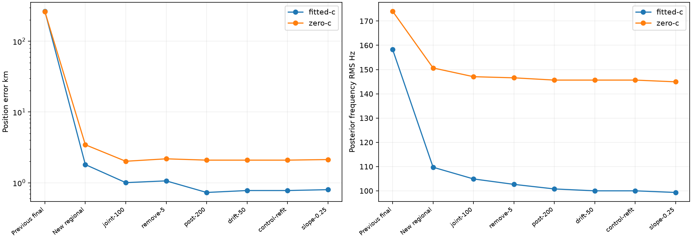

# Iteration 48: preserving a wider region rescues DS16-046

**Adding 50 km-separated regions reduces fitted-c error from 265.789 km to
0.798 km, and zero-c from 261.743 km to 2.128 km.** The new region wins by the
unchanged model score; reference position is used only to report error afterward.
This is a consumed-case diagnostic, not yet a dataset-wide qualified replacement.

## What changed

Commit `105203307` froze this test before fitting. The 400-point 40/20/10/5 km grid,
observations, priors, clock model, hard60 bounds and per-fit budgets stay unchanged.
A replay retains three regions at minimum separation 50 km instead of 25 km.
It includes the distant (30,170) km region, the correct neighborhood at (−90,−90)
km and another region at (110,90) km. The old baseline beats the old sep25 replay
in both arms, verified before fitting. Comparing it with the new sep50 replay
therefore preserves all previously winning regional choices on this case.

This adds regional fitting work; it is not an equal-total-compute comparison.
The spatial grid budget remains exactly 400 ordered points. The extra candidate
bank is generated by the existing procedure, not chosen using reference position.
The added arms have matched observations, banks, priors, starts and budgets;
zero-c also locks RF-time terms in downstream stages.

Both arms select `point:-90:-90` in the added region set. The regional solution
already reduces errors to 1.807 km fitted-c and 3.445 km zero-c. The unchanged
joint-clock/pruning/RF-time/satellite-slope pipeline then reaches 0.798/2.128 km.
Every one of its 12 paired stage fits is independently converged; no fallback is
needed. Production and frozen full-dataset benchmark results remain unchanged.

| Arm | Old regional score | New regional score | Prior final error km | New final error km |
|---|---:|---:|---:|---:|
| fitted-c | 30374.195 | 29510.512 | 265.789353 | 0.798370 |
| zero-c | 31167.787 | 30317.085 | 261.742792 | 2.128007 |

## Interpretation and remaining work

This verifies the retention diagnosis from iteration47: the useful region was
already sampled and refined, but never received final fitting. Once retained,
the same score selects it without a reference-location initializer. It does not
show that 50 km separation alone is globally best: broader separation can lose
nearby alternatives, so a general policy must preserve the existing region sets
and add wider ones, then select eligible finalists by score.

Frequency RMS also improves, but it is reported separately: the final fitted-c
RMS falls from 158.248 to 99.322 Hz; zero-c from 174.035 to 144.944 Hz. Model-stage
objectives are not compared across different candidate banks or priors as an
accuracy proxy. The regional selection above follows the existing scoring policy.

Next, evaluate the additive wider-region policy on the full DS16/DS17/DS18 corpus,
preserving all membership and exposure labels, c ablations, failures and paired
regressions. The independent DS18 likelihood-ranking failure remains unresolved;
this single rescue is not substituted into its benchmark or the pooled mean.

[result.json](result.json) records every downstream fit and the exact-grid check;
[regions.json](regions.json) contains regional starts and calibration receipts.
All frozen hashes and zero-c locks pass. The plot was inspected and Ruff passes.
No public contract, production setting, golden fixture, QNAP data or RF collection
changed. The deployed fitted-c default and longest-16-track PNG limit remain intact.
