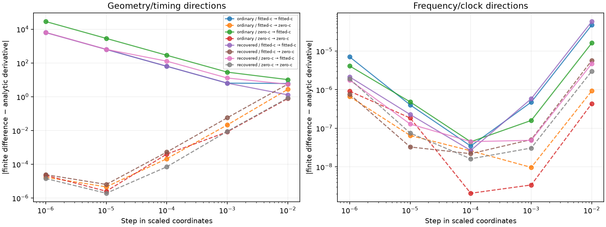

# Iteration 49: hard horizon transitions explain the stationarity disagreement

**All four nonstationary fitted-c outputs from iteration46 lie at hard
horizon-visibility transitions.** At a 0.0001 scaled step, small geometric
perturbations change visibility for one or two observation/satellite entries.
All four converged zero-c controls have zero visibility flips at that same scale.
The analytic gradient is a within-visibility-region derivative; it does not
represent a finite score jump when a satellite crosses the horizon.

## Controlled audit

Commit `609124810` froze this audit before execution. It evaluates all eight
saved outputs on the same 145-satellite bank and shared calibration from
iteration46. No optimization or position selection occurs. Directions cover
east, north, c where free, the largest timing-gradient coordinate, the largest
clock-gradient coordinate and the scaled negative-gradient direction. Both
signs are tested at steps 0.01, 0.001, 0.0001, 0.00001 and 0.000001. Constraints
are checked separately; infeasible trials are not counted as valid descent.

A 0.0001 east/north step is 0.1 m. Visibility is geometric above/below horizon,
not receiver-pair agreement. The likelihood includes a visibility-dependent
signal probability and no-detection normalization, so even a weakly associated
satellite can change the score when its visibility flag flips.

| Hypothesis | Seed arm | Arm | Stationarity | Max FD mismatch at 1e-4 | Visibility flips |
|---|---|---|---:|---:|---:|
| ordinary | fitted-c | fitted-c | 3.27703 | 63.29 | 1 |
| ordinary | fitted-c | zero-c | 5.89144e-05 | 0.000211515 | 0 |
| ordinary | zero-c | fitted-c | 0.162332 | 284.59 | 1 |
| ordinary | zero-c | zero-c | 0.000105726 | 0.000685457 | 0 |
| recovered | fitted-c | fitted-c | 0.0795899 | 63.5928 | 1 |
| recovered | fitted-c | zero-c | 6.05708e-05 | 0.000525341 | 0 |
| recovered | zero-c | fitted-c | 5.76427 | 127.818 | 2 |
| recovered | zero-c | zero-c | 6.57553e-05 | 7.03392e-05 | 0 |

For example, the ordinary fitted-seed/fitted-c result has east derivative 0.450
analytically but 63.740 by central difference at the 0.1 m step. The positive
step changes one visibility entry and raises the objective by 0.012765. Its c
and clock directions have no visibility changes and agree with finite differences
at this scale. The other fitted-c failures show the same geometric pattern.

The zero-c controls agree much more closely; their small derivative residuals
depend on step size because the likelihood has high timing curvature and finite
precision. These are numerical diagnostics, not a new convergence threshold.

## Consequence for the next experiment

This is evidence of a nonsmooth objective at the fitted-c endpoints, not evidence
that a larger time budget alone will fix the problem. The smooth stationarity
criterion cannot certify a discontinuous boundary as an ordinary smooth optimum.
The recorded failures remain failures under the frozen protocol; we do not
retroactively declare them converged or promote them into benchmark results.

The next useful model test is a physically motivated, differentiable horizon
detection taper, with derivatives of both the signal mixture and no-detection
normalization included. It should retain hard zero visibility below the horizon
and smoothly increase detection probability above it. Validate its gradients
through the transition before fitting, then use matched c arms, banks, starts,
priors and budgets. A smooth taper is a model change, not a harmless solver flag.

This audit does not resolve the independent zero-c ranking result: the converged
distant solution still scores better than the recovered one in iteration46.
It also does not alter the full DS16/DS17/DS18 comparison or substitute oracle
positions. No production, contract, golden-fixture, QNAP or RF-collection changes
were made. Runtime checks reproduced all eight saved objectives; Ruff passes.
[results.json](results.json) records every finite-difference trial, visibility
change, feasibility check and score delta.
