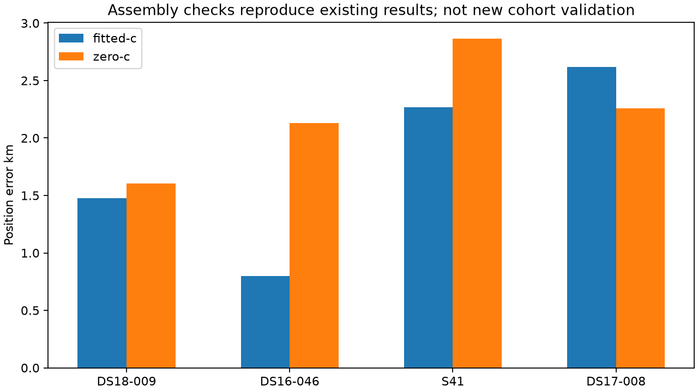

# Iteration 50: additive three-region-set assembly qualifies

**The new assembly preserves existing choices and reproduces all four numerical
controls.** It accepts baseline, sep25 and sep50 documents explicitly, chooses
each arm's eligible regional winner by score, then uses the winning fitted-region
calibration/bank/seed for the unchanged matched downstream c ablation.

The stage-runner source after initial regional selection is byte-for-byte
identical to iteration20 (ignoring trailing whitespace). The iteration28
extension is unchanged. No synthetic public persisted document or production
contract is introduced; each regional source remains explicit.

Commits `17545441b` and `71873a56d` froze the two numerical qualifications before
execution. DS18-009 uses a duplicate sep25 document in the third slot to verify
unchanged behavior; DS16-046 uses the actual sep50 result from iteration48.
Both reproduce every stage's vectors, clocks, objectives and position errors
within 1e-5 absolute tolerance, with identical convergence flags. Historical S41
and DS17-008 reproduce the iteration27 final vectors, clocks, objective and error
within the same tolerance, including convergence/fallback behavior.

| Case | Fitted source | Zero-c source | Fitted km | Zero-c km | Converged fitted/zero |
|---|---|---|---:|---:|---|
| DS18-009 | baseline | baseline | 1.476941 | 1.602606 | True/True |
| DS16-046 | sep50 | sep50 | 0.798370 | 2.128007 | True/True |
| S41 | baseline | baseline | 2.266234 | 2.863721 | True/True |
| DS17-008 | sep25 | sep25 | 2.616195 | 2.256467 | True/True |

Two selection tests also pass. The real DS17-008 sep25 rescue survives a tied
new candidate, and independent per-arm selection rejects nonconverged low-score
candidates while ignoring reference error. Earlier candidates win score ties.
These are implementation checks on consumed examples, not fresh validation or
evidence of cohort-wide accuracy improvement.

## Next matched comparison

Evaluate baseline + sep25 + sep50 on all 148 frozen DS16/DS17/DS18 members. Some
older scans had no prior sep25 replay; compute it explicitly and report that the
policy adds both missing sep25 work and sep50 work where applicable. Preserve
the original region sets, exact 400-point grid, existing priors and per-fit
budgets. The total regional fit budget increases and must be reported.

Keep complete membership, old exposure labels, failed inputs, convergence
fallbacks, matched c=0/fitted-c and paired per-dataset regressions. Reusing an
archived region document requires exact input/configuration binding. Do not
replace benchmark entries selectively based on their position errors. Pending
DS16 baseline completion remains separate from scientific selection.

The four receipts in results/ preserve numerical checks and provenance. Ruff and
both selection tests pass; the plot was inspected. No production settings,
public contracts, golden fixtures, QNAP data or RF collection changed. The goal
of a full-corpus mean below 1 km remains unachieved.
