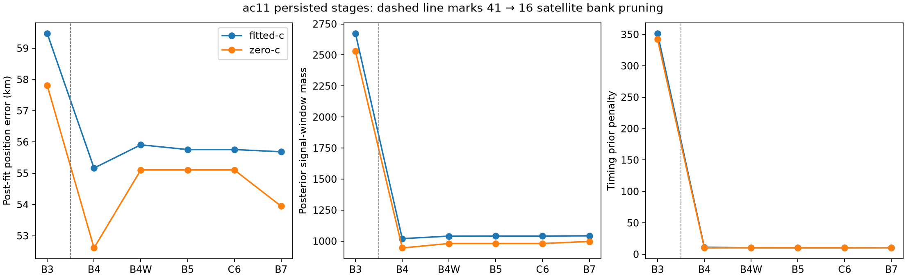
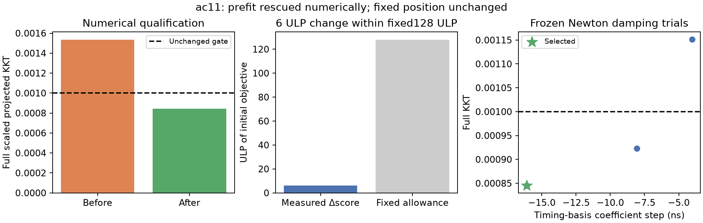

# Why scan-fw-ac11ac00c0676d1b failed

The published B7 result is **55.685 km wrong with fitted-c**, and **53.945 km
wrong with c=0**. Both final fits satisfy the independent convergence test.
The confirmed failure chain begins earlier: a promising ordinary search region
was discarded during calibration, and the final joint fit refined another
region. Restoring the discarded region has **not yet demonstrated a position
rescue**. This distinction matters: a reproducible calibration qualification failure is not
proof that it explains the entire position error.

## Evidence in the published pipeline

1. The search sampled 400 points. Its lowest-score retained ordinary region,
   `point:-47.5:-62.5`, had score 40696.314623 and 5 km grid spacing. Selection of
   this diagnostic region uses the search score, not the known receiver position.
2. Calibration failed for that region in all three regional separation passes.
   The stored coarse state had stationarity 0.001535 against a 0.001 requirement.
3. The existing bounded recovery eligibility covers failed initial 40 km grid
   points. This failed retained 5 km point was ineligible. It never reached
   association and final region comparison.
4. Both published arms instead came from `point:-72.5:-137.5`. B3 was already
   59.468 km wrong fitted-c and 57.806 km wrong c=0. All subsequent B7 stages
   qualified near the wrong regional solution.
5. Timing pruning removed 25 of 41 satellites, but position error improved at
   that step. The evidence does not establish pruning as the cause of worse
   accuracy. Later frequency flexibility made only small position changes.

The final fitted-c stationarity is 0.0000119; c=0 is 0.000234. Extending those
final fits solely because the answer is geographically wrong is not supported
by their convergence diagnostics.

## Controlled calibration tests

| Test | Outcome | What it establishes |
|---|---|---|
| Replay ordinary prefit with legacy and bounded solvers | Both stop almost immediately above the unchanged stationarity gate | Larger budgets did not help these replay starts; solvers stopped before budget |
| Reset timing terms to zero | Qualified, but objective about 7,278 worse | A qualified alternative can be a much poorer model fit |
| Strict score-decreasing scalar polish | No accepted step | Objective comparisons limit this tiny correction |
| Curvature polish with a fixed numerical score allowance | Stationarity 0.001535 → 0.000845 in six evaluations | First prefit qualification recovered without relaxing the gate |
| Continue the corrected calibration | Optimizer reports success; independent stationarity 0.016401 | A second calibration state still blocks downstream testing |
| Apply the same scalar polish to that state | All Newton corrections violate a coupled timing constraint | Scalar coordinate correction is inadequate at this boundary |
| Move in the feasible tangent direction | Stationarity 0.016401 → 0.002408; still fails 0.001 | Coupled motion helps, but scalar curvature is insufficient in this test |

The successful prefit correction changed a relative timing **basis coefficient**
by approximately 16 ns. Its objective changed by six floating-point increments
at a score near 40,696, within the predeclared fixed 128-increment allowance.
This is numerical cleanup at a fixed hypothesis position. It is not evidence
of a physical receiver-clock correction or position improvement.

The corrected postfit is a different objective because receiver calibration
has been applied. Its score must not be compared directly with the prefit score
as a same-model improvement. The latest failed scalar polish changed neither
its parameters nor its score. A subsequent constraint-preserving tangent
correction accepted four steps and slightly lowered the objective, but did not
qualify. Its remaining trial steps lower the objective while increasing the
largest stationarity residual. A joint curvature correction is the next isolated
test; no threshold relaxation is justified by the present result.

## Interpretation and limits

There are two confirmed implementation weaknesses: recovery eligibility omits
failed fine-grid retained regions, and numerical optimizer success can still
leave calibration outside the independent acceptance gate. The latter correctly
prevents unqualified fits from being treated as converged, but currently causes
the entire region to be lost. The final optimizer's local convergence does not
establish global regional correctness.

The next causal check must qualify the ordinary calibration, run association
and matched c=0/fitted-c finals, retain the original operational candidates, and
select by comparable model score. Until then, the known position error remains
55.685/53.945 km; no repaired result has been substituted into production.

This scan is newer-cohort member 051 and is now consumed development data.
Reference receiver coordinates remain evaluation-only. No truth-guided seeds,
satellite bank, region selection, new RF collection or production changes were
used. Reserved recordings remain closed.

## Reproducible evidence

- [Original checkpoint/calibration path](../2026_10_09_position_error_iter93/CALIBRATION_PATH.md)
- [Per-stage position and support audit](../2026_10_09_position_error_iter93/STAGE_AUDIT.md)
- [Four prefit replays](../2026_10_09_position_error_iter93/PREFIT_RESULTS.md)
- [Precision and curvature diagnostic](../2026_10_09_position_error_iter94/CURVATURE.md)
- [Qualified prefit correction](../2026_10_09_position_error_iter96/RESULTS.md)
- [Downstream calibration failure](../2026_10_09_position_error_iter95/RESULTS.md)
- [Unchanged scalar polish results](../2026_10_09_position_error_iter97/RESULTS.md)
  and [raw receipt](../2026_10_09_position_error_iter97/result.json)
- [Exact timing constraint and valid KKT projection](../2026_10_09_position_error_iter97/CONSTRAINT_AUDIT.md)
- [Tangent correction protocol](../2026_10_09_position_error_iter99/README.md)
  and [raw receipt](../2026_10_09_position_error_iter99/result.json)

Research protocols and receipts are append-only. Each negative attempt remains
visible. Iteration 96 was frozen in a local commit before execution; a concurrent
remote update delayed its remote publication until after the run. Iterations 95
and 97 were published before execution.
