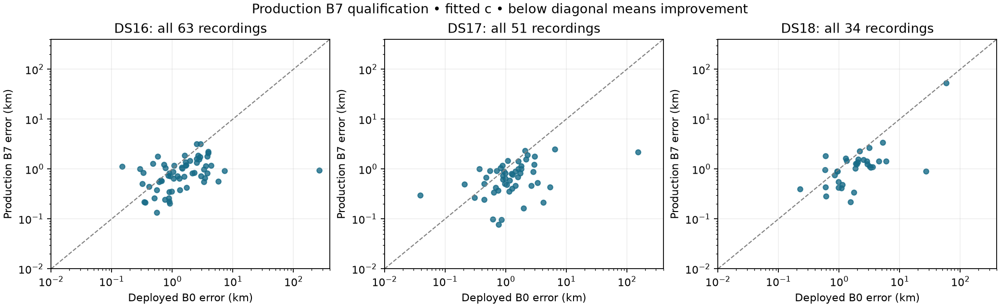
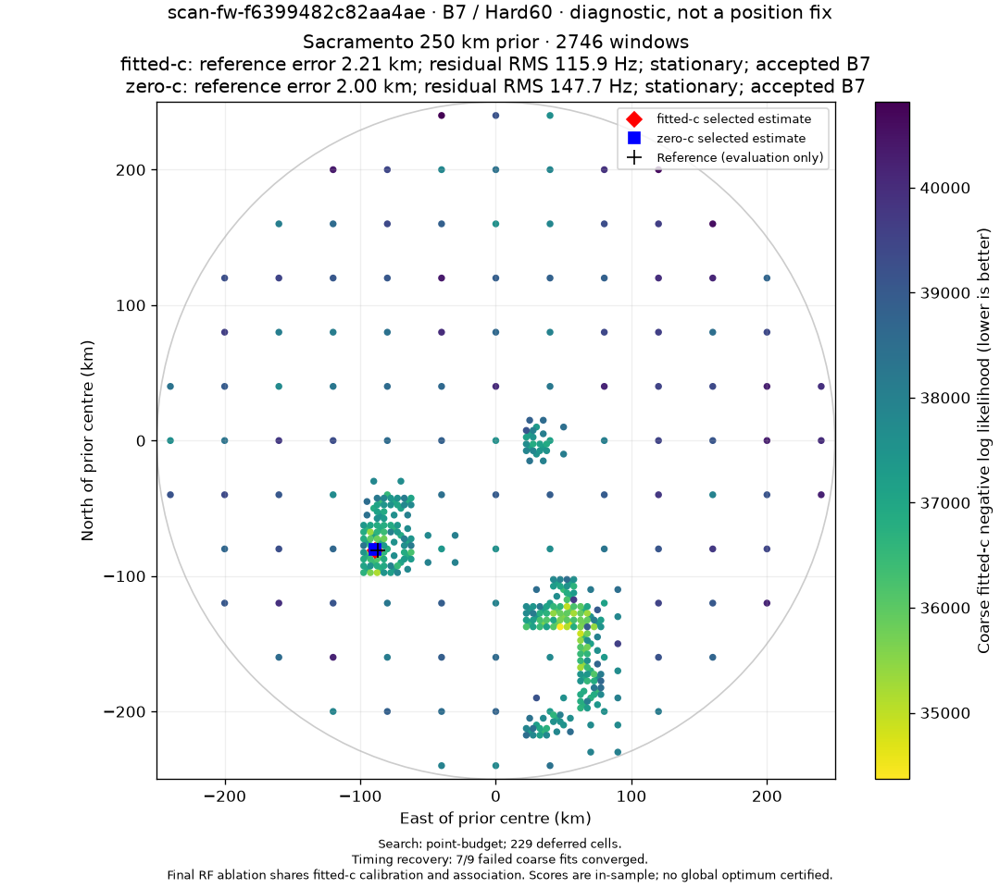
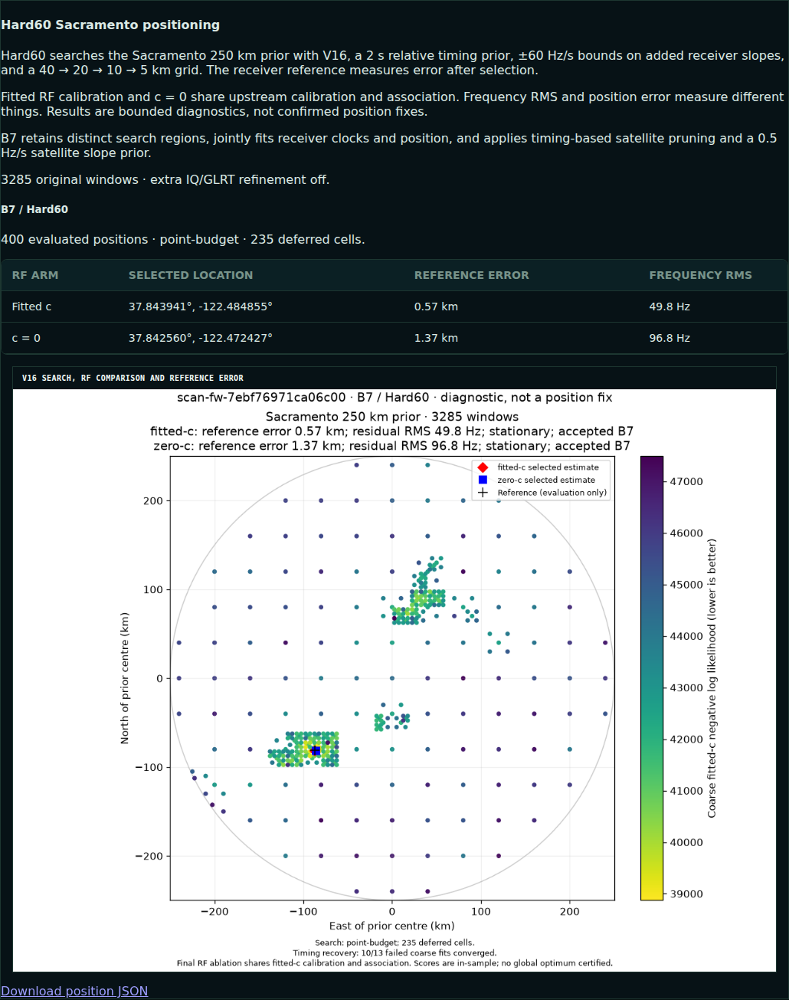

# B7 standard adaptive analysis rollout

Status: fully deployed on 2026-10-09; ordinary queue publication and live browser verification passed.

The user authorized a full rollout to new adaptive-scan analyses. This replaces
the proposed percentage rollout with a single default-policy cutover after
software qualification. No new RF collection, acquisition changes, or historical
backfill is part of this deployment.

## What changes

B7 retains distinct regional finalists, jointly fits receiver clocks and
position, prunes candidates with inferred relative timing beyond 5 s, widens the
clock prior, and adds RF-time terms and a 0.5 Hz/s satellite-slope prior. It keeps
the deployed 2 s relative / 3 s common timing priors, hard +/-60 Hz/s added
receiver-slope bounds, 40/20/10/5 km grid, nearest-edge priority, and bounded
recovery. This bound is stage-specific; it is not a bound on total clock drift.

The production sequence is B3 → B4 → B4W → B5 → C6 → B7 after region retention.
C6 is retained because it is the prescribed B7 fallback. The other experimental
control branches are not run on every new scan. Fits retain the qualified
upstream result when a stage fails; different model objectives are never used
to rank different stages. Both c arms are retained and fitted-c remains first.

V3 publications explicitly store the selected joint model and score components.
Joint priors are counted once. V1/V2 publications remain immutable and readable;
the WebUI prefers V3 when present. An older pending tracking job is superseded
by a new policy-bound job rather than executing B7 under its old identity.
Per-track TLE review PNGs remain limited to the longest 16 tracks.

## Scientific scope

The [sealed ablation](../2026_10_09_position_error_iter85/DECISION.md) measured:

| Dataset | Members | B0 fitted-c mean | B7 fitted-c mean |
|---|---:|---:|---:|
| DS16 | 63 | 5.964 km | 0.979 km |
| DS17 | 51 | 4.477 km | 0.819 km |
| DS18 | 34 | 4.422 km | 2.692 km |
| Pooled | 148 | 5.098 km | 1.317 km |

B7's fitted-c median is 0.864 km, p95 2.269 km, and worst 53.401 km.
It improves 118 scans and regresses 30 against B0, with largest regression
1.250 km. The pooled c=0 mean is 1.666 km. Better frequency fit is reported
separately from better position accuracy. The below-1-km pooled goal is not met.

These datasets are consumed development data. This rollout does not turn them
into independent validation, and no independent reserve outcomes were opened.
Candidate sets, pruning, and shared seeds remain fitted-derived, so the matched
c comparison is a conditional final-stage ablation. Known receiver coordinates
and reference errors are evaluation-only. They do not choose banks, regions,
starts, priors, or operational winners. The reference-guided/common-bank
diagnostic rescue and unfinished geometry-prior experiment are not included.

## Qualification evidence

The production downstream stages are freshly replayed against the immutable
regional inputs for all 148 members, including DS16's additional 15 and DS18's
sealed unpublished archive. This is numerical parity qualification, not a cold
grid replay for every member. Full coverage, paired errors, convergence,
fallbacks, frequency metrics, and receipt hashes are published in
[QUALIFICATION.md](QUALIFICATION.md) and [summary.json](summary.json).
All 148 paired results exactly reproduce the sealed positions and objectives;
there are no qualification input failures, exclusions, or stage fallbacks.
The complete individual receipts are in [qualification.tar.zst](qualification.tar.zst).

An additional cold replay rebuilt the entire regional search and final stages
for DS17-008, `scan-fw-f6399482c82aa4ae`, without borrowed numerical receipts.
It completed in 516.1 s across two checkpointed slices. Both positions and
objectives exactly match the sealed experiment: fitted-c 2.205054 km and c=0
2.004275 km. This was the 152.84 km deployed-baseline failure.
See [cold comparison](cold-comparison.json) and [complete cold receipt](cold.json).

- Staged production interpreter: [109 worker tests](staged-worker-tests.log)
  and [30 API/contract/rendering tests](staged-api-tests.log) passed.
- The [exact-base gate](deployment-test-receipt.json) passes all 11 selected
  Python test shards, Ruff checks/formatting, the web build, and all 228 web
  tests. Whole-repository mypy still fails with 28 pre-existing errors in 14
  files. An independent extraction of base `67e810c4e` reproduces the identical
  errors; [comparison](mypy-comparison.json). This is not a passing whole-repo
  receipt. The established analysis-only overlay procedure is used.
- The staged native extension is byte-identical to the qualification extension.
  All 1,407 staged source/native/UI files are verified before activation;
  [stage inventory](stage.json).

## Deployment and rollback

Worker/queue revision: `88e231eb1fd0ae52d9e043b08d643d27b711629c`,
immutable stage `/opt/leo-b7/88e231eb1-r1`.
API revision: `aa296fd9491a96bcd2e223770e3e527cd284cefa`,
immutable stage `/opt/leo-b7/aa296fd94-r1`.
The concurrently deployed position-error dashboard at web revision
`a4e6098e936bcacb33557b363c97afbaebee62c6` is preserved.
Configuration digest:
`sha256:dc67650e940b002fce58d74ba654d87df008611d839438e2d71248a5a2694893`.

The release overlays only reviewed changes on the effective inherited worker
and API trees, preserving the longest-16 review deployment. It changes the
analysis-worker, queue, and API selectors. All 19 running workers and the API
were checked against their actual process environments after cutover;
[runtime receipt](final-runtime.json). All new adaptive tracking analyses now
use B7, retaining the documented upstream fallback if a stage fails.

The measured existing queue limits are heavy=13, memory=12, cpu=8, streaming=16;
they are preserved. This corrects the older plan's assumption of a two-heavy-lease
production limit. Acquisition timers, radio settings, and database schema are
unchanged. The separate earlier experiments remain paused.

[activate.py](activate.py) rehashes the release and requires complete paired
qualification plus the cold receipt. It records previous selectors before
cutover. [rollback.py](rollback.py) restores the previous worker/queue selectors
while retaining compatible V3 readers by default. `--include-api` also restores
the old API if that component is faulty. Published artifacts and checkpoints
are retained; rollback deletes only this rollout's exact selector drop-ins.

### Queue handoff correction

The initial cutover exposed a migration-only bug: the old-job completion label
exceeded the existing database's 32-character outcome field. Revision
`88e231eb1` shortens it to `superseded-tracking-policy`; the persisted contract
and numerical policy are unchanged. All 27 staged queue tests pass, including
the width assertion. The corrected release also reran the exact-base gate with
the same pre-existing mypy failures and no new errors;
[final gate receipt](final-gate-receipt.json).

The interrupted old job's orphaned lease was recovered through the public
catalog port after verifying its process had exited and its replacement existed.
The failed attempt is retained; [recovery receipt](orphan-recovery.json).
Old job 48940 now succeeds with the superseded outcome, and replacement 48942
succeeds with `complete`; [queue receipt](live-jobs.json). No schema change or
broad queue reset was required.

### Live result and rendering

The first ordinary B7 queue publication was
[`scan-fw-7ebf76971ca06c00`](http://gauss:8090/?scan_id=scan-fw-7ebf76971ca06c00).
It was selected for deployment verification by queue completion, not position
error. Both arms accepted B7 and independently passed convergence:

| Arm | Position error | Frequency RMS |
|---|---:|---:|
| Fitted c | 0.571 km | 49.84 Hz |
| c = 0 | 1.366 km | 96.80 Hz |

An actual Chromium session verified the V3 configuration digest, decoded the
1080 × 960 PNG, matched its content hash, and found no panel alerts or page
errors. Exactly 16 per-track review images render under the longest-track
selection policy. The panel screenshot was also visually inspected;
[browser receipt](live/browser.json), [published document](live/document.json).
Historical V2 rendering and its PNG hash remain intact;
[historical browser receipt](historical/browser.json).

These live observations are consumed deployment diagnostics, not unseen
scientific validation; [exposure receipt](live-exposure.json). This verifies
deployment and rendering, not a new independent estimate of localization quality.
