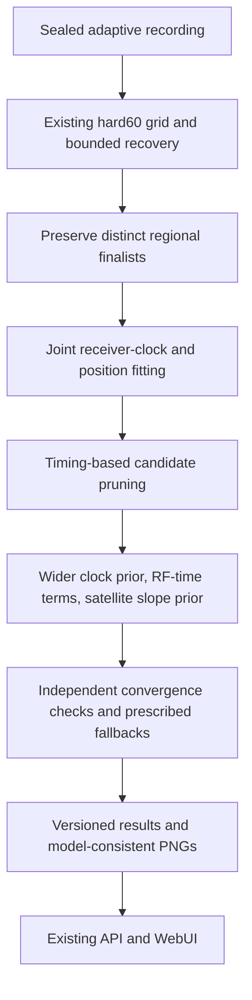

# Plan: qualify B7 as the standard adaptive-scan analysis

Status: proposed, 2026-10-09. This report changes no running analysis, defaults,
or acquisition settings. Research remains paused except for work subsequently
authorized by the user.

Use one versioned B7 candidate, integrate it into the existing pipeline, qualify
it, then progressively activate it with the current hard60 available for rollback.
Do not ship the entire experimental ladder as work performed on every scan.

## Why this candidate

The [completed ablation](../2026_10_09_position_error_iter85/DECISION.md)
includes all 148 recordings and matched c=0/fitted-c results. Fitted-c means:

| Dataset | Current hard60 B0 | Proposed B7 |
|---|---:|---:|
| DS16, 63 recordings | 5.964 km | 0.979 km |
| DS17, 51 recordings | 4.477 km | 0.819 km |
| DS18, 34 recordings | 4.422 km | 2.692 km |
| All 148 | 5.098 km | 1.317 km |

B7 reduces the pooled mean by 74.2%. Its median is 0.864 km, p95 2.269 km,
and worst 53.401 km. Against B0, 118 scans improve and 30 regress; the largest
regression is 1.250 km. The pooled below-1-km goal is not achieved. These are
consumed development results, not independent validation.

B4 is the simpler comparison candidate: 1.466 km pooled mean, capturing 96.1%
of B7's improvement over B0. Complete the previously proposed removal study
before the candidate freeze, particularly for the small RF-time contribution.
The intended target here is B7; changing it to B4 requires a documented decision
and a new freeze, not per-scan selection by reference error.

## The production path

Preserve the 40/20/10/5 km grid, nearest-edge priority, 400-point budget,
existing bounded recovery, and timing priors of 2 s relative and 3 s common.
The existing Sacramento-centered 250 km search prior is unchanged and explicit;
it is a deployment configuration, not a reference-derived seed. Do not claim
that qualification establishes performance outside this search region.

Port the frozen experiment's rules:

- Preserve original regional finalists plus the 25 km and 50 km separation
  alternatives. Reuse compatible grid evaluations only after proving equivalence;
  do not change numerical search behavior as an incidental optimization.
- Jointly fit receiver clocks and position, prune inferred absolute relative
  timing above 5 s while retaining at least four satellites, then widen the clock
  prior: knot sigma 100 to 200 Hz and curvature sigma 50 to 100 Hz.
- Enable the tested RF-time prior sigma 50 and satellite-specific slope Gaussian
  sigma 0.5 Hz/s. Freeze their precise parameterization, units, and centering
  from the experiment in typed configuration and model tests.
- Keep hard60: the +/-60 Hz/s bound applies to the added affine receiver slope
  at a stage. It is neither a +/-60 Hz frequency bound nor a bound on total
  accumulated receiver drift. The satellite slope prior is a separate parameter.
- Preserve the tested stage sequence and prerequisites, the new-fit budgets of
  90 s / 600 iterations, and independent stationarity threshold 0.001. Preserve
  original regional-stage budgets. Budget changes require their own validation.
- Compute matched c=0 and fitted-c outputs, displaying fitted-c by default.
  Lock RF-time terms in the c=0 arm. Document that banks, pruning, and shared
  seeds are fitted-derived: this is a conditional matched final-stage ablation.
- Accept a stage only under its independent qualification rule; otherwise retain
  its prescribed upstream fallback. Use B0 when joint-model prerequisites fail.
  Never rank different model stages by incomparable objectives.

Candidate positions used for orbit geometry are legitimate hypotheses. Known
receiver coordinates and errors remain evaluation-only: they cannot choose
satellites, seeds, retained regions, parameters, or operational winners. The
common-bank diagnostic rescue, reference-guided starts, and unfinished geometry
experiment are outside this deployment candidate.

## Five delivery gates

| Phase | Deliverable | Completion gate |
|---|---|---|
| 1. Freeze | B7 policy, exact model/rules, removal-study decision, validation protocol | Reviewed configuration/source digests; no unresolved candidate changes |
| 2. Integrate | Pure model code, existing application orchestration, versioned publication | Component tests pass; explicit score and fallback semantics; no runtime imports from reports |
| 3. Qualify | Full-cohort production replay, independent grouped validation, load measurements | Numerical parity, declared accuracy gates, bounded runtime, correct historical and new rendering |
| 4. Shadow | B7 on a small deterministic sample of ordinary queued scans; B0 remains served | Fresh receipts, stable queue, valid artifacts, verified browser rendering |
| 5. Activate | B7 served at 5%, then 25%, then 100% of eligible new analyses | Each step passes operational gates; rollback selector verified |

### Integration: explicit models and scores

Place numerical models in the analysis component and stage orchestration in the
application component. Reuse existing queue, checkpoints, deadlines, and storage
ports. No additional service or scheduling framework is needed. Checkpoint keys
must include the complete policy/configuration digest; in-flight work stays bound
to the configuration with which it started.

The current report builder selects fixed-clock results using objective plus a
separate calibration penalty. The joint objective already contains clock priors.
Reusing that expression would double-count penalties and could select the wrong
result. Define canonical score components and a single total for each model;
publish the already-selected, qualified stage and its fallback provenance.

Introduce a V3 result/publication contract rather than reinterpret immutable V2
semantics. Keep algorithm policy identity separate from schema version. Include
typed joint clock, static-c, RF-time, and satellite-slope state; score components;
convergence and fallback status; candidate/seed provenance; and input, orbit,
configuration, and code digests. Preserve V1/V2 readers and historical artifacts.

Render predictions and residuals from the selected joint state. Test that no
old calibration state is substituted and no prior penalty is added twice.
Keep fitted-c as the displayed default and retain the longest-16-track limit
for per-track TLE review PNGs. Component-owned tests cover models, orchestration,
contracts, storage, API, and rendering; existing scientific goldens stay unchanged.

### Qualification: reproduce first, then generalize

1. Cold-replay representative integration cases first: both former >100 km
   failures, DS18-022, stage-failure/fallback cases, both sample rates, and the
   sealed unpublished archive. Then replay all DS16 63, DS17 51, and DS18 34
   through the integrated pipeline, retaining every member and failure.
2. Propose parity tolerances of 1 m position and 0.001 objective against the
   sealed B7 receipts, with identical model, bank, seed/selection policy and
   fallback decisions. Investigate discrepancies even when accuracy improves;
   do not silently substitute a new algorithm. Objective comparison is only
   within the same model and parameterization.
3. Report per-dataset mean, median, p95, worst, convergence, fallbacks, paired
   regressions, and matched c arms. Report frequency-fit effects separately.
   Distinguish cached replay from cold computation. The ablation's 29 s average
   omitted grid work and is not a production latency estimate.
4. Freeze a reproducible randomized whole-group validation protocol before
   opening independent outcomes. Audit exposure and overlap using metadata;
   keep correlated observations together, record seed/group assignments, and
   fit any learned preprocessing on training groups only. All three datasets
   are consumed development. POST18-RESERVE is not automatically a randomized
   holdout, and lack of a registry match does not prove independence.
5. Proposed accuracy gates for the frozen independent comparison: lower mean
   than B0, no increase in p95 or worst error, and no newly introduced >100 km
   error. Publish paired uncertainty, regressions, and sample size; a small
   reserve alone cannot establish rare-failure safety. A failed gate returns
   the candidate to development, and those outcomes become consumed. Do not
   retune on them and claim the same set as independent validation.
6. Measure cold latency, memory, deadline failures, and throughput under the
   existing heavy-work concurrency cap of two. Before activation, record a
   concrete capacity gate from observed scan arrivals and available headroom;
   sustained queue growth or unexplained timeout increases block promotion.

Use already recorded data. No new RF collection is requested or authorized.

### Shadow, activation, and rollback

Capture the actual running worker/API source selectors and configuration before
building the release. Follow the established analysis-only immutable release
procedure, with exact-base tests against the effective production revision and
a source inventory. The generic fast test gate is not deployment qualification;
an API-only fast deployment does not deploy analysis workers. Do not change
acquisition timers, hardware settings, or collection services.

Deploy compatible readers first with B7 disabled. Use an explicit policy selector
and a stable scan-ID hash for canary membership, persisted on the analysis job.
Shadow a small fixed batch while B0 remains served; keep combined heavy work
within the existing cap. Promote serving to 5%, 25%, and 100% only after the
previous step passes the following checks, rather than after elapsed time alone:

- Naturally arriving sealed scans enter through the ordinary queue and produce
  their own fresh stage receipts with the intended policy/code/configuration.
- Convergence, prescribed fallback behavior, runtime, and backlog meet the frozen
  gates. Exercise rare fallback branches in qualification fixtures if no live
  canary triggers them; do not claim an unobserved live branch was verified.
- The API returns the selected new result and content-addressed PNG, with matching
  artifact hash, HTTP 200 and image/png. Browser images decode, have positive
  natural dimensions, display visibly, and agree with the numerical result.
  Check both c arms, fitted-c default, the longest-16-track limit, and historical
  V2 scans. Record browser screenshots and console errors.
- Confirm the effective sources of running processes, not merely that a commit
  exists on remote main. Publish activation and verification receipts.

Rollback changes the analysis policy selector back to B0, restores exact prior
worker selectors if necessary, and restarts only affected analysis services.
Retain compatible readers and all V3 artifacts for diagnosis. Existing jobs keep
their pinned policy; drain or resume them under that policy rather than mutate
their meaning. Missing/corrupt PNGs, invalid model scores, unexpected fallback
behavior, or persistent queue growth trigger rollback and investigation.

After full promotion, B7 becomes the default for new eligible adaptive-scan
analyses. Historical backfill is a separate, explicitly scheduled task.

## Deliverables and decision

Publish the implementation review, qualification report with per-dataset plots,
independent-validation receipt, release/source inventory, and live PNG verification
to remote main. Keep experiment 85 sealed and link to it rather than rewriting it.

Recommendation: qualify the full B7 path as one candidate and preserve B0 as the
rollback policy. The first implementation milestone is numerical and publication
parity, not immediate default activation. The remaining 53.4 km DS18 failure and
the modest benefit of the later model terms remain explicit review items.
